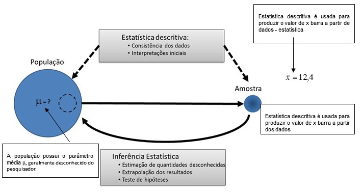

# 1 - Conceitos Básicos

A **Estatística Experimental** tem como objetivo o estudo dos experimentos, isto é, seu planejamento, execução, análise dos dados e interpretação dos resultados. Para um *experimentador* ou *pesquisador*, conduzir e avaliar de maneira correta uma pesquisa é essencial o conehcimento de alguns conceitos básicos de estatística, principalmente no que se refere às potencialidades e limitações das técnicas utilizadas.

Na terminologia estatística, o grande conjunto de dados que contém a característica que temos interesse recebe o nome de **População**. Esse termo refere-se não semente a uma coleção de indivíduos, mas também ao alvo sobre o qual reside o nosso interesse. Assim, nossa população pode ser tanto todo o conjunto de cervos em uma área de proteção, todas as árvores de uma determinada espécie na floresta amazônica, todas as lâmpadas produzidas em uma fábrica em um determinado período de tempo. Dentro dessa definição de população, poderemos, ainda, fazer uma distinção entre os tipos de população:

## 1.1 Populações Comuns: 
      
      "Uma população é um conjunto de pessoas (ou coisas) que possuem uma característica observável comum"
      
Este é o conceito mais amplo de população, e temos como exemplos: população de pessoas que moram na Região Sudeste do Brasil que apresentam resultado positivo para hepatite C; a população de plantas de uma variedade de soja plantada na região sul do Brasil; a população de bovinos de corte do estado do Mato Grosso, etc.

## 1.2 Populações Estatísticas: 
        
        "A população estatística se refere aos dados (informação), e não às pessoas, indivíduos ou objetos" 
        
Nessa abordagem, a população é composta de características das pessoas (ou objetos de estudo). Tomando o exemplo anterior, na população comum de pessoas que moram na Região Sudeste do Brasil que apresentam positivo para hepatite C, teríamos como populações estatísticas um parâmetro que indicasse se todas as pessoas necessitaram de transfusão sanguínea em algum momento de suas vidas, por exemplo. No caso da população de uma variedade específica de soja teríamos como população estatística, a sua produtividade. Portanto, a população estatística consiste em características de pessoas ou objetos de estudo, independente de terem sido medidas ou não.

## 1.3 Amostra

Na maioria dos casos, não conseguimos acessar toda uma população para estudar as características de interesse, isso devido às razões econômicas, éticas e dificuldades de outra natureza. Assim, tomaremos alguns elementos dessa população para formar um grupo a ser estudado. Este subconjunto da população, em geral com menores dimensões, é denominado amostra.

A figura abaixo mostra a relação entre esses conceitos e principais terminologias
<center>

</center>


## 1.4 Dados

Esse termo se refere ao registro das medições de características de interesse. Assim, as características tipo sanguíneo e altura de alguns, ou todos, os elementos de uma população são avaliados e registrados. Os resultados desses processos são obtidos na forma de dados. Assim, em um ensaio experimental ou levantamento, o pesquisador terá medido, ou observado, as características que compõe a amostra e as terão registradas em forma de dados. Entretanto, o mesmo não será verdade no caso da população. Tomemos como exemplo um experimento no qual temos por objetivos realizar um teste clínico para aferição da pressão sanguínea dos alunos de uma determinada universidade. Nesse caso, será impraticável medir a pressão sanguínea de todos os alunos, mas é bastante razoável fazer medições em uma amostra de 50 dessas pressões sanguíneas.

## 1.5 Variável

Uma característica que pode diferir de uma entidade biológica para outra é denominada variável. É a característica de estudo do pesquisador. As informações a respeito das variáveis de interesse são armazenadas na forma de dados. 

## 1.6	Parâmetros estatísticos

Os conceitos de parâmetros e estatísticas se relacionam fortemente aos conceitos de população e amostra. Um parâmetro é definido como qualquer resumo dos elementos de uma população, enquanto o resumo provável de elementos de uma amostra é chamado de estatística (medida, métrica) (não confundir com o nome da disciplina Estatística). Assim, a pressão sanguínea média de todos os alunos de uma universidade seria um parâmetro enquanto que a pressão sanguínea média dos alunos de uma determina turma (amostra) dessa universidade seria uma estatística.

Os valores dos parâmetros de uma população não são, normalmente, disponíveis ao pesquisador. Por outro lado, os valores das estatísticas estão prontamente disponíveis.


## 1.7 Experimento ou Ensaio

O Experimento é um trabalho previamente planejado e construído de forma que este siga determinados princípios básicos e no qual se faz a comparação dos efeitos dos tratamentos.

## 1.8 Tratamento 

É o método, o elemento ou material, cujo efeito se deseja medir ou comparar em um experimento. Por exemplo, um tratamento pode ser:  
    
-uma variedade de cana-de-açúcar; 
-um híbrido de sorgo;  
-uma dose de um adubo para a cultura do milho;  
-um espaçamento para a cultura do algodão;  
-um tipo de preparo do solo, ou um manejo específico de uma área;  
-um inseticida para o controle de praga.

## 1.9 Unidade Experimental ou Parcela

Conceito mais importante na experimentação, pois é na **parcela** que aplicamos um tratamento e é nela que o efeito desse tratamento será avaliado. É nela que obtemos os dados que deverão refletir o efeito de cada tratamento ensaiado. A parcela pode ser constituída, por exemplo:

-uma planta;  
-um grupo de plantas;  
-uma placa de petri com um meio de cultura;  
-um animal;  
-um lote de animais.

## 1.10 Delineamento Experimental

É o plano utilizado na experimentação, e implica na forma como os tratamentos deverão ser distribuídos nas unidades experimentais e como serão analisados os dados a serem obtidos. Como exemplo, temos o delineamento inteiramente casualizado (DIC), o delineamento em blocos casualizados (DBC), o delineamento em quadrado latino (DQL), o delineamento em parcelas subdivididas (PSUB), etc.

# 2 - Medidas Estatísticas

As populações são descritas por certas características chamadas **Parâmetros**. As amostras são descritas pelas mesmas características, que no caso, são chamadas de **Estimativas de Parâmetros**. Alguns desses parâmetros são chamados de **Medidas de Posição** e outros de **Medidas de dispersão**.

## 2.1 Medidas de Posição ou tendência central 

Mostram o valor representativo em torno do qual os dados se distribuem.  São utilizadas para sintetizar, em um único número, o conjunto de dados observados. Talvez a medida mais conhecida desse tipo seja o que normalmente é conhecido como "média" ou, mais precisamente média aritmética de um conjunto de dados. 

### 2.1.1 Média Aritmética Simples

É a mais utilizada das medidas de posição. A média aritmética (ou simplesmente média) de um conjunto de $n$ observações, $x_1, x_2,\cdots, x_n$, da variável aleatória $X$, é o quociente da divisão da soma dos valores das observações dessa variável por $n$. A média para uma amostra pode ser representada por $\bar{x}$ (lê-se xis barra) ou $\hat{m}$ (lê-se m, chapéu), assim, temos:
$$
\bar{x} = \frac{x_1+x_2+\cdots+x_n}{n}=\frac{\sum_{i=1}^nx_{i}}{n}, i=1,2,\cdots, n
$$

**Observação**: Cada medida no conjunto de dados é referida como um valor $x_i$, tal que o primeiro valor é referido como $x_1$, o segundo como $x_2$, e assim por diante. O subscrito $i$, que pode ser qualquer número inteiro entre 1 e o total de valores $n$, corresponde, então, à posição de cada valor no conjunto de observações. Dado o conjunto de dados **x**, contendo 4 observações (4.5, 3.8, 2.1 e 3.3), ou seja, $n=4$, pode ser representado como:

x|4.5|3.8|2.1|3.3
:---|:---:|:---:|:---:|:---:|
posição|1|2|3|4|

onde: $x_1=4.5$ e $x_4=3.3$.

Vamos programar no 

```{r}
# Criando a variável x, ou seja, um vetor computacional, criado com a função c()
# o símbolo <- representa atribuição, ou seja "o objeto x recebe um vetor"
x <- c(4.5,3.8,2.1,3.3)
x # mostrar os valores no console do R

# vamos imprimir o primeiro elemento de x, ou seja x1
# utilizamos os colchetes para a indexação.
x[1] 
x[4]

# Agora vamos calcular a média de x
mean(x)
```

### 2.1.2 Mediana

A mediana de um conjunto **ordenado** de dados e o valor que ocupa a posição central (nem sempre pertence ao conjunto de dados), isto é, é precedido e seguido pelo mesmo número de dados.

Sejam as obsevações
$$
x_1,x_2,...,x_n
$$
já devidamente ordenadas.

Se $n$ é par e $n=2k$, a mediana será a média dos dois valores centrais, isto é:
$$
m_d=\frac{x_k+x_{k+1}}{2}
$$
Assim, se por exemplo, n=10, a mediana será:
$$
m_d=\frac{x_5+x_{6}}{2}
$$

Quando $n$ é impar, e se $n=2k+1$, a mediana será:
$$
m_d=x_{k+1}
$$
Se, por exemplo $n=11$, temos
$$
m_d=x_6
$$

No exemplo citado acima, temos os valores ordenados:

$$2.1,3.3,3.8,4.5$$
a mediana será:

$$
n = 4 \text{ e } k=2 \\
m_d=\frac{x_2+x_{3}}{2}=\frac{3.3+3.8}{2}=3.55
$$

vamos programar no 

```{r}
median(x)
```

### 2.1.3 Moda

A moda é o valor que ocorre com maior frequência na amostra. Então, podemos ter distribuições com nenhuma (amodal), uma (unimodal) ou mais de uma (plurimodal) moda.

No exemplo acima, temos que a moda é nula, pois não há um valor mais frequente.

$M_o= NULO$

dado uma amostra **y** com os valores **12, 12, 12, 14, 14, 14, 15, 16, 17, 18**. Temos como moda os valores 12 e 14, pois aparecem com maior frequência na amostra.

$M_o = \text{12 e 14}$

no 
```{r}
# O R não contém em seus pacotes básicos uma função para calcular a moda de uma amostra
# contudo, vamos criar a nossa função (minha_moda) para realizar essa tarefa.
minha_moda<-function(x){
  x=na.omit(x) # retirando os NAs, valores não disponíveis
  tb<-table(x) # criando a tabela de frequência, com a contagem de cada valor
  amplitude=diff(range(tb)) # calculando a amplitude das contages (MAX-MIN),
  if(amplitude==0){
    return("Amodal") # se a amplitude for zero, não existe moda na amostra
  }else{  # caso não for zero, a função retorna um vetor com a(s) moda(s)
    return(as.numeric(names(tb)[max(tb) == tb]))
  }
}
y<-c(12, 12, 12, 14, 14, 14, 15, 16, 17, 18)

# Testando para a variável x, AMODAL
minha_moda(x)

# Testando para a variável y, módas são 12 e 14
minha_moda(y)

```

## 2.2 Medidas de dispersão ou variabilidade 

O resumo de um conjunto de dados, por meio de uma única medida representativa de posição central, esconde toda informação sobre a variabilidade do conjunto de valores. As medidas de variação medem o grau com que os dados tendem a se distribuir em torno de um valor central que, geralmente, é a média aritmética. Portanto, as tendências centrais podem não ser suficientes na descrição e discriminação de diferentes conjuntos de dados.

Assim, as medidas de dispersão medem o grau com que os dados tendem a se distribuir em torno de um valor central, que geralmente é a média aritmética. Dentre as medidas de dispersão, discutiremos a Amplitude total, a Variância, o Desvio Padrão, o Erro padrão da média e o Coeficiente de Variação.


## 2.2.1 Amplitude total 

É uma medida não muito informativa, pois leva em conta apenas os dados extremos da amostra.

Admitamos as seguintes amostras, todas com média $\bar{x}=9.0$

```{r, echo=FALSE}
library(kableExtra)
df<-data.frame("X1"=c(9,9,9,9,9),
               "X2"=c(7,8,9,10,11),
               "X3"=c(0.6,3.4,9.8,13.8,17.4)
               )
kable(df)
```

a média não nos dá, por si só, uma completa informação a respeito do comportamento dos dados. Entretanto, se tomarmos a diferença entre o Maior e o Menor deles, isto é, a Amplitude Total, teremos:
$$
A_1=9-9=0 \\
A_2=11-7=4 \\
A_3=17.4-0.6=16.8
$$

Podemos concluir que a terceira amostra é mais dispersa. Por outro lado, a fim de comprovar a inficiência dessa medida, considere uma nova amostra X4

```{r, echo=FALSE}
library(kableExtra)
df<-data.frame("X1"=c(9,9,9,9,9),
               "X2"=c(7,8,9,10,11),
               "X3"=c(0.6,3.4,9.8,13.8,17.4),
               "X4"=c(.6,9,9,9,17.4)
               )
kable(df)
```

Nesse caso, a média ainda é 9 e a amplitude é a mesma da de X3, ou seja, 16.8, no entando as duas amostras são bem distintas. falta então alguma informação a mais, que permita diferenciá-las.

## 2.2.2 Variância

A variância é a medida de variabilidade que leva em consideração todas as observações presentes na amostra. É considerada a melhor medida de dispersão.

Consideramos um conjunto de dados correspondentes a uma população finita de tamanho $N$ elementos, representados por: $x_1,x_2,...,x_N$.

A partir destas observações, podemos calcular a média da população, dada por:

$$
\mu=\frac{\sum_{i=1}^Nx_{i}}{N},
$$
podemos calcular o quanto cada observação desvia da média, ou seja, podemos calcular os desvios ($\epsilon_i$)em realação à média.

$$
\epsilon_i=x_i-\mu,   (i = 1,2,...,N)
$$

Podemos mostrar que $\sum_{i=1}^N\epsilon_i=0$

Prova:
$$
\sum_{i=1}^N\epsilon_i=\sum_{i=1}^N(x_i-\mu) \\
\sum_{i=1}^N\epsilon_i=\sum_{i=1}^Nx_i-\sum_{i=1}^N\mu \\
\sum_{i=1}^N\epsilon_i=\sum_{i=1}^Nx_i-N\mu \\
\sum_{i=1}^N\epsilon_i=\sum_{i=1}^Nx_i-N\frac{\sum_{i=1}^Nx_i}{N} \\
\sum_{i=1}^N\epsilon_i=\sum_{i=1}^Nx_i-{\sum_{i=1}^Nx_i} \\
\sum_{i=1}^N\epsilon_i=0
$$


```{r}
# Vamos exemplificar utilizando a amostra 3
X3<-c(0.6,3.4,9.8,13.8,17.4)

# Média
m<-mean(X3)
m

# Amplitude
amplitude<-diff(range(X3))
amplitude

# Calculando os desvios em relação à média
e<-X3-m
e

# Somando os desvios, obtemos o valor 0
sum(e)
```

Para evitar essa inconveniência, vamos elevar cada valor de desvio ao quadrado e somá-los, assim obtemos as Somas dos Quadrados dos Desvios.

$$
SQD=\sum_{i=1}^N\epsilon_i^2 \\ SQD=\sum_{i=1}^N(x_i-\mu)^2 \\
$$

Essa fórmula pode ser apresentada de outra forma mais prática:

$$
SQD=\sum_{i=1}^N(x_i-\mu)^2 \\
SQD=\sum_{i=1}^N(x_i^2-2x_i\mu+\mu^2) \\
SQD=\sum_{i=1}^Nx_i^2-2\mu \sum_{i=1}^Nx_i+N\mu^2 \\
SQD=\sum_{i=1}^Nx_i^2-2\mu \sum_{i=1}^Nx_i \cdot \frac{N}{N}+N\mu^2 \\
SQD=\sum_{i=1}^Nx_i^2-2N\mu^2+N\mu^2 \\
SQD=\sum_{i=1}^Nx_i^2-N\mu^2 \\
SQD=\sum_{i=1}^Nx_i^2-N \left( \frac{\sum_{i=1}^N x_i}{N} \right)^2  \\
SQD=\sum_{i=1}^Nx_i^2-N  \frac{\left(\sum_{i=1}^N x_i\right)^2}{N^2}  \\
SQD=\sum_{i=1}^Nx_i^2-  \frac{\left(\sum_{i=1}^N x_i\right)^2}{N}  \\
$$

Então, a variância da população é definida como a média dos quadrados dos desvios em relação à média aritmética, isto é:

$$
\sigma^2 =\frac{SQD}{N}
$$

Quando trabalhamos com amostras, temos dois casos a considerar:

**a)** Os dados constituem um amostra, mas os desvios são tomados em relação à média verdadeira $\mu$ (populacional). Neste caso, o divisor é $n$ (tamanho da amostra), temos uma estimativa da variância que representamos por:

$$
\hat{\sigma}^2 =\frac{SQD}{n}=\frac{\sum_{i=1}^n(x_i-m  )^2}{n}
$$

**b)** Os dados constituem um amostra e os desvios são tomados em relação à estimativa da média ($\hat{m}$). Este é o caso mais usual e a estimativa da variância fica:

$$
s^2 =\frac{SQD}{n-1}=\frac{\sum_{i=1}^n(x_i-\hat{m})^2}{n-1}\\ou\\s^2=\frac{\sum  _{i=1}^nx_i^2-\frac{(\sum_{i=1}^nx_i)^2}{n}}{n-1}
$$

Para os dados da amostra X3, temos:


```{r}
# Vamos exemplificar utilizando a amostra 3
X3<-c(0.6,3.4,9.8,13.8,17.4)
sum((X3-mean(X3))^2)/(length(X3)-1)

# Ou, simplesmente:
var(X3)
```


### Propriedades da variância

**a)** Quando somamos uma constante ($k$) à cada valor de $x_i$, a variância não se altera:

PROVA: Seja uma amostra aleatória de tamanho $n$, cujos elementos são representados por $x_1, x_2,\cdots,x_n$. Se somarmos a cada valor $x_i$ uma constante k, teremos:

$$
z_1,z_2\cdots,z_n, onde, z_i=x_i+k, para , i=1,2,\cdots,n.
$$

Então,

$$
\hat{V}(Z)=\frac{\sum_{i=1}^n(z_i-\hat{m_z})^2}{n-1} \\
\hat{V}(Z)=\frac{\sum_{i=1}^n\left(z_i-\frac{\sum_{i=1}^nz_i}{n}\right)^2}{n-1} \\
\hat{V}(Z)=\frac{\sum_{i=1}^n\left[(x_i+k)-\frac{\sum_{i=1}^n(x_i+k)}{n}\right]^2}{n-1} \\
\hat{V}(Z)=\frac{\sum_{i=1}^n\left[(x_i+k)-\frac{\sum_{i=1}^nx_i}{n}-\frac{nk}{n}\right]^2}{n-1} \\
\hat{V}(Z)=\frac{\sum_{i=1}^n\left(x_i+k-\hat{m_x}-k\right)^2}{n-1} \\
\hat{V}(Z)=\frac{\sum_{i=1}^n\left(x_i-\hat{m_x}\right)^2}{n-1} \\
\hat{V}(Z)=\hat{V}(X) 
$$

**b)** Quando multiplicamos uma constante ($k$) à cada valor de $x_i$, a variância fica muktiplicada por $k^2$:

PROVA: Seja uma amostra aleatória de tamanho $n$, cujos elementos são representados por $x_1, x_2,\cdots,x_n$. Se multiplicarmos cada valor $x_i$ uma constante k, teremos:

$$
z_1,z_2\cdots,z_n, onde, z_i=x_i\cdot k, para , i=1,2,\cdots,n.
$$

Então,

$$
\hat{V}(Z)=\frac{\sum_{i=1}^n(z_i-\hat{m_z})^2}{n-1} \\
\hat{V}(Z)=\frac{\sum_{i=1}^n\left(z_i-\frac{\sum_{i=1}^nz_i}{n}\right)^2}{n-1} \\
\hat{V}(Z)=\frac{\sum_{i=1}^n\left(x_i\cdot k-\frac{\sum_{i=1}^nx_i\cdot k}{n}\right)^2}{n-1} \\
\hat{V}(Z)=\frac{\sum_{i=1}^n\left( k\cdot x_i-k\frac{\sum_{i=1}^nx_i}{n}\right)^2}{n-1} \\
\hat{V}(Z)=\frac{\sum_{i=1}^n\left[ k\left(x_i-\hat{m_x} \right)\right]^2}{n-1} \\
\hat{V}(Z)=\frac{\sum_{i=1}^n\left[ k^2\left(x_i-\hat{m_x} \right)^2\right]}{n-1} \\
\hat{V}(Z)=k^2\frac{\sum_{i=1}^n \left(x_i-\hat{m_x} \right)^2}{n-1} \\
\hat{V}(Z)=k^2\hat{V}(X) 
$$

## 2.2.3 Desvio Padrão

A variância, pela sua natureza, tem uma unidade quadrática. A sua raiz quadrada, que ainda é uma medida de dispersão, é denominada desvio padrão.

A vantagem do desvio padrão é ter a mesma unidade dos dados originais e, consequentemente, da média.

Assim, para X3:


```{r}
sd(X3)
```

É importante observar que as amostras X3 e X4 apresentadas no exemplo anterior embora não pudesem se diferenciadas pela Amplitude total, podem, perfeitamente, ser identificadas por meio da variância ou do desvio padrão, como apresentado do quadro abaixo:

|Amostra|Média|Amplitude|Variância|Devio padrão|
|---|---|---|---|---|
|"X3"|9|16.8|49.04|7.00|
|"X4"|9|16.8|35.28|5.94|

Observamos portanto, que a amostra X3 é mais dispersa que a amostra X4.

## 2.2.4 Erro Padrão da média

Se em vez de uma amostra tivéssemos várias, provenientes de uma mesma população, obteríamos diversas estimativas da média, e provavelmente distintas entre si.

A partir dessas diversas estimativas da média, poderíamos estimar uma variância, considerando-se os desvios de cada média, em relação a média de todas elas. Seria então uma estivativa da variância da média.

Entretanto, domonstra-se que a partir de uma única amostra, podemos estimar essa variância, por meio da fórmula:

$$
\hat{V}(\hat{m})=\frac{s^2}{n},
$$

onde $s^2$ é a estimativa da variância dos $n$ dados, calculada da maneira usual.

A sua raiz quadrada é denominada Erro padrão da média, ou seja:

$$
s(\hat{m})=\sqrt{\frac{s^2}{n}}=\frac{\sqrt{s^2}}{\sqrt{n}}=\frac{s}{\sqrt{n}}
$$

O erro padrão da média fornece uma ideia da precisão da estimativa da média, isto é, quanto menor ele for, maior precisão terá a estimativa da média.

Assim, para os dados de X3, temos:


```{r}
#Erro padrão da média
sd(X3)/sqrt(length(X3))
```

Sempre que apresentarmos uma média, é conveniente apresentar também o seu erro padrão. 

$$
9 \pm 3.13
$$

Comparando as amostras X3 e X4, teríamos:

|Amostra|Média|Amplitude|Variância|Devio padrão|Erro padrão da média|
|---|---|---|---|---|---|
|"X3"|9|16.8|49.04|7.00|3.1|
|"X4"|9|16.8|35.28|5.94|2.6|

Assim, observa-se uma menor precisão  da estimativa da média na amostra 3.

## 2.2.5 Coeficiente de variação

É uma medida de dispersão que expressa percentualmente o desvio padrão por unidade de média, ou seja:

$$
CV=100\cdot\frac{s}{\hat{m}}
$$

Como $s$ e $\hat{m}$ são expressos na mesma unidade dos dados, o coeficiente de variação é um número abstrato, isto é, não tem unidade e portanto é expresso em porcentagem da média.


```{r}
#Coeficiente de variação
100*sd(X3)/mean(X3)
```

Em ensaios agrícolas de campo,  esperam-se coeficientes de variação, da ordem de 10 a 20%. Porém, em ensaios entomológicos, de levantamento de pragas, normalmente os coeficientes de variação são maiores que 30%.

