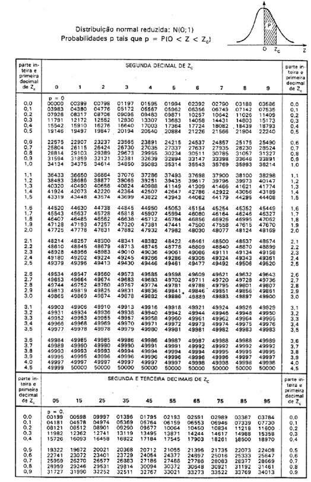

# 2 COMPARAÇÕES DE PARÂMETROS DE DUAS POPULAÇÕES

## 2.1 COMPARAÇÃO DAS VARIÂNCIAS DE DUAS POPULAÇÕES NORMAIS

Suponha duas amostras aleatórias independentes de tamanhos $n_1$ e $n_2$ ou  seja, $X_1,X_2,...,X_{n_1}$ e $Y_1,Y_2,...,Y_{n_2}$, respectivamente, de uma população com distribuição $N(\mu_1, \sigma_1^2)$ e de uma população com distribuição $N(\mu_2, \sigma_2^2)$.


**Hipóteses:**
$$
H_0: \sigma_1^2 = \sigma_2^2 \text{   ou   } \left(\frac{\sigma_1^2} {\sigma_2^2} =1\right) \\
H_1: \sigma_1^2 \neq \sigma_2^2 \text{   ou   } \left(\frac{\sigma_1^2} {\sigma_2^2} \neq 1\right)
$$

**Estatística do Teste**

Sendo $s_1^2$ e $s_2^2$  as variâncias amostrais, respectivamente,  das amostras $n_1$ e $n_2$, o quociente entre as razões

$$
 \frac{s^2_1/\sigma^2_1}{s^2_2/\sigma^2_2}
$$
Segue uma distribuição **F de Snedecor** com parâmetros $n_1-1$ e $n_2-1$ **graus de liberdade** (GL), denotada por $F(n_1-1,n_2-1)$

Sob a suposição de $H_0$ ser verdadeira, isto é,  $\sigma_1^2 = \sigma_2^2$, tem-se que:          

$$
F= \frac{s^2_1}{s^2_2} \approx F(n_1-1,n_2-1)
$$

Para informações mais detalhada a respeito dessa distribuição, recomenda-se:  [An Introduction to the F Distribution](https://www.youtube.com/watch?v=G_RDxAZJ-ug)


A função densidade de probabilidade da distribuição $F$ é dada por:

$$
f(x) = \frac{\Gamma(\frac{\nu1+\nu2}{2})(\frac{\nu1}{\nu2})^{\frac{\nu1}{2}}x^{\frac{\nu1}{2}-1}}{\Gamma(\frac{\nu1}{2}) \Gamma(\frac{\nu2}{2}) (1+\frac{\nu1}{\nu2}x)^{\frac{\nu1+\nu2}{2}}} \text{   para   } x> 0 
$$
Onde: $\nu1$ são os graus de liberdade de $s^2_1$, $\nu2$ são os graus de liberdade de $s^2_2$ e $\Gamma$ é a função **Gama**, uma extensão da função fatorial para números reais positivos no espaço contínuo.

**Construção da região crítica:**

Fixado $\alpha$ (chance de ocorrer o **erro tipo I**), os pontos críticos serão *F1* e *F2* da distribuição $F$, tais que:


```{r, echo=FALSE, message=FALSE,error=FALSE,warning=FALSE}
library(tidyverse)
data.frame(x=0,y=1) %>% 
  ggplot(aes(x=x,y=y)) + 
  stat_function(fun = function(.x) df(.x,8,8),lwd=1.3,col="red")+
  xlim(0,5)+ ylim(0,.75)+
  geom_vline(xintercept = c(0.25,3.3),col="blue",lty=2) +theme_minimal()+
  geom_vline(xintercept = 0)+geom_hline(yintercept = 0)+
  annotate('text', label = expression(alpha/2), x = 0.12, y = .52)+ 
  annotate("segment", x = 0.10, xend = 0.2, y = .48, yend = .15, 
           colour = "black", size=1, alpha=0.6, arrow=arrow()) +
  annotate('text', label = expression(alpha/2), x = 4, y = .1)+
  annotate("segment", x = 4, xend = 3.5, y = .06, yend = .02, 
           colour = "black", size=1, alpha=1, arrow=arrow()) +
  labs(y="Densidade",x="F", title = "F(5,7)")+
  annotate('text', label = expression(1 - alpha), x = 1, y = .3,size=8)+
  annotate('text', label = expression(F[1(1-alpha/2)]), x = .55, y = 0.025,size=5)+
  annotate('text', label = expression(F[2(alpha/2)]), x = 2.9, y = 0.025,size=5)
```


Se $\alpha = 10\%$, por exemplo, podemos encontrar o valor de $F_{2(5\%)}$, utilizando a Tabela abaixo:


[Download da Tabela](https://github.com/arpanosso/ExpAgr_2020/raw/master/TabelaF.pdf)


**Exemplo**

Dado: $n_1-1 = 5$ e $n_2-1 = 7$, e $\alpha = 5\%$ temos que olhar na coluna $5$ (graus de liberdade do numerador) e na linha $7$ (graus de liberdade do denominador) e teremos o valor $F_2 = 3,97$

Para encontrarmos $F_{1(5\%)}$, utilizamos uma propriedade de integração, o que na prática significa:

$$
F_{(1-\alpha, n_1-1, n_2-1)} = \frac{1}{F_{(\alpha, n_2-1, n_1-1)}} \\
\text{ou seja} \\
F_{(95\%, n_1-1, n_2-1)} = \frac{1}{F_{(5\%, n_2-1, n_1-1)}} \\
F_{(95\%, 5, 7)} = \frac{1}{F_{(5\%, 7, 5)}} = \frac{1}{4,88} = 0,205
$$

O valor é o inverso daquele observado na Tabela, obtido pela inversão dos graus de liberdade.

Portanto, a região crítica do teste será: $RC = \{ F <  0,205 \text{  ou  } F > 3,97 \}$.

O mesmo valor pode ser obtido no $R$ a partir da função `qf(p,df1,df2)`, cujos argumentos são: `p` o valor da área (probabilidade) acumulada até o valor $F$ desejado, `df1` são os graus de liberdade do numerador e `df2` são os graus de liberdade do denominador da razão $\frac{s^2_1}{s^2_2}$:


```{r}
qf(0.95,5,7) # F2
qf(0.05,5,7) # F1
```


Na prática o procedimento é mais simples: primeiro calcula-se o $F$ da amostra utilizando **SEMPRE O MAIOR VALOR DE VARIÂNCIA NO NUMERADOR** $(s^2_1 > s_2^2)$, portanto $F > 1$ e consideramos o ponto crítico sempre em  $F_{2(\alpha, n_1-1, n_2-1)}$

```{r, echo=FALSE, message=FALSE,error=FALSE,warning=FALSE}
data.frame(x=0,y=1) %>% 
  ggplot(aes(x=x,y=y)) + 
  stat_function(fun = function(.x) df(.x,5,7),lwd=1.3,col="red")+
  xlim(0,5)+ ylim(0,.75)+
  geom_vline(xintercept = qf(0.95,5,7),col="blue",lty=2) +theme_minimal()+
  geom_vline(xintercept = 0)+geom_hline(yintercept = 0)+
  annotate('text', label = expression(alpha), x = 4.3, y = .1,size=7)+
  annotate("segment", x = 4.3, xend = 4.3, y = .06, yend = .01, 
           colour = "black", size=1, alpha=1, arrow=arrow()) +
  labs(y="Densidade",x="F", title = "F(5,7)")+
  annotate('text', label = expression(paste(1 - alpha,"= 0.95")), x = .85, y = .3,size=6)+
    annotate('text', label = expression(F[c(alpha)]), x = 3.8, y = 0.065,size=5)
```

Assim, a **região crítica** do teste será $RC = \{F \ge F_c\}$

Calculamos a **estatística na amostra** como :

$$
F_{obs} = \frac{s^2_1}{s^2_2} \text{, com }  s_1^2 > s^2_2
$$
As **hipóteses** sempre serão:  
$$
H_0: \sigma_1^2 = \sigma_2^2 \text{   ou   } (\sigma_1^2 /\sigma_2^2 =1) \\
H_1: \sigma_1^2 > \sigma_2^2 \text{   ou   } (\sigma_1^2 /\sigma_2^2 > 1)
$$

**Conclusão** 

Se $F_{obs} \not\in RC$ então **não rejeitamos** $H_0$ e concluímos que as variâncias são iguais ou seja, as variâncias são **HOMOCEDÁSTICAS**. 

Se $F_{obs} \in RC$ então **rejeitamos** $H_0$ e concluímos que as variâncias são diferentes ou seja, **HETEROCEDÁSTICAS** 

**EXEMPLO:**

Em um ensaio de competição de $2$ cultivares de milho, onde a cultivar $A$ foi plantada e $6$ parcelas  ($n_A=6$ amostras) e a cultivar $B$ em $8$ parcelas amostrais ($n_B=8$ amostras), as produções em $kg\;ha^{-1}$ foram obervadas na tabela:


Fonte: [Cruz (2009)](https://repositorio.unesp.br/bitstream/handle/11449/106194/cruz_fab_dr_ilha.pdf?sequence=1&isAllowed=y)

Cultivar|||||||||
---|---|---|---|---|---|---|---|---|---|
$A$|1470|1920|2340|2100|1920|1480|||
$B$|3260|3990|4050|3420|3510|3880|3550|3660|

Comparar ao nível de $5\%$ de significância ($\alpha = 0,05$) se as variâncias desses cultivares são iguais.

**PASSO 1:** Definir $H_0$ e $H_1$.
$$
H_0: \sigma_1^2 = \sigma_2^2 \text{   ou seja,  } (\sigma_1^2 /\sigma_2^2 = 1 ) \\
H_1: \sigma_1^2 > \sigma_2^2 \text{   ou seja,  } (\sigma_1^2 /\sigma_2^2 > 1)
$$

**PASSO 2:** Calcular a estatística do teste.

Definir os graus de liberdade:

$$
n_A = 6 \\
n_B = 8
$$

Assim:

$$
\nu_1 = 6 - 1 = 5 \\
\nu_2 = 8 - 1 = 7 \\
$$

Calcular as variâncias amostrais de $A$ e $B$:


$$
s_A^2 = 118176,7 \\
s_B^2 = 80200,00 
$$

Como $s^2_A > s^2_B$ vamos calcular a estatística do teste:

$$
F_{obs} = \frac{s^2_A}{s^2_B} = \frac{118076,7}{80200}=1,4735
$$
**PASSO 3:** Construir a Região Crítica.

```{r, echo=FALSE, message=FALSE,error=FALSE,warning=FALSE}
data.frame(x=0,y=1) %>% 
  ggplot(aes(x=x,y=y)) + 
  stat_function(fun = function(.x) df(.x,5,7),lwd=1.3,col="red")+
  xlim(0,5)+ ylim(0,.75)+
  geom_vline(xintercept = qf(0.95,5,7),col="blue",lty=2) +theme_minimal()+
  geom_vline(xintercept = 0)+geom_hline(yintercept = 0)+
  annotate('text', label = expression(paste("5%")), x = 4.7, y = .08,size=5,col="red")+
  labs(y="Densidade",x="F", title = "F(5,7)")+
     annotate('text', label = expression(F[c]), x = 3.8, y = 0.065,size=5)+  
  annotate('text', label = "Região crítica a", x = 4.6, y = 0.15,size=5,col="red")
```

Olhando na tabela $F_{(0,05; 5; 7)} = 3,97$

Assim, a **região crítica** do teste será $RC = \{F > 3,97\}$

**PASSO 4:** Comparar $F_{obs}$ com o $F_c$.


```{r, echo=FALSE, message=FALSE,error=FALSE,warning=FALSE}
data.frame(x=0,y=1) %>% 
  ggplot(aes(x=x,y=y)) + 
  stat_function(fun = function(.x) df(.x,5,7),lwd=1.3,col="red")+
  xlim(0,5)+ ylim(0,.75)+
  geom_vline(xintercept = qf(0.95,5,7),col="red",lty=2) +theme_minimal()+
  geom_vline(xintercept = 0)+geom_hline(yintercept = 0)+
  labs(y="Densidade",x="F", title = "F(5,7)")+
  annotate('text', label = expression(3.97), x = 3.8, y = 0.065,size=5,col="red")+
  geom_vline(xintercept = 1.47,col="blue",lwd=2) + 
  annotate('text', label = expression(paste(F[obs],"= 1.4735")), x = 0.85, y = 0.065,size=5,col="blue")+
  annotate('text', label = "Região Crítica", x = 4.6, y = 0.15,size=5,col="red")
```

**PASSO 5:** Concluir o teste.

Como $F{obs} \not\in RC$ **não rejeitamos ** $H_0$ ao nível de 5% de significância, e concluímos que as variedades de milhos testadas têm variâncias semelhantes, ou seja, são **homocedásticas**.


### Resolvendo no R


```{r}
# Construir os vetores de dados
A<- c(1470,1920,2340,2100,1920,1480)
B<- c(3260,3990,4050,3420,3510,3880,3550,3660)

# Aplicar o teste de variâncias
var.test(A,B,conf.level = 0.95)
```

### Interpretação no R

Observe que a função retorna a estatística do teste $F = 1.4735$ seguido pelos valores de graus de liberdade ($df$, do inglês degrees of freedom) para o numerador ($5$) e para o denominador ($7$), e o valor-p ($p-value = 0.6176$). 

**Passo 1**: Identificar o p-valor ($p-value$) do teste:

O $p-value$ indica a probabilidade (área embaixo da curva) após o valor de $F_{obs}$, ou seja, a probabilidade associada à estatística $F_{obs}$ foi de $0,6176$, como apresentado abaixo:

```{r, echo=FALSE, message=FALSE,error=FALSE,warning=FALSE}
data.frame(x=0,y=1) %>% 
  ggplot(aes(x=x,y=y)) + 
  stat_function(fun = function(.x) df(.x,5,7),lwd=1.3,col="red")+
  xlim(0,5)+ ylim(0,.75)+
  theme_minimal()+
  geom_vline(xintercept = 0)+geom_hline(yintercept = 0)+
  labs(y="Densidade",x="F", title = "F(5,7)")+
  geom_vline(xintercept = 1.47,col="blue",lwd=2) + 
  annotate('text', label = expression(paste(F[obs])), x = 1.3, y = 0.065,size=4,col="blue") +
  annotate('text', label = "p-value = 0.6176", x = 2.3, y = 0.045,size=5,col="blue")

```

**PASSO 2:** Comparar $p-value$ com o $\alpha$.

Se $p-value > \alpha$ então **não rejeitamos** $H_0$ e concluímos que as variâncias são iguais, ou seja, **HOMOCEDÁSTICAS**, caso contrário, **rejeitamos** $H_0$.  

**PASSO 3:** Concluir o teste.

Para o nosso exemplo, $p-value$ foi maior que o $\alpha$, ou seja:

Como $p-value > \alpha$ **não rejeitamos ** $H_0$ ao nível de 5% de significância, e concluímos que as variedades de milhos testadas são **homocedásticas**.

## 2.2	Comparação de duas médias de populações normais: amostras independentes

Com o objetivo de se comparar duas populações ou, sinonimamente, dois tratamentos, examinaremos a situação na qual os dados estão na forma de realizações de amostras aleatórias de tamanhos $n_1$ e $n_2$, selecionadas, respectivamente, das populações $1$ e $2$. 

Os dados são as medidas das respostas associadas com o seguinte delineamento experimental. Uma coleção de $n_1 + n_2$ elementos são aleatoriamente divididos em $2$ grupos de tamanhos $n_1$ e $n_2$, onde cada membro do primeiro grupo recebe o tratamento $1$ e do segundo, o tratamento $2$.

Especificamente, estaremos interessados em fazer inferência sobre o parâmetro: $\mu_1 - \mu_2$ (média da população 1) - (média da população 2)

Formalmente, suponha duas amostras aleatórias independentes de tamanhos $n_1$ e $n_2$ ou  seja, $X_1, X_2,...,X_{n_1}$ e $Y_1, Y_2,...,Y_{n_2}$, respectivamente, de uma população com distribuição $N(\mu_1, \sigma_1^2)$ e de uma população com distribuição $N(\mu_2, \sigma_2^2)$.

Para cada uma dessas populações nós temos os seguintes estimadores $\bar{x}$, $\bar{y}$ médias de população $1$ e $2$ respectivamente e $s^2_1$, $s^2_2$ variâncias amostrais para as populações $1$ e $2$, respectivamente.

**Hipóteses:**
$$
\begin{cases} H_0:\mu_1=\mu_2, \; ou\;(\mu_1-\mu_2 = 0) \\ 
H_1: \mu_1\neq\mu_2, \; ou\;(\mu_1-\mu_2 \neq 0),\; bilateral
\end{cases}
$$

ou

$$
H_1: \mu_1 >\mu_2, \; ou\;(\mu_1-\mu_2 > 0),\; unilateral \; direita
$$

ou

$$
H_1: \mu_1 < \mu_2, \; ou\;(\mu_1-\mu_2 < 0),\; unilateral\; esquerda 
$$

**Estatística do Teste:**

$$
z = \frac{(\bar{x}-\bar{y})-(\mu_1-\mu_2)}{\sqrt{\frac{\sigma^2_1}{n_1}+\frac{\sigma^2_2}{n_2}}} \approx N(0,1)
$$


### 2.2.1 Caso 1: variâncias populacionais conhecidas

Para testar a hipótese $H_0$  usa-se  a   estatística  anterior.  
Ao supormos $H_0$ verdadeira então $\mu_1-\mu_2 = 0$, portanto a estatística:

$$
z = \frac{(\bar{x}-\bar{y})}{\sqrt{\frac{\sigma^2_1}{n_1}+\frac{\sigma^2_2}{n_2}}}
$$

Tem distribuição $N(0,1)$, portanto a região crítica do teste é construída a partir da **Tabela Normal Padrão**




[Download da Tabela](https://github.com/arpanosso/ExpAgr_2020/raw/master/TabelaNormal.pdf)


### 2.2.2 Caso 2: variâncias populacionais desconhecidas e iguais (Teste t)

Preliminarmente, testa-se se as variâncias das duas populações são iguais, homocedásticas, pelo teste **F de Snedecor**. 

Caso a hipótese $H_0$ não seja rejeitada, vamos utilizar a estatística estatística $t$ com $n_1 + n_2 - 2$ graus de liberdade:

$$
t = \frac{(\bar{x} - \bar{y})}{S_p \cdot \sqrt{\frac{1}{n_1} +\frac{1}{n_2}} } \approx t(n_1+n_2 - 2)
$$

$Sp$ é o estimador não viciado do desvio padrão das populações, o qual é calculado por uma média ponderada:

$$
S_P=\sqrt{\frac{(n_1 - 1)  s^2_1+(n_2-1)s^2_2}{(n_1 - 1)+(n_2-1)}}
$$

Portanto a região crítica do teste é construída a partir da **Tabela  da distribuição t** ao nível $\alpha$ com $n_1 + n_2 - 2$ graus de liberdade.


[Download da Tabela](https://github.com/arpanosso/ExpAgr_2020/raw/master/Tabela_tdeStudent.pdf)

### 2.2.3 Caso 3: variâncias populacionais desconhecidas e desiguais (Teste de Smith-Satterthwaite)

Quando a hipótese de igualdade de variâncias for rejeitada, a estatística do teste fica:

$$
t = \frac{(\bar{x}-\bar{y})}{\sqrt{\frac{s^2_1}{n_1}+\frac{s^2_2}{n_2}}}:
$$

Essa estatística aproxima-se de uma dirtribuição $t$ de Student com o número de graus de liberdade dado por, aproximadamente:


$$
gl'=\frac{(\frac{s^2_1}{n_1}+\frac{s_2^2}{n_2})^2}{\frac{(\frac{s^2_1}{n_1})^2}{n_1-1}+\frac{(\frac{s^2_2}{n_2})^2}{n_2-1}}
$$

Como o número de graus de liberdade assim calculado, geralmente, é **não inteiro**, recomenda-se aproximá-lo para o **inteiro imediatamente anterior** a este.


**EXEMPLO:**

Para o exemplo anterior, temos

Cultivar|||||||||
---|---|---|---|---|---|---|---|---|---|
1|1470|1920|2340|2100|1920|1480|||
2|3260|3990|4050|3420|3510|3880|3550|3660|

Comparar ao nível de 5% de significância se as **Médias** desses cultivares são iguais.

**PASSO 1:** Definir $H_0$ e $H_1$.
$$
H_0: \mu_1 = \mu_2 \text{   ou   } (\mu_1 - \mu_2 =0) \\
H_1: \mu_1 \neq \mu_2 \text{   ou   } (\mu_1 - \mu_2\neq 0)
$$

**PASSO 2:** Calcular a estatística do teste para o **caso 2 variâncias populacionais desconhecidas e iguais (Teste t)**.

Calcular a média dos cultivares:

**Cultivar A**

$$
Média: \bar{x}  = 1871,667\;kg\;ha^{-1}\\
Variância: s^2_1 = 118176.7\;[kg\;ha^{-1}]^2
$$

**Cultivar B**

$$
Média: \bar{x}  = 3665\;kg\;ha^{-1}\\
Variância: s^2_1 = 80200\;[kg\;ha^{-1}]^2
$$
Vamos estimar $Sp$:

$$
S_P=\sqrt{\frac{(n_1 - 1) s^2_1+(n_2-1) s^2_2}{(n_1 - 1)+(n_2-1)}} =\sqrt{\frac{(6 - 1) 118176.7+(8-1) 80200}{(6 - 1)+(8-1)}} = 309,8768\;kg\;ha^{-1}
$$

```{r}
sqrt(((6-1)*118176.7+(8-1)*80200)/(6-1+8-1))
```

Vamos calcular a estatística:

$$
t_{obs} = \frac{(\bar{x} - \bar{y})}{S_p \cdot \sqrt{\frac{1}{n_1} +\frac{1}{n_2}} }=\frac{(1871,667 - 3665)}{309,8768 \cdot \sqrt{\frac{1}{6} +\frac{1}{8}} } = -10,7159
$$


```{r}
(1871.667-3665)/(309.8768*sqrt(1/6+1/8))
```

**PASSO 3:** Construir a Região Crítica.

A região crítica do teste será construída a partir da **Tabela  da distribuição t** ao nível $5\%$ com $(6 + 8 - 2) = 12 $ graus de liberdade.

```{r, echo=FALSE, message=FALSE,error=FALSE,warning=FALSE}
data.frame(x=0,y=1) %>% 
  ggplot(aes(x=x,y=y)) + 
  stat_function(fun = function(.x) dt(.x,12),lwd=1.3,col="red")+
  xlim(-5,5)+ ylim(0,.5)+
  geom_vline(xintercept = qt(c(0.025,0.975),12),col="blue",lty=2) +theme_minimal()+
  geom_vline(xintercept = 0)+geom_hline(yintercept = 0)+
  annotate('text', label = expression(paste("2,5%")), x = 2.7, y = .08,size=5,col="red")+
  annotate('text', label = expression(paste("2,5%")), x = -2.7, y = .08,size=5,col="red")+
  labs(y="Densidade",x="t", title = "t(12)")+
  annotate('text', label = expression(t[c]), x = 2, y = 0.02,size=5)+
  annotate('text', label = expression(-t[c]), x = -2, y = 0.02,size=5)+
  annotate('text', label = "Região crítica a", x = 4.6, y = 0.15,size=5,col="red")+
  annotate('text', label = "Região crítica a", x = -4, y = 0.15,size=5,col="red")
```

Olhando na tabela $t_{(0,05; 12)} = 2,179$

Assim, a **região crítica** do teste será $RC = \{t < -2,179 \;ou\;t>2,179\}$

**PASSO 4:** Comparar $t_{obs}$ com o $t_c$.


```{r, echo=FALSE, message=FALSE,error=FALSE,warning=FALSE}
data.frame(x=0,y=1) %>% 
  ggplot(aes(x=x,y=y)) + 
  stat_function(fun = function(.x) dt(.x,12),lwd=1.3,col="red")+
  xlim(-12,5)+ ylim(0,.5)+
  geom_vline(xintercept = qt(c(0.025,0.975),12),col="blue",lty=2) +theme_minimal()+
  geom_vline(xintercept = 0)+geom_hline(yintercept = 0)+
  annotate('text', label = expression(paste("2,5%")), x = 2.7, y = .08,size=5,col="red")+
  annotate('text', label = expression(paste("2,5%")), x = -2.7, y = .08,size=5,col="red")+
  labs(y="Densidade",x="F", title = "t(12)")+
  annotate('text', label = expression(t[c]), x = 2, y = 0.02,size=5)+
  annotate('text', label = expression(-t[c]), x = -2, y = 0.02,size=5)+
  annotate('text', label = "Região crítica a", x = 4.6, y = 0.15,size=5,col="red")+
  annotate('text', label = "Região crítica a", x = -4, y = 0.15,size=5,col="red")+
  geom_vline(xintercept = -10.71,col="blue",lwd=2) 
```

**PASSO 5:** Concluir o teste.

Como $t_{obs} \in RC$ **rejeitamos ** $H_0$ ao nível de $5\%$ de significância, e concluímos que as médias dos cultivares de milhos são diferentes, ou seja, a cultivar $B$ apresenta uma média de produtividade maior que a cultivar $A$.


```{r}
# Construir os vetores de dados
A<- c(1470,1920,2340,2100,1920,1480)
B<- c(3260,3990,4050,3420,3510,3880,3550,3660)

# Aplicar o teste de Médias, pelo teste t
t.test(A,B,
       alternative = "t", # use t para bilateral, "l" para unilateral a esquerda e "g" para unilateral a direita
       var.equal = TRUE,  # TRUE se as variância forem iguais, caso contrário, FALSE
       conf.level = 0.95) # Nível de confiança do teste
```

**Interpretação no R**: Observe que a função retorna a estatística do teste $t = -10.716$ seguido pelos valores de graus de liberdade ($df$) igual a $12$, e o $p-value = 1.688e-07$ que significa $0,0000001688$ valor bem próximo a $0$. 


O $p-value$ indica a probabilidade (área embaixo da curva) antes do valor de $t_{obs}$, no caso dele ser negativo, a probabilidade associada à estatística $t_{obs}$ foi de $0,0000001688$, como apresentado abaixo. Se o valor de $t_{obs}$ for positivo, 0 $p-value$ indica a probabilidade (área embaixo da curva) depois do valor de $t_{obs}$

```{r, echo=FALSE, message=FALSE,error=FALSE,warning=FALSE}
data.frame(x=0,y=1) %>% 
  ggplot(aes(x=x,y=y)) + 
  stat_function(fun = function(.x) dt(.x,12),lwd=1.3,col="red")+
  xlim(-13,5)+ ylim(0,.5)+
  geom_vline(xintercept = qt(c(0.025,0.975),12),col="blue",lty=2) +theme_minimal()+
  geom_vline(xintercept = 0)+geom_hline(yintercept = 0)+
  annotate('text', label = expression(paste("2,5%")), x = 2.7, y = .08,size=5,col="red")+
  annotate('text', label = expression(paste("2,5%")), x = -2.7, y = .08,size=5,col="red")+
  labs(y="Densidade",x="F", title = "t(12)")+
  annotate('text', label = expression(t[c]), x = 2, y = 0.02,size=5)+
  annotate('text', label = expression(-t[c]), x = -2, y = 0.02,size=5)+
  annotate('text', label = "Região crítica a", x = 4.6, y = 0.15,size=5,col="red")+
  annotate('text', label = "Região crítica a", x = -4, y = 0.15,size=5,col="red")+
  geom_vline(xintercept = -10.71,col="blue",lwd=2)+
  annotate('text', label = "p-value \n 1.688e-07", x = -12.3, y = 0.045,size=5,col="blue")
```

**PASSO 2:** Comparar $p-value$ com o $\alpha$.

Se $p-value > \alpha$ então **não rejeitamos** $H_0$ e concluímos que as médias são iguais, caso contrário, **rejeitamos** $H_0$.  

**PASSO 3:** Concluir o teste.

Para o nosso exemplo, $p-value$ foi menor que o $\alpha$, ou seja:

Como $p-value < \alpha$ **rejeitamos ** $H_0$ ao nível de 5% de significância, e concluímos que os cultivares de milhos testadas são apresentam médias diferentes.
