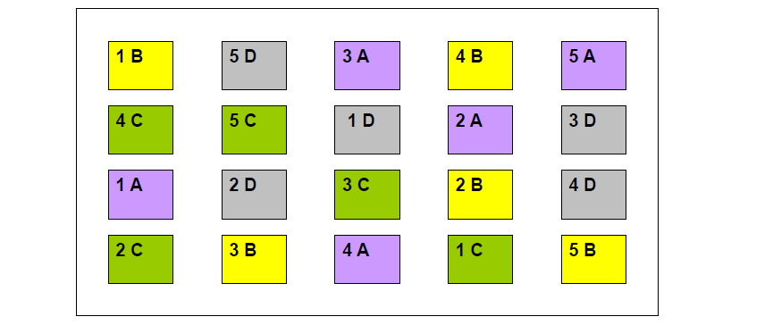
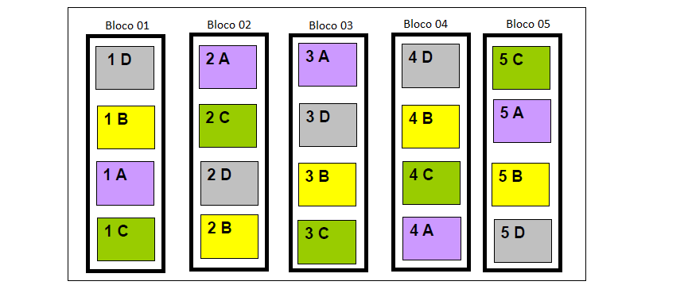
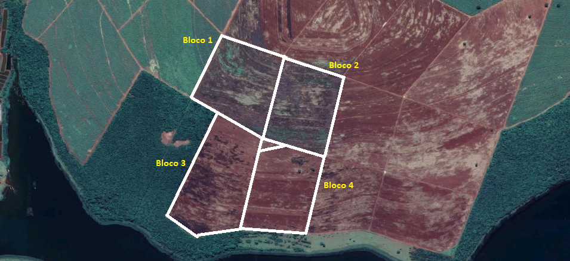
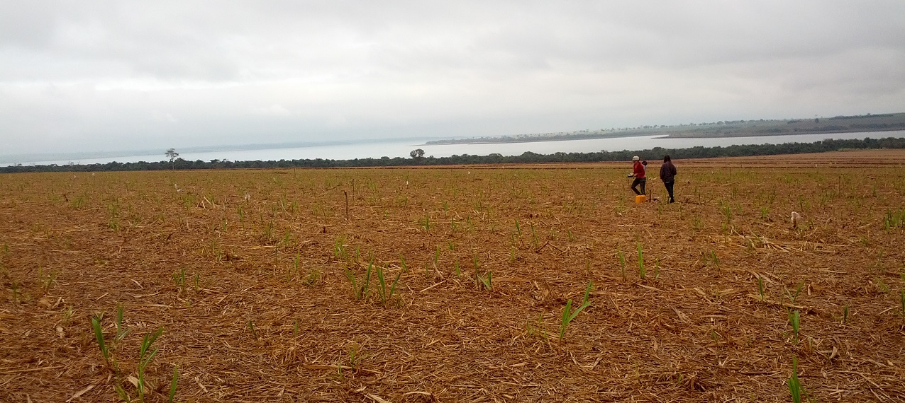
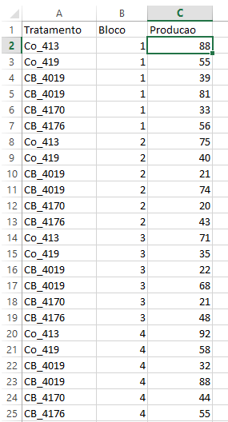
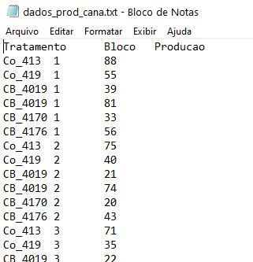

# 3. PLANEJAMENTO DE EXPERIMENTOS 

## 3.1. INTRODUÇÃO

O principal objetivo da **Estatística Experimental** é o estudo dos experimentos, seu planejamento, execução, análise e interpretação dos resultados obtidos.

Os dados que empregamos na análise estatística constituem uma amostra da população em estudo, e são obtidos de trabalhos previamente planejados, que são os **EXPERIMENTOS**, sendo por isso chamados de **dados experimentais.**

O que nos obriga utilizar a análise estatística é a presença em todos os dados experimentais, de efeitos de **fatores não controlados** (que podem ou não ser controláveis) e que causam a variação na característica alvo de estudo (variável resposta). 

Entre os fatores que não podem ser controlados, podemos citar: 

+ pequenas variações nas lâminas de molhamento de irrigação;  

</img>
  
  
+ pequenas variações na infestação das parcelas pelas pragas de estudo;

</img>  

+ variação na constituição genética das plantas; 

</img>  

+ pequenas variações na fertilidade do solo;  

</img>  

+ profundidade de semeadura, entre outros.

</img> 


Esses efeitos, que estão sempre presentes, não podem ser conhecidos individualmente e, no conjunto alteram, pouco ou muito, os resultados obtidos.

Os efeitos desses fatores que não podem ser controlados são chamados de **variação do acaso** ou **variação aleatória**.

Procurando tornar mínima a variação do acaso, o experimentador deve fazer o planejamento do experimento de tal forma que consiga isolar os efeitos de todos os fatores que podem ser controlados.

O planejamento constitui a etapa inicial de qualquer trabalho, e, portanto, um experimento também deve ser devidamente planejado, de modo a atender aos interesses do experimentador e às hipóteses básicas necessárias para a validade da análise estatística.

Frequentemente o estatístico é consultado para tirar conclusões com base em dados experimentais. Como as conclusões dependem da forma como foi realizado o experimento, o estatístico solicitará uma descrição detalhada do experimento e de seus objetivos. Muitas vezes, ocorrem casos em que, após a descrição do experimento, o estatístico verifica que não pode chegar a conclusão alguma, uma vez que o experimentador não utilizou um delineamento adequado ou não atendeu às hipóteses básica necessárias para a validade da análise estatística. Para evitar essa perda de tempo e de recursos, é primordial o planejamento adequado do experimento.

Ao iniciar o planejamento de um experimento, o experimentador deve formular e responder a uma série de perguntas. Como exemplo, podemos citar:

**1. Quais as variáveis que serão analisadas?**

Num mesmo experimento, várias características podem ser estudadas. Por exemplo, num experimento com a cultura do milho, podemos determinar a altura das plantas, a porcentagem de plantas acamadas, a produção de grãos, o peso de 100 grãos, o comprimento da espiga, o diâmetro da espiga, etc. Portanto, devemos definir adequadamente as características (variáveis) de interesse, para que as mesmas possam ser determinadas no decorrer do experimento.

**2. Quais os fatores que afetam essas características?**

Relacionar todos os fatores que possuem efeito sobre as características que serão estudadas, como por exemplo: variedade, adubação, espaçamento, irrigação, tratos culturais, controle de pragas e doenças, etc.

**3. Quais desses fatores serão estudados no experimento?**

Nos experimentos simples, apenas um tipo de **tratamento** ou **fator** pode ser estudado de cada vez, sendo os demais fatores mantidos constantes. 

Por exemplo, quando fazemos um experimento de competição de variedades, todos os outros fatores tais como espaçamento, adubação, irrigação, tratos culturais devem ser os mesmos para todas as variedades. 

No caso de experimentos mais complexos, como os experimentos **fatoriais** e em **parcelas subdivididas**, podemos simultaneamente estudar os efeitos de dois ou mais tipos de **fatores**.

**4. Como será a unidade experimental ou parcela?**

A escolha da parcela deve ser feita de forma a minimizar o erro experimental. Devido à importância da definição de unidade experimental, faremos uma discussão mais detalhada sobre o assunto  em seguida.

**5. Quantas repetições deverão ser utilizadas?**

 O número de repetições de um experimento depende do número de tratamentos a serem utilizados e do delineamento experimental escolhido. De modo geral, recomenda-se que o número de parcelas do experimento não seja inferior a $20$ e que o número de graus de liberdade associado aos efeitos dos fatores não controlado ou acaso não seja inferior a $10$.


## 3.2. UNIDADE EXPERIMENTAL OU PARCELA

Um dos aspectos mais importantes a ser considerado durante o planejamento do experimento é a definição de unidade experimental ou parcela. De um modo geral a escolha da parcela deve ser feita de forma a minimizar o erro experimental, isto é, **as parcelas devem ser o mais uniforme possível**, para que as mesmas consigam refletir o efeito dos tratamentos aplicados.

### 3.2.1. TAMANHO DA PARCELA

Em experimentos de campo, o tamanho das parcelas pode variar bastante, em função dos seguintes fatores:

**1. Material com que se está trabalhando**: Dependendo da cultura que está sendo estudada, devemos aumentar ou diminuis o tamanho das parcelas. Por exemplo parcelas da cultura da soja geralmente são menores que as parcelas para a cultura da cana-de-açúcar ou para a cultura da Laranja.

**2. O objetivo da pesquisa**:  O objetivo do trabalho experimental também influencia no tamanho da parcela. Por exemplo, se desejamos estudar o efeito da profundidade de semeadura do sorgo granífero sobre o desenvolvimento inicial das plantas, não necessitamos trabalhar com parcelas tão grandes quanto as que seriam necessárias para um estudo de produção da cultura.

**3. Número de tratamentos em estudo**: Quando o número de tratamentos é muito grande, como ocorre com os experimentos de melhoramento vegetal, o tamanho das parcelas deve ser reduzido, para diminuir a distância entre as parcelas extremas, visando a homogeneidade entre elas.

**4. Quantidade disponível de sementes**: Nos experimentos de melhoramento genético vegetal, este é um fator limitante para o tamanho das parcelas.

**5. Uso de máquinas agrícolas**: Nos experimentos em que é necessária a utilização de máquinas agrícolas, tais como tratores e colhedoras, o tamanho das parcelas deve ser, obrigatoriamente, grande.


**6. Área total disponível para a pesquisa**: Frequentemente, o pesquisador tem que ajustar seu experimento ao tamanho da área disponível, que em geral é pequeno, o que resulta na utilização de parcelas pequenas. 


**7. Custo tempo e mão-de-obra**: São os principais fatores que limitam o tamanho das parcelas.

### 3.2.2. FORMA DA PARCELA

No que se refere à forma das parcelas, experimentos realizados em diversos países, como diferentes culturas, têm mostrado que, para se obter maior precisão, as parcelas devem ser compridas e estreitas, evitando-se que todas a parcela ocupem uma mancha de alta ou baixa fertilidade do solo, que possa existir na área experimental.

Para parcelas de tamanho pequeno, o efeito da forma é muito pequeno. O tamanho e a forma ideais para a parcela são aqueles que resultem em maior homogeneidade das parcelas.

Em alguns experimentos, devemos utilizar bordaduras nas parcelas, para se evitar a influência sobre a parcela, dos tratamentos aplicados nas parcelas vizinhas. Neste caso, teremos a **área total** e a **área útil** da parcela, sendo que os dados a serem utilizados na análise estatística serão aqueles coletados na **área útil da parcela**.

Nos experimentos em **casa-de-vegetação**, para a constituição de cada parcela, podemos utilizar um conjunto de vasos ou então, um único vaso com duas ou três plantas e, às vezes, uma única planta constituindo a unidade experimental.

Em experimentos de **laboratório**, uma amostra simples do material poderá constituir a parcela, porém, às vezes é necessário utilizar uma amostra composta. Quando são feitas várias determinações em uma mesma amostra, o valor da parcela será a média das várias determinações. 

Não devemos confundir as diversas determinações da mesma amostra, com as repetições do experimento.

## 3.3. PRINCÍPIOS BÁSICOS DA EXPERIMENTAÇÃO

Para assegurar que os dados serão obtidos de forma a propiciar uma análise correta e que conduza a conclusões válidas com relação ao problema em estudo, o experimentador deve levar com conta alguns princípios básicos ao planejar o experimento. 

### 3.3.1. PRINCÍPIO DA REPETIÇÃO

O princípio da repetição consiste na reprodução do experimento básico. Sejam, por exemplo e variedade, $A$ e $B$, plantadas em 2 parcelas o mais semelhante possível. O fato da variedade $A$ se comportar melhor que a $B$, pouco ou nada significa, pois a variedade $A$ pode ter tido um melhor comportamento por simples acaso.

Podemos tentar contornar o problema, plantando as variedades $A$ e $B$ em diversas parcelas, e considerando o comportamento médio de cada variedade. Aqui intervém o princípio da repetição, ou seja, a reprodução do experimento básico.

Entretanto, apenas esse princípio não resolve totalmente o problema, pois se todas as parcelas com a variedade $A$ estiverem agrupadas, e aquelas com a variedade $B$ também, o efeito de fatores não controlados continuará a ser uma hipótese possível para o melhor comportamento da variedade $A$. 

### 3.3.2. PRINCÍPIO DA CASUALIZAÇÃO

Princípio da casualização consiste na distribuição dos tratamentos às parcelas de forma casual, para evitar que um determinado tratamento venha a ser beneficiado por sucessivas repetições em parcelas melhores.

Se, por exemplo, temos as duas variedades $A$ e $B$ distribuídas ao acaso em $6$ parcelas cada, teremos:


Então, se a variedade $A$ se comportar melhor que a $B$ em qualquer das parcelas, pela teoria de probabilidades, a probabilidade de que isso ocorra por acaso é:

$$
p = \frac{6! \cdot 6!}{12!} = \frac{1}{924} = 0,1\% \Rightarrow q=1-p=99,9\%
$$
Isso significa que o resultado obtido ainda pode ser devido ao acaso, porém a probabilidade de que isso ocorra por acaso é apenas de $0,1\%$, ou seja, existe uma probabilidade de $99,9\%$ de que haja realmente um melhor comportamento de um dos tratamentos.


### 3.3.3.  PRINCÍPIO DO CONTROLE LOCAL

Este princípio é frequentemente utilizado, mas não é de uso obrigatório. A função do controle local é tornar o delineamento mais eficiente, reduzindo o erro experimental. 

O controle local consiste na formação de grupos de parcelas o mais homogêneos possível, de modo a reduzir o erro experimental. Cada grupo constitui um bloco, sendo que os tratamentos devem ser sorteados dentro de cada bloco. Por exemplo:



## 3.4. RELAÇÃO ENTRE PRINCÍPIOS BÁSICOS DA EXPERIMENTAÇÃO E OS DELINEAMENTOS EXPERIMENTAIS

A análise de variância consiste na decomposição da variância total de um material heterogêneo em partes atribuídas a causas conhecidas e independentes e a uma porção residual de origem desconhecida e de natureza aleatória.

Quando planejamos um experimento, levando em conta apenas o princípio da repetição e da casualização, sem considerar o princípio do controle local, temos o **Delineamento Inteiramente Casualizado (DIC)** ou Delineamento Inteiramente ao Acaso.

Só devemos utilizar esse delineamento, quando temos certeza da homogeneidade das condições experimentais. É frequentemente utilizado em experimentos de laboratório onde as condições experimentais podem ser perfeitamente controladas.

Num experimento inteiramente Casualizado, com $5$ tratamentos, cada um dos quais foi repetido $5$ vezes, teremos o seguinte esquema de análise de variância:

```{r echo=FALSE, message=FALSE,error=FALSE,warning=FALSE}
require(kableExtra)
df<-data.frame(CV=c("Tratamentos","Resíduo","Total"),
               GL=c("4","20","24"))
names(df) <- c("Causas de Variação", "G.L.")
kable(df) %>% 
  kable_styling(bootstrap_options = "basic", full_width = FALSE) %>% 
  row_spec(c(3),bold=TRUE)
```

O **resíduo** ou **erro**, é a causa de variação que reflete o efeito dos fatores não controlados, também chamado de acaso.

Quando não há homogeneidade entre parcelas, devemos utilizar o princípio do controle local, estabelecendo blocos. Neste caso, o delineamento a ser utilizado é o **Delineamento de Blocos ao Acaso (DBC)**.

O esquema de análise de variância de um experimento em blocos causalizados com 5 tratamento de 5 repetições é dado por:  

```{r echo=FALSE, message=FALSE,error=FALSE,warning=FALSE}
df<-data.frame(CV=c("Tratamentos","Blocos","Resíduo","Total"),
               GL=c("4","4","16","24"))
names(df) <- c("Causas de Variação", "G.L.")
kable(df) %>% 
  kable_styling(bootstrap_options = "basic", full_width = FALSE) %>% 
  row_spec(c(4),bold=TRUE)
```

Quando necessitamos controlar 2 tipos de heterogeneidade, devemos utilizar o **Delineamento em Quadrados Latino (DQL)**. Neste delineamento, os tratamentos sofrem um duplo controle local, sendo dispostos em linhas e colunas.

Para um experimento em quadrado latino com $5$ tratamento, o esquema de análise de variância será:


```{r echo=FALSE, message=FALSE,error=FALSE,warning=FALSE}
df<-data.frame(CV=c("Tratamentos","Linhas","Colunas","Resíduo","Total"),
               GL=c("4","4","4","12","24"))
names(df) <- c("Causas de Variação", "G.L.")
kable(df) %>% 
  kable_styling(bootstrap_options = "basic", full_width = FALSE) %>% 
  row_spec(c(5),bold=TRUE)
```

# 4. TESTES DE SIGNIFICÂNCIA 

## 4.1. INTRODUÇÃO

Um dos principais objetivos da estatística é a tomada de decisão a respeito da população, com base nas observações de amostra, ou seja, a obtenção de conclusões válidas para toda a população com base em amostra retiradas dessas populações.

Ao tentarmos tomar decisões, é conveniente a formulação de hipóteses ou suposições relativas às populações. Essas suposições, que podem ou não ser verdadeiras são chamadas de **hipóteses estatísticas** e consistem, geralmente, em considerações a respeito das distribuições de probabilidade das populações.

Em muitos casos formulamos uma hipótese estatística com o objetivo de rejeitá-la ou invalida-la. Por exemplo, quando realizamos um experimento com o objetivo de verificar qual é a variedade de cana-de-açúcar mais produtiva, formulamos a hipótese de que não existem diferenças entre as variedades em relação à produção (isto é, que quaisquer diferenças observadas são devidas unicamente aos fatores não controlado ou acaso). Essa hipótese inicial que formulamos, é denominada de **hipótese da nulidade* e é representada por $H_0$*.

Admitindo-se está hipótese como verdadeira, se verificarmos que os resultados obtidos ao final do experimento em uma amostra aleatória diferem acentuadamente dos resultados esperados para essa hipótese, com ase na teoria das probabilidades, podemos concluir que as diferenças observadas são significativas, e rejeitar essa hipótese $H_0$.

Então, rejeitamos a hipótese da nulidade em favor de uma outra, que é representada por $H_1$ e denominada de **hipótese alternativa**. Por exemplo, no caso da comparação entre variedade, a hipótese alternativa seria: As variedades testadas se comportam de maneira diferente em relação à produção de cana-de-açúcar.

Os métodos que nos permitem decidir se aceitamos ou rejeitamos uma determinada hipótese, ou se a amostra observada difere significativamente dos valores esperados, são denominados **testes de significância** ou **testes de hipóteses**.

Porém, ao tomarmos decisões de rejeitar ou aceitar uma determinada hipótese, estamos sujeitos a incorrer em dois tipos de erros:

**ERRO TIPO I**: é o erro que cometemos ao rejeitar uma determinada hipótese verdadeira, que deveria ser aceita.

**ERRO TIPO II**: é o erro que cometemos ao aceitar uma hipótese falsa, que deveria ser rejeitada.

Esses dois tipos de erros são associados de tal forma que à medida que diminuímos a probabilidade de ocorrência de um deles, automaticamente aumentamos a probabilidade de ocorrência de outro.

Geralmente, em estatística controla apenas o **erro Tipo I**, por meio do nível de significância do teste.

**O nível de significância do teste**, representado por $\alpha$ é a probabilidade máxima com que nos sujeitamos a correr o risco de cometer o **erro Tipo I**, ao testarmos uma hipótese.

Na prática é usual fixarmos esse nível de significância em 5% ou em 1%, ou seja $\alpha = 0,05$ ou $\alpha = 0,01$.

Então, se por exemplo, escolhermos o nível de significância de 5%$(\alpha=0,05)$, isto indica que temos 5 chances em 100 de rejeitarmos uma hipótese que deveria ser aceita, isto é, há uma confiança de 95% de que tenhamos tomado uma decisão correta.

Esta confiança que temos de termos tomada uma decisão correta é denominada de **Grau de Confiança do Teste**, e é dada por $100 \cdot (1-\alpha) \%$.

O teste de significância mais utilizado em estatística experimental é o **Teste F**, que estudaremos a seguir.


## 4.2. TESTE F DE SNEDECOR PARA ANÁLISE DE VARIÂNCIA

A **Análise de Variância** é uma técnica que nos permite fazer a decomposição da variância total em parte atribuídas a causas conhecidas e independentes e uma porção residual de origem desconhecida e de natureza aleatória.

O teste F tem por finalidade comparar estimativas de variâncias.

Na análise de variância, as estimativas de variância são dadas pelos **quadrados médios** (Q.M.) e obtemos um Q.M. para cada causa de variação. Assim, em um experimento inteiramente casualizado, temos duas estimativas de variância: uma devido aos efeitos de tratamentos (dadas pelo **QM Tratamentos**) e outra devida aos efeitos dos fatorem não controlados ou acaso (dada pelo **QM Resíduo**).

Para aplicar o teste F na análise de variância, utilizamos sempre no denominador, o **QM Resíduo**, ou seja, comparamos sempre uma variância devida aos efeitos do fator controlado (Tratamentos, Blocos, Linhas, Colunas, etc.), com a variância devida aos efeitos dos fatores não controlados ou acaso (Resíduos)

Então:

$$
F= \frac{QM_{Tratamentos} }{ QM_{Resíduos}}
$$

Sob a hipótese da nulidade, isto é, supondo-se que os efeitos dos tratamentos são todos equivalentes, teríamos duas estimativas de variância (**QM Tratamentos** e **QM Resíduo**) que não deveriam diferir, a não ser por flutuações amostrais, pois ambas estimam a variação do acaso.

Assim, 

$QM_{Resíduo}$ - estima a variação do acaso: $\sigma^2$.

$QM_{Tratamentos}$ - estima a variação do acaso mais a variação devida ao efeito de tratamentos: $\sigma^2 + K \sigma^2_T$

Portanto, 

$$
F=\frac{QM_{Tratamentos}}{QM_{Resíduo} } = \frac{\sigma^2+K\sigma^2_t}{\sigma^2}
$$

A seguir, comparamos o valor de F calculado com os valores da tabela de distribuição F (geralmente aos níveis de 5% e 1%). Os valores críticos são obtidos na tabela da distribuição F, em função do número de graus de liberdade de tratamentos (ou blocos), na horizontal (numerador) e do número de graus de liberdade do resíduo, na vertical (denominador).

O critério do teste é o seguinte:

Se $F\;calculado \ge F\;tabelado$ o teste é significativo ao nível testado. Então, devemos rejeitar a hipótese da nulidade ($H_0$), e concluir que os efeitos dos tratamentos diferem entre si a esse nível de probabilidade, e essas diferenças não devem ser atribuídas ao acaso, mas sim aos efeitos dos tratamentos testatos, com um grau de confiância $100 \cdot(1-\alpha)\%$.

Se $F\;calculado \le F\;tabelado$ o teste é não significativo ao nível testado. Então, não devemos rejeitar a hipótese da nulidade ($H_0$). Neste caso concluímos que os efeitos dos tratamentos não diferem entre si a esse nível de probabilidae. Abaixo segue o esquema da distribuição F.


```{r, echo=FALSE, message=FALSE,error=FALSE,warning=FALSE}
require(tidyverse)
data.frame(x=0,y=1) %>% 
  ggplot(aes(x=x,y=y)) + 
  stat_function(fun = function(.x) df(.x,5,7),lwd=1.3,col="red")+
  xlim(0,5.3)+ ylim(0,.75)+
  geom_vline(xintercept = qf(0.95,5,7),col="blue",lty=2) +theme_minimal()+
  geom_vline(xintercept = 0)+geom_hline(yintercept = 0)+
  labs(y="Densidade",x="F", title = "Função de densidade de Probabilidade y = F(x;5;7)")+
  annotate('text', label = expression(paste("Região de aceitação de ")), x = .9, y = .20,size=4)+
  annotate('text', label = expression(paste(H[0]," ",(1 - alpha),"= 0,95")), x = .9, y = .15,size=4)+
  annotate('text', label = expression("Região de rejeição de "), x = 4.8, y = 0.25,size=4)+
  annotate('text', label = expression(paste(H[0]," (",alpha,"= 0,05)")), x = 4.8, y = 0.20,size=4)
```

Resumidamente, temos:

a) **Fcalc < Ftab(5%)** - O teste F é não significativo ao nível de $5\%$ de probabilidade. Aceitamos $H_0$ - Utiliza-se a notação $Fcalc^{NS}$.

b) **Ftab(5%) < Fcalc < Ftab(1%)** - O teste é significativo ao nível de $5\%$ de probabilidade. Rejeitamos $H_0$ com um grau de confiança superior a $95\%$. Utiliza-se a notação: $Fcalc^*$.

c) **Fcalc > Ftab(1%)** - O teste é significativo ao nível de $1\%$de probabilidade. Rejeitamos $H_0$ com um grau de confiança superior a $99\%$. Utiliza-se a notação: $Fcalc^{**}$.


## 4.3 EXEMPLO DE APLICAÇÃO DO TESTE F

Num experimento de competição de cultivares de cana-de-açúcar foram utilizados $6$ Tratamentos e $4$ repetições. As cultivares testadas foram:

1) Co 413
2) Co 419
3) CB 40/19
4) CB 40/69
5) CB 41/70
6) CB 41/76

O delineamento experimental utilizado foi em blocos casualizados, com os blocos controlando diferenças na fertilidade do solo entre terraços.


Croqui experimental localizada no município de Apareceida do Taboado (MS).


Croqui do experimento mostrando a disposição dos blocos na área experimental.



Aspectos gerais da uma parcela experimental.


Fonte: Arquivo pessoal.


Os dados experimentais, de produção da cultura foram tabulados em planilha eletrônica da seguinte forma.



[dados_prod_cana.xlsx](https://github.com/arpanosso/experimentacao-agricola-unesp-fcav/raw/master/data/dados_prod_cana.xlsx)

Observe que os dados estão na forma retanrgular, também denominada "frame" de dados. Nessa forma cada coluna representa um **fator** ou característica encontrada no experimento e fornece as informações de cada parcela experimental (linhas da tabela). Note que a primeira linha da tabela é destinada para informar o nome de cada coluna (cabeçalho) 

Os dados poderiam ser apresentados em arquivos tipo "txt" exemplo
[dados_prod_cana.txt](https://raw.githubusercontent.com/arpanosso/experimentacao-agricola-unesp-fcav/master/data/dados_prod_cana.txt)



Para a produção da cultura da cana-de-açúcar, em t/ha foram estimados os seguintes valores de soma de quadrados para a análise de variância. 

$SQ{Trat} =10471,21$

$SQ{Bloco} =1424,792$

$SQ{Total} =12097,96$

As hipóteses que desejamos testar, para tratamentos são:

$H_0$: As cultivares de cana-de-açúcar testadas não diferem entre si quanto à produção de cana-de-açúcar.

$H_1$: As cultivares de cana-de-açúcar testadas possuem efeitos diferentes quanto à produção de cana-de-açúcar.

Para testar estas hipóteses, podemos montar o seguinte quadro de análise de variância:

```{r echo=FALSE, message=FALSE,error=FALSE,warning=FALSE}
df<-data.frame(CV=c("Tratamentos","Blocos","Resíduo","Total"),
               GL=c("5","3","15","23"),
               SQ =c("10471,21","1424,79","201,96","12097,96"),
               QM = c("2094,24","474,93","13,46",""),
               Fs=c("155,55**","35,27**","",""))
names(df) <- c("Causas de Variação", "GL", "SQ","QM","F")
kable(df) %>% 
  kable_styling(bootstrap_options = "basic", full_width = FALSE) %>% 
  row_spec(c(4),bold=TRUE)
```

Valores de $F$ da Tabela:

Para Tratamentos $(5 \times 15\; gl): \begin{cases} 5\%=2,90 \\ 1\% = 4,56\end{cases}$

Para Blocos $(3 \times 15\; gl): \begin{cases} 5\%=3,29 \\ 1\% = 5,42\end{cases}$

**Conclusão para Tratamento:**

O teste foi significativo ao nível de 1% de probabilidade. Rejeitamos a hipótese $H_{0}$ e concluímos que as cultivares (pelo menos 2) testadas possuem  efeitos diferentes quanto à produção de cana-de-açúcar, a esse nível  de probabilidade, com um grau de confiança superior a 99% de probabilidade.

**Conclusão para Blocos:**

O teste foi significativo ao nível de 1% de probabilidade. Rejeitamos a hipótese $H_{0}$ e concluímos que os terraços utilizados como blocos (pelo menos 2) diferem entre si em relação à produção de cana-de-açúcar, a esse nível  de probabilidade, com um grau de confiança superior a 99% de probabilidade.


```{r}
url <- "https://raw.githubusercontent.com/arpanosso/experimentacao-agricola-unesp-fcav/master/data/dados_prod_cana.txt"

dados <- read.table(url, h= TRUE)

head(dados)
Producao <- dados$Producao
Tratamento <- as.factor(dados$Tratamento)
Bloco <- as.factor(dados$Bloco)
modelo <- aov(Producao ~ Tratamento + Bloco)
anova(modelo)
```

