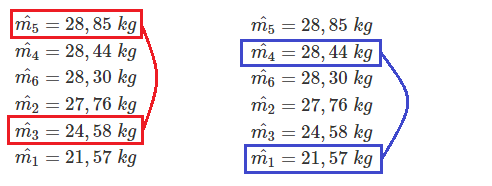
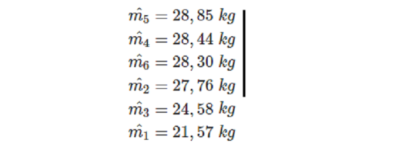

# 4. TESTES PARA COMPARAÇÃO DE MÉDIAS

## 4.1. INTRODUÇÃO

O Teste $F$ nos permite apenas tirar conclusões gerais relacionadas ao comportamento dos tratamentos como um todo, indicando se eles se comportam da mesma maneira ou de maneira diferente, nada nos informando com relação a quais os melhores tratamentos. 

Para verificar quais são os melhores tratamentos, devemos utilizar os teste de **comparação de médias**.

Antes de entrarmos no estudo dos testes de comparação de médias, devemos abordar conceitos relacionados com estes testes.

### 4.1.1. CONTRASTES DE MÉDIAS

Contraste de médias são relações lineares entre as médias verdadeiras dos tratamentos, de forma qua a soma algébrica dos coeficientes dessa função seja nula (igual a Zero).

Então, uma combinação linear das médias do tipo:

$$
Y=c_1m_1+c_2m_2+ \cdots + c_Im_I,
$$

será um contraste se, e somente se:

$$
\sum_{i=1}^Ic_i=c_1+c_2+ \cdots +c_I = 0.
$$

Assim, se em um experimento temos $3$ tratamento, cujas médias verdadeiras são $m_1,m_2$ e $m_3$ as relações:

$$
Y_1=m_1-m_2 \\
Y_2=m_1+m_2-2 \; m_3
$$

são contrastes, enquanto a relação:

$$
Y_3=m_1+m_2-m_3
$$

não é um contraste.

O número de contrastes que podemos formar com um grupo de médias é grande, e numa análise estatística, formamos aqueles que realmente são de interesse do pesquisador.

### 4.1.2. ESTIMATIVA DO CONTRASTE

Geralmente, não conhecemos as médias verdadeiras, de forma que o verdadeiro valor do contraste também nos é desconhecido. 

Porém, como conhecemos as estimativas das médias, podemos calcular as estimativas dos contrastes.

Então, para um contraste de médias na forma geral:

$$
Y=c_1m_1+c_2m_2+ \cdots + c_Im_I,
$$

com

$$
\sum_{i=1}^Ic_i=c_1+c_2+ \cdots +c_I = 0.
$$

obtemos a estimativa:

$$
\hat{Y}=c_1 \hat{m_1}+c_2 \hat{m_2}+ \cdots + c_I \hat{m_I}.
$$

Devemos lembrar que, como trabalhamos com estimativas de médias, obtemos também as estimativas dos contrastes. O valor verdadeiro do contraste seria obtido somente se conhecêssemos as medias populacionais.

Assim, se num experimento, as estimativas das médias dos tratamentos forem:

$$
\hat{m_1}=280 \\
\hat{m_2}=250 \\
\hat{m_3}=320 \\
\hat{m_4}=275
$$

Podemos obter as estimativas dos contrastes:

$$
Y_1=m_1-m_2
$$


e 

$$
Y_2=m_1+m_2-m_3-m_4,
$$

substituindo as médias verdadeiras pelas suas estimativas, ou seja:

$$
\hat{Y_1}=\hat{m_1}-\hat{m_2} = 280-250=30
$$

e 

$$
\hat{Y_2}=\hat{m_1}+\hat{m_2}-\hat{m_3}-\hat{m_4} = 280+250-320-275 = -65
$$

### 4.1.3. COVARIÂNCIA ENTRE DOIS CONTRASTES

Considerando as duas estimativas de contrastes:

$$
\hat{Y_1}=a_1 \hat{m_1} + a_2\hat{m_2} + \cdots + a_I \hat{m_I}
$$

e 

$$
\hat{Y_2}=b_1 \hat{m_1} + b_2\hat{m_2} + \cdots + b_I \hat{m_I},
$$

nas quais as médias foram estimadas com $r_1, r_2, \cdots, r_I$ repetições, respectivamente.

A estimativa da **covariância** entre essas duas estimativas de contrastes é definida por:

$$
\hat{COV}(\hat{Y_1},\hat{Y_2}) = a_1 b_1 \hat{V}(\hat{m_1})+a_2 b_2 \hat{V}(\hat{m_2}) + \cdots + a_I b_I \hat{V}(\hat{m_I})
$$

Lembrando que a estimativa da variância é dada por:

$$
\hat{V}(\hat{m_i}) = \frac{s^2_i}{r_i}, (i = 1,2,\dots,I)
$$

temos:
$$
\hat{COV}(\hat{Y_1},\hat{Y_2}) = a_1 b_1 \frac{s^2_1}{r_1}+a_2 b_2 \frac{s^2_2}{r_2} + \cdots + a_I b_I \frac{s^2_I}{r_I}
$$

Como geralmente temos $s_1^2 = s_2^2 = \cdots =s_I^2=s^2$, então

$$
\hat{COV}(\hat{Y_1},\hat{Y_2}) = \left( \frac{a_1b_1}{r_1} + \frac{a_2b_2}{r_2} + \cdots + \frac{a_Ib_I}{r_I} \right) s^2
$$

Na prática, principalmente nas análises de variâncias, frequentemente admitimos a mesma variância para todas as médias $(QM_{Resíduo})$ e geralmente com os mesmos números de repetições $(r)$, resultando:

$$
\hat{COV}(\hat{Y_1},\hat{Y_2}) = (a_1b_1 + a_2b_2 + \cdots + a_Ib_I) \frac{s^2}{r} \\ 

\hat{COV}(\hat{Y_1},\hat{Y_2}) = (a_1b_1 + a_2b_2 + \cdots + a_Ib_I) \frac{QM_{Resíduo}}{r}
$$

### 4.1.4. CONTRASTES ORTOGONAIS

A ortogonalidade entre dois contrastes traduz uma independência entre eles, isso é, a variação de um é completamente independente da variação do outro.

Dizemos que dois contrastes são ortogonais entre si se a convariância entre eles for nula. Assim, a condição de ortoganilidade é dada por:

$$
\frac{a_1b_1}{r_1}s_1^2+\frac{a_2b_2}{r_2}s_2^2+ \cdots + \frac{a_Ib_I}{r_I}s^2_I =0,
$$

ou seja, 
 
$$
\sum_{i=1}^I=\frac{a_ib_i}{r_i}=0.
$$

Se admitimos a mesma variância para todas as médias, a condição de ortogonalidade será:

$$
a_1b_1+a_2b_2+ \cdots + a_Ib_I = 0,
$$

ou seja,

$$
\sum_{i=1}^I a_ib_i=0.
$$

Para exemplificar, vamos considerar os dois contrastes $Y_1$ e $Y_2$ vistos anteriormente. Podemos escrevê-los da seguinte forma:

$$
Y_1= m_1-m_2  \\
Y_2 = m_1+m_2-2m_3
$$

Neste caso, temos:

|  ` ` | ` ` |  ` `| ` `  | ` ` |
|---|---|---|---|---|
|$Y_1$ | $\rightarrow$ |1 |-1 |0|
|$Y_2$ | $\rightarrow$ |1 |1 |-2 |
|$\sum_{i=1}^3a_ib_i$ | $\rightarrow$ |**1** |**-1** |**0**  |

Assim,

$$
1 -1 + 0 = 0
$$

Portanto, $Y_1$ e $Y_2$ são ortogonais entre si.

**Observações**

1) Três ou mais contrastes serão ortogonais entre si se eles forem ortogonais dois a dois.

2) Do ponto de vista prático, se dois ou mais contrastes são ortogonais entre si, isto indica que **as comparações neles feitas** são independentes entre si.

3) Em um experimento qualquer, o número máximo de contrastes ortogonais que podemos obter é igual ao número de graus de liberdade de tratamentos do experimento.

### 4.1.5. VARIÂNCIA DE UM CONTRASTE

Considere um contraste na forma:

$$
Y= c_1m_1+c_2m_2+ \cdots + c_Im_I,
$$

cuja sua estimativa é

$$
\hat{Y}= c_1\hat{m_1}+c_2\hat{m_2}+ \cdots + c_I\hat{m_I},
$$

A estimativa de variância da estimativa do contraste é representada por $\hat{V}(\hat{Y})$ e é dada por:

$$
\hat{V}(\hat{Y}) = \hat{COV}(\hat{Y},\hat{Y}) = c^2_1\hat{V}(\hat{m_1}) + c^2_2\hat{V}(\hat{m_2}) + \cdots + c^2_I\hat{V}(\hat{m_I}),
$$

e é válida apenas quando todas as médias são independentes.

Substituindo-se as variâncias das médias, obtém-se:

$$
\hat{V}(\hat{Y}) = \frac{c_1^2s_1^2}{r_1} + \frac{c_2^2s_2^2}{r_2} + \cdots + \frac{c_I^2s_I^2}{r_I}
$$

se tivermos $s_I^2=s_2^2= ... = s_I^2 = s^2$, então:

$$
\hat{V}(\hat{Y}) = \left( \frac{c^2_1}{r_1} + \frac{c_2^2}{r_2} + \cdots + \frac{c^2_I}{r_I} \right) s^2
$$

e ainda, se tivermos $r_1 = r_2 = \cdots = r_I = r$

$$
\hat{V}(\hat{Y}) = \left( {c^2_1} + {c_2^2} + \cdots + {c^2_I} \right) \frac{s^2}{r}
$$


Na análise de variância, utilizamos o $QM_{Resíduo}$ como estimativa de da variância $s^2$, então teremos, finalmente:

$$
\hat{V}(\hat{Y}) = \left( {c^2_1} + {c_2^2} + \cdots + {c^2_I} \right) \frac{QM_{Resíduo}}{r}
$$

### 4.1.6. ERRO PADRÃO DO CONTRASTE

O erro padrão de um contraste, representado por $s(\hat{Y})$, é a raiz quadrada da estimativa da variância da estimativa do contraste, ou seja:

$$
s(\hat{Y}) = \sqrt{\hat{V}(\hat{Y})}
$$


## 4.2. TESTE *t* DE STUDENT

O teste *t* é um teste que serve para comparar médias ou dois grupos de médias e, portanto, implica na utilização de contrastes de médias.

Admitindo então, um contraste na sua forma geral:

$$
Y= c_1m_1+c_2m_2+ \cdots + c_Im_I,
$$

e sua estimativa

$$
\hat{Y}= c_1\hat{m_1}+c_2\hat{m_2}+ \cdots + c_I\hat{m_I},
$$

Podemos testá-lo com o uso de teste *t*.

Quando aplicamos o teste *t* a um contraste, estamos interessados em verificar se a estimativa do contraste $(\hat{Y})$ difere ou não de zero (o valor que assumiria sob a hipótese da nulidade $(H_0)$. Assim, as hipóteses que serão testadas são:

$$ 
\begin{cases}
H_0: Y=0 \\
H_1: Y \neq 0
\end{cases}
$$

A estatística do teste *t* é calculada por:

$$
t_{obs} = \frac{\hat{Y}-0}{\sqrt{\hat{V}(\hat{Y})}} = \frac{\hat{Y}}{s(\hat{Y})}.
$$

Normalmente, comparamos o valor do contraste com o valor zero $(0)$, isto é, verificamos se sua estimativa não difere estatisticamente de zero. Na realidade, quando assim procedemos, estamos verificando se as médias ou grupos de médias contrastadas não diferem estatisticamente entre si.

Embora não muito usual, o valor do contraste poderia ser comparado com qualquer outro valor $A$ constante. A estatistica do test *t*, neste caso seria:

$$
t_{obs} = \frac{\hat{Y}-A}{\sqrt{\hat{V}(\hat{Y})}} = \frac{\hat{Y}-A}{s(\hat{Y})}.
$$

Em ambos os casos, o valor de *t* calculado deve ser comparado com os valores tabelados, para verificar a significância do teste. Estes valores de *t* são tabelados em função do **número de graus de liberdade do resíduo** da análise de variância e do nível de significância do teste ($5\%$ ou $1\%$ de probabilidade).


[Download da Tabela](https://github.com/arpanosso/ExpAgr_2020/raw/master/Tabela_tdeStudent.pdf)

**Critério do teste é o seguinte**

a) Se $t_{obs} \in RC$ ou seja, $|t_{obs}| \ge t{tab}$, o teste é significativo ao nível $\alpha$ de probabilidade considerado. Neste caso, rejeitamos $H_0$ e concluímos que as médias ou grupos de médias testados no contraste diferem significativamente entre si.

b) Se $t_{obs} \not \in RC$ ou seja, $|t_{obs}| < t{tab}$, o teste é não significativo ao nível $\alpha$ de probabilidade considerado. Neste caso, rejeitamos $H_0$ e concluímos que as médias ou grupos de médias testados no contraste não diferem significativamente entre si.

Para a aplicação exata do teste *t*, são necessárias duas condições básicas:

1 - Que os contrastes sejam estabelecidos **"a priori"**, ou seja, que os mesmos **não sejam sugeridos pelos resultados**.

2 - Que os contrastes a serem testados **sejam ortogonais entre si**

### 4.2.1 EXEMPLO DE APLICAÇÃO DO TESTE *t* de *STUDENT*

Como exemplo de aplicação, utilizaremos os dados do trabalho: "Competição de adubos nitrogenados no abacaxizeiro", realizado por BRASIL SOBRINHO et al. (*Boletim Técnico Científico*, ESALQ, n. 12, 1962), cujo ensaio foi instalado no delineamento em blocos casualizados com $6$ tratamentos e $4$ repetições, sendo que os blocos controlaram diferenças de fatores ambientais.

Cada parcela constituiu-se de $20$ plantas úteis no espaçamento de $1,5\;m$ entre linhas e $0,4\;m$ entre plantas. Os tratamentos utilizados, com as respectivas médias de produção no 1º ano agrícola, em kg, foram:

|TRATAMENTO| MÉDIAS ESTIMADAS|
|:---|:---:|
|1- Testemunha|$21,57$|
|2- Sulfato de amônio|$27,76$|
|3- Salitre do Chile|$24,58$|
|4- Uréia|$28,44$|
|5- Nitrocálcio de Cubatão|$28,85$|
|6- Nitrocálcio de Cubatão + Enxofre|$28,30$|

Os dados de produção do 1º ano agrícola proporcionaram o seguinte quadro de análise de variância:

```{r echo=FALSE, message=FALSE,error=FALSE,warning=FALSE}
require(kableExtra)
df<-data.frame(CV=c("Tratamentos","Blocos","Resíduo","Total"),
               GL=c("5","3","15","23"),
               SQ =c("168,29","7,32","9,59","185,20"),
               QM = c("33,66","2,44","0,64",""),
               Fs=c("52,59**","3,81*","",""))
names(df) <- c("Causas de Variação", "GL", "SQ","QM","F")
kable(df) %>% 
  kable_styling(bootstrap_options = "basic", full_width = FALSE) %>% 
  row_spec(c(4),bold=TRUE)
```

$F$ da Tabela:

Para Tratamentos $(5 \times 15\; gl): \begin{cases} 5\%=2,90 \\ 1\% = 4,56\end{cases}$

Para Blocos $(3 \times 15\; gl): \begin{cases} 5\%=3,29 \\ 1\% = 5,42\end{cases}$

[DOWNLOAD das tabelas](https://github.com/arpanosso/ExpAgr_2020/raw/master/F_5_e_1.pdf)

**Conclusão para Tratamento:**

O teste foi significativo ao nível de $1\%$ de probabilidade indicando que devemos rejeitar a hipótese $H_{0}$ e concluir que os adubos testados diferem sobre a produção de abacaxi, a esse nível  de probabilidade, com um grau de confiança superior a $99\%$ de probabilidade.

**Conclusão para Blocos:**

O teste foi significativo ao nível de $5\%$ de probabilidade indicando que devemos rejeitar a hipótese $H_{0}$ e concluir que os blocos possuem feitos diferentes sobre a produção de abacaxi, a esse nível  de probabilidade, com um grau de confiança superior a $95\%$ de probabilidade. Na prática, isto indica que existem fatores do ambiente que influem sobre a produção de abacaxi, justificando o controle local feito através de blocos.

Como exemplo do test *t*, vamos testar os $2$ contraste a seguir, ortogonais entre si:

|Tratamentos|Contraste
|:---|:---
|Salitre vs. Nitrocálcio| $Y_1 = 2m_3 - m_5 -m_6$
|Nitrocálcio vs. Nitrocálcio + Enxofre | $Y_2=m_5 - m_6$


**a) Salitre vs. Nitrocálcio**

**1. Hipóteses**

$$ 
\begin{cases}
H_0: m_3=\frac{m_5 + m_6}{2} \\
H_1: m_3 \neq  \frac{m_5 + m_6}{2}
\end{cases}
$$

**2. Estimativa do contraste**

$$
\hat{Y_1} = 2\hat{m_3} - \hat{m_5} - \hat{m_6} = 2.(24,58) - 28,85 - 28,30 = -7,99\;kg.
$$


**3. Estimativa da Variância da estimativa do contraste**

$$
\hat{V}(\hat{Y_1}) = [2^2+(-1)^2+(-1)^2]\frac{0,64}{4} = 0,96.
$$

**4. Erro Padrão da estimativa do contraste**

$$
s(\hat{Y_1}) = \sqrt{0,96} = 0,98\;kg.
$$


**5. Cálculo da estatística t **

$$
t_{obs} = \frac{\hat{Y_1}}{s(\hat{Y_1})} = \frac{-7,99}{0,98} = -8,15^{**}
$$

**6. Construindo a região crítica do teste**

Os valores críticos de *t* são tabelados em função do **número de graus de liberdade do resíduo**. Neste caso temos $15$ graus de liberdade para o resíduos então:

*t* tabelado $(15\; gl): \begin{cases} 5\%=2,13 \\ 1\% = 2,95\end{cases}$

**7. Conclusão do teste**

Como $t_{obs} \in RC$ pois $-8,15 < - 2,95$, ou seja, o teste foi significativo ao nível de 1% de probabilidade. Neste caso, rejeitamos $H_0$ e concluímos que o grupo Salitre difere do grupo Nitrocálcio a esse nível de probabilidade, sendo o grupo Nitrocálcio o mais recomendado pois apresentou uma maior produção.


```{r,message=FALSE,error=FALSE,warning=FALSE}
library(tidyverse)
I <- 6 # Número de tratamentos
r <- 4 # Número de repetições com que cada média foi calculada
GLres <- 15 # Graus de liberdade do Resíduo (6-1)*(4-1) = 15
QMres <- 0.64 # Quadrado médio do resíduo da análise de variância
medias<-c(21.57,27.76,24.58,28.44,28.85,28.30) # vetor de médias
c1<-c(0,0,2,0,-1,-1) # coeficientes do primeiro contraste
Y1 <- sum(medias*c1) # Definindo o primeiro contraste
Y1

#calculando a estatística do teste
tobs <- Y1/sqrt(sum(c1^2)*QMres/r)
tobs

# limite crítico ao nível de 5%
tc5<-qt(1-0.05/2,GLres)
tc5

# limite crítico ao nível de 1%
tc1 <- qt(1-0.01/2,GLres)
tc1

# Construção do Gráfico para interpretação
data.frame(x=0,y=1) %>% 
  ggplot(aes(x=x,y=y)) + 
  stat_function(fun = function(.x) dt(.x,GLres),col="red")+
  xlim(-9,9)+ ylim(0,.5)+
  geom_vline(xintercept = qt(c(0.025,0.975,0.005,0.995),GLres),col="blue",lty=2) +
  geom_vline(xintercept = 0)+geom_hline(yintercept = 0)+
  annotate('text', label = expression(paste("2,5%")), x = 2.7, y = .08,size=5,col="orange")+
  annotate('text', label = expression(paste("2,5%")), x = -2.7, y = .08,size=5,col="orange")+
  annotate('text', label = expression(paste("0,5%")), x = 6.7, y = .08,size=5,col="red")+
  annotate('text', label = expression(paste("0,5%")), x = -6.7, y = .08,size=5,col="red")+
  labs(y="Densidade",x="t")+
  annotate('text', label = "Região crítica", x = 6.6, y = 0.15,size=5,col="red")+
  annotate('text', label = "Região crítica", x = -6, y = 0.15,size=5,col="red")+
  geom_vline(xintercept = tobs, col= "blue",lwd=2) + 
  annotate('text', label = expression(paste(t[obs])), x = tobs+.8, y = .02,size=5,col="blue")+
  theme_minimal()
```

**b) Nitrocálcio vs. Nitrocálcio + Enxofre**

**1. Hipóteses**

$$ 
\begin{cases}
H_0: m_5=m_6 \\
H_1: m_5 \neq  m_6
\end{cases}
$$

**2. Estimativa do contraste**

$$
\hat{Y_2} = \hat{m_5} - \hat{m_6}=28,85-28,30 = 0,55\;kg.
$$


**3. Estimativa da Variância da estimativa do contraste**

$$
\hat{V}(\hat{Y_2}) = [(1)^2+(-1)^2]\frac{0,64}{4} = 0,32.
$$

**4. Erro Padrão da estimativa do contraste**

$$
s(\hat{Y_2}) = \sqrt{0,32} = 0,57\;kg.
$$


**5. Cálculo da estatística t **

$$
t_{obs} = \frac{\hat{Y_2}}{s(\hat{Y_2})} = \frac{0,55}{0,57} = 0,96^{NS}
$$

**6. Construindo a região crítica do teste**

t tabelado $(15\; gl): \begin{cases} 5\%=2,13 \\ 1\% = 2,95\end{cases}$

**7. Conclusão do teste**

Como $t_{obs} \not\in RC$ pois $0,96 <  2,13$, ou seja, o teste foi não significativo ao nível de 5% de probabilidade. Neste caso, não rejeitamos $H_0$ e concluímos que a média do tratamento Nitrocálcio não difere da média do tratamento Nitrocálcio + Enxofre a esse nível de probabilidade.


```{r,message=FALSE,error=FALSE,warning=FALSE}
c2<-c(0,0,0,0,1,-1) # coeficientes do primeiro contraste
Y2 <- sum(medias*c2) # Definindo o primeiro contraste
Y2

#calculando a estatística do teste
tobs <- Y2/sqrt(sum(c2^2)*QMres/r)
tobs

# Construção do Gráfico para interpretação
# Construção do Gráfico para interpretação
data.frame(x=0,y=1) %>% 
  ggplot(aes(x=x,y=y)) + 
  stat_function(fun = function(.x) dt(.x,GLres),col="red")+
  xlim(-9,9)+ ylim(0,.5)+
  geom_vline(xintercept = qt(c(0.025,0.975,0.005,0.995),GLres),col="blue",lty=2) +
  geom_vline(xintercept = 0)+geom_hline(yintercept = 0)+
  annotate('text', label = expression(paste("2,5%")), x = 2.7, y = .08,size=5,col="orange")+
  annotate('text', label = expression(paste("2,5%")), x = -2.7, y = .08,size=5,col="orange")+
  annotate('text', label = expression(paste("0,5%")), x = 6.7, y = .08,size=5,col="red")+
  annotate('text', label = expression(paste("0,5%")), x = -6.7, y = .08,size=5,col="red")+
  labs(y="Densidade",x="t")+
  annotate('text', label = "Região crítica", x = 6.6, y = 0.15,size=5,col="red")+
  annotate('text', label = "Região crítica", x = -6, y = 0.15,size=5,col="red")+
  geom_vline(xintercept = tobs, col= "blue",lwd=2) + 
  annotate('text', label = expression(paste(t[obs])), x = tobs+.8, y = .02,size=5,col="blue")+
  theme_minimal()
```


## 4.3. TESTE DE TUKEY

O Teste de Tukey também pode ser usado como um complemento ao Teste $F$ da análise de variância. Ele serve para testar todo e qualquer contraste **entre 2 médias de tratamentos**. Assim, num experimento com $I$ tratamentos, o número de comparações de médias duas a duas, é a combinação dessas $I$ médias $2$ a $2$, ou seja:

$$
C_I^2 = \begin{pmatrix} I \\ 2\end{pmatrix} = \frac{I!}{2!.(I-2)!} = \frac{I(I-1)}{2}\;contrastes
$$

É considerado um teste versátil, porém **não nos permite comparar 2 grupos de médias**.

Baseia-se na **diferença mínima significativa** (dms) representado por $\Delta$ e dada por:

$$
\Delta = q\frac{s}{\sqrt{r}} = q.s(\hat{m})
$$

onde,

$s$ é o desvio padrão residual, dado por $s = \sqrt{QM_{Resíduo}}$.

$r$ é o número de repetições com que as médias dos tratamentos foram calculadas.

$q$ é o valor da **amplitude total estudentizada**, valor encontrado em tabelas, em função do **Número de Tratamentos** do experimento $(n)$ e do **Número de graus de liberdade do resíduo** $(n')$, geralmente ao nível de 5% de probabilidade.


**Download em PDF:** [Tabela Tukey a 5%](https://github.com/arpanosso/ExpAgr_2020/raw/master/Tabela_Tukey_5p.pdf)

Para que o teste seja exato, exige que todas as médias tenham o mesmo número de repetições. Quanto as médias não forem calculadas com o mesmo número de repetições, o Teste de Tukey é aproximado e, neste caso, a $dms$ deve ser obtida por meio da expressão:

$$
\Delta' = q.\sqrt{\frac{1}{2}.\hat{V}(\hat{Y})}
$$

No caso do delineamento inteiramente casualizado, se $\hat{Y} = \hat{m_i} - \hat{m_j}$ com $r_i \neq r_j$, temos:

$$
\hat{V}(\hat{Y}) = \left( \frac{1}{r_i} + \frac{1}{r_j} \right).QM_{Resíduo}
$$

Assim, temos:

$$
\Delta'_{i\;vs.\;j} = q.\sqrt{\frac{1}{2}.\left( \frac{1}{r_i} + \frac{1}{r_j} \right).QM_{Resíduo}}
$$

### 4.3.1 EXEMPLO DE APLICAÇÃO DO TESTE DE TUKEY

Considerando-se os dados do exemplo anterior, **4.2.1**, temos:

$$
s^2 = QM_{Resíduo} = 0,64
$$

e

$$
r=4
$$

**1. Organizar as médias em ordem DECRESCENTE:**

$$
\hat{m_5} = 28,85\;kg \\
\hat{m_4} = 28,44\;kg \\
\hat{m_6} = 28,30\;kg \\
\hat{m_2} = 27,76\;kg \\
\hat{m_3} = 24,58\;kg \\
\hat{m_1} = 21,57\;kg 
$$

**2. Calcular a diferença mínima significativa (dms - $\Delta$):**

Tabela da amplitude total estudentizada a $5\%$ temos:

$q_{(6\;Trat \times 15\;gl\;do\;Resíduo)} = 4,60$ e,

$s=\sqrt{QM_{Resíduo}} = \sqrt{0,64} = 0,80\;kg$


Então temos:

$$
\Delta = q\frac{s}{\sqrt{r}} = 4,60.\frac{0,80}{\sqrt{4}} = 1,84\;kg
$$

Devemos comparar os valores das estimativas dos contrastes $|\hat{Y}|$ com o $\Delta$. Se $|\hat{Y}| \ge \Delta$ o contraste é significativo ao nível $\alpha$ de probabilidade considerado, no caso $5%$, indicando que as médias dos tratamentos testados no contraste diferem entre si a esse nível de probabilidade. Portanto, devemos agora estimar todos os contrastes.

**3. Obtenção das estimativas dos contrastes:**

Número de contrastes:

$$
C_6^2 = \frac{I.(I-1)}{2} =\frac{6.(6-1)}{2} = \frac{30}{2} = 15 \;contrastes
$$

A obtenção das estimativas dos contrastes pode ser feita de duas maneiras:

**a) Podemos escrever cada um dos contrastes e comparar com o valor da $dms$ anteriormente calculada:**

$$
\hat{Y_1} = \hat{m_5} - \hat{m_4} = 0,41^{ns}\\
\hat{Y_2} = \hat{m_5} - \hat{m_6} = 0,55^{ns}\\
\hat{Y_3} = \hat{m_5} - \hat{m_2} = 1,09^{ns}\\
\hat{Y_4} = \hat{m_5} - \hat{m_3} = 4,27^{*}\\
\hat{Y_5} = \hat{m_5} - \hat{m_1} = 7,28^{*}\\
\hat{Y_6} = \hat{m_4} - \hat{m_6} = 0,14^{ns}\\
\hat{Y_7} = \hat{m_4} - \hat{m_2} = 0,68^{ns}\\
\hat{Y_8} = \hat{m_4} - \hat{m_3} = 3,86^{*}\\
\hat{Y_9} = \hat{m_4} - \hat{m_1} = 6,87^{*}\\
\hat{Y_{10}} = \hat{m_6} - \hat{m_2} = 0,54^{ns}\\
\hat{Y_{11}} = \hat{m_6} - \hat{m_3} = 3,72^{*}\\
\hat{Y_{12}} = \hat{m_6} - \hat{m_1} = 6,73^{*}\\
\hat{Y_{13}} = \hat{m_2} - \hat{m_3} = 3,18^{*}\\
\hat{Y_{14}} = \hat{m_2} - \hat{m_1} = 6,19^{*}\\
\hat{Y_{15}} = \hat{m_3} - \hat{m_1} = 3,01^{*}
$$

**b) Montar um quadro resumido com as médias em ordem decrescente, representando as estimativas dos contrastes:**

||$\hat{m_4}$|$\hat{m_6}$|$\hat{m_2}$|$\hat{m_3}$|$\hat{m_1}$|
|:---:|:---:|:---:|:---:|:---:|:---:|
|$\hat{m_5}$|$0,41^{ns}$|$0,55^{ns}$|$1,09^{ns}$|$4,27^{*}$|$7,28^{*}$|
|$\hat{m_4}$||$0,14^{ns}$|$0,68^{ns}$|$3,86^{*}$|$6,87^{*}$|
|$\hat{m_6}$|||$0,54^{ns}$|$3,72^{*}$|$6,73^{*}$|
|$\hat{m_2}$||||$3,18^{*}$|$6,19^{*}$|
|$\hat{m_3}$|||||$3,01^{*}$|

**4. Representar as diferenças entre as médias colocando letras iguais para as médias que não diferem entre si:**

$$
\hat{m_5} = 28,85\;kg - a\\
\hat{m_4} = 28,44\;kg - a\\
\hat{m_6} = 28,30\;kg - a\\
\hat{m_2} = 27,76\;kg - a\\
\hat{m_3} = 24,58\;kg - b\\
\hat{m_1} = 21,57\;kg - c
$$

**Obs:** Médias seguidas pela mesma letra não diferem entre si pelo teste de Tukey ao nível de 5% de probabilidade.


```{r}
# Carregue, instale se necessário, o pacote "agricolae"
library(agricolae)

# Contrução do vetor com o nome dos tratamentos
trat<-c("Test.","Sulf. amônio","Sal. Chile","Ureia","Nitc.","Nitc.+S")

# Utilizar a função 'HDS.test' do pacote agricolae
tukey<-HSD.test(medias, # vetor de média
                trat, # nomes de tratamentos
                GLres, # graus de liberdade de resíduos
                QMres/r, # variância amostral
                alpha=0.05, # probabilidade de erro tipo I
                console = TRUE) # resultado na tela

# Construção do gráfico de colunas
bar.group(tukey$groups,
          ylim=c(0,max(medias))*1.2,
          las=1,
          xlab="Tratamentos",
          ylab="Produção (kg)",
          main="Teste de Tukey (5%)");box()
```


## 4.4. TESTE DE DUNCAN

O teste de Duncan também pode ser utilizado como um complemento ao teste $F$ da análise de variância. Ele é menos rigoroso que o teste de Tukey, e serve para comparar as médias duas a duas. Para ser exato, este teste também exige que as médias possuam todas o mesmo número de repetições.

O teste de Duncan baseia-se na **amplitude total mínima significativa**, representada por $D$ e dada por:

$$
 D= z_\alpha . \frac{s}{\sqrt{r}} = z_\alpha . s(\hat{m})
$$

Onde:

$s = \sqrt{QM_{Resíduo}}$

$r =$ nº de repetições que foram obtidas as médias.

$z_\alpha$ = Amplitude total estudentizada, valor encontrado em tabelas, em função do número de médias abrangidas pelo contraste e do número de graus de liberdade do resíduo. 


**Download em PDF:** [Tabela Duncan a 5%](https://github.com/arpanosso/ExpAgr_2020/raw/master/t_Duncan_5p.pdf)

**PROCEDIMENTO PARA APLICAÇÃO DO TESTE DE DUNCAN:**

**1- Ordenar as médias em ordem decrescente.**

**2- Calcular a estimativa do contraste que abrange $k$ médias.**

**3- Calcular o valor de $D_k$ correspondente, dado por.**

$$
 D_{k}= z_{(k,\alpha)} . \frac{s}{\sqrt{r}}
$$

**4- Comparar o valor de $|\hat{Y}|$ com $D_k$.**

Se $|\hat{Y}| \ge D_k$ o teste é significativo. Neste caso, reduz-se de um nº de médias abrangidas pelo contraste (valor de $k$) e volta-se ao passo 2.

Se $|\hat{Y}| < D_k$ o teste é não significativo. Neste caso, une-se por uma barra as médias abrangidas pelo contraste (pode-se adicionar as mesmas letras para essas médias), e não são feitas mais comporações entre estas médias.

Quando as médias dos tratamentos não são igualmente repetidas, o teste é aproximado, e calculamos a amplitude total mínima significativa por:

$$
D' = z_\alpha . \sqrt{\frac{1}{2} \hat{V}(\hat{Y})}
$$

### 4.4.1 EXEMPLO DE APLICAÇÃO DO TESTE DE DUNCAN

Para exemplificar a aplicação do teste de Duncan, vamos utilizar os dados do exemplo **4.2.1** de "Competição de adubos nitrogenados no abacaxizeiro". Neste exemplo os tratamentos, com suas respectivas médias de produção de abacaxi em kg/parcela, foram:

|TRATAMENTO| MÉDIAS ESTIMADAS|
|:---|:---:|
|1- Testemunha|21,57|
|2- Sulfato de amônio|27,76|
|3- Salitre do Chile|24,58|
|4- Uréia|28,44|
|5- Nitrocálcio de Cubatão|28,85|
|6- Nitrocálcio de Cubatão + Enxofre|28,30|

Considerando:
$$
s^2 = QM_{Resíduo} = 0,64
$$

e

$$
r=4
$$

**1- Ordenar as médias em ordem decrescente.**

$$
\hat{m_5} = 28,85\;kg \\
\hat{m_4} = 28,44\;kg \\
\hat{m_6} = 28,30\;kg \\
\hat{m_2} = 27,76\;kg \\
\hat{m_3} = 24,58\;kg \\
\hat{m_1} = 21,57\;kg 
$$

**2- Contraste que abrange $6$ médias.**


$$
\hat{Y_1} = \hat{m_5} - \hat{m_1} = 28,85-21,57=7,28\;kg
$$

$$
D_{6} = z_6.\frac{s}{\sqrt{r}} = 3,36.\frac{\sqrt{0,64}}{\sqrt{4}} = 1,34\;kg
$$

Como $|\hat{Y_1}|>D_6$, o teste é significativo ao nível de 5% de probabilidade, rejeitamos $H_0$ e concluímos que $\hat{m_5} \neq \hat{m_1}$.

**3- Contraste que abrange $5$ médias.**



$$
\hat{Y_2} = \hat{m_5} - \hat{m_3} = 4,27\;kg \\
\hat{Y_3} = \hat{m_4} - \hat{m_1} = 6,87\;kg 
$$

$$
D_{5} = z_5.\frac{s}{\sqrt{r}} = 3,31.\frac{\sqrt{0,64}}{\sqrt{4}} = 1,31\;kg
$$

Como $|\hat{Y_2}|>D_5$, o teste é significativo ao nível de 5% de probabilidade, rejeitamos $H_0$ e concluímos que $\hat{m_5} \neq \hat{m_3}$.

Como $|\hat{Y_3}|>D_5$, o teste é significativo ao nível de 5% de probabilidade, rejeitamos $H_0$ e concluímos que $\hat{m_4} \neq \hat{m_1}$.

**4- Contraste que abrange $4$ médias.**


$$
\hat{Y_4} = \hat{m_5} - \hat{m_2} = 1,09\;kg \\
\hat{Y_5} = \hat{m_4} - \hat{m_3} = 3,86\;kg \\
\hat{Y_6} = \hat{m_6} - \hat{m_1} = 6,73\;kg
$$

$$
D_{5} = z_4.\frac{s}{\sqrt{r}} = 3,25.\frac{\sqrt{0,64}}{\sqrt{4}} = 1,30\;kg
$$

Como $|\hat{Y_4}|<D_4$, o teste é não significativo ao nível de 5% de probabilidade, não rejeitamos $H_0$ e concluímos que $\hat{m_5}$ não difere de $\hat{m_2}$. Assim, ligamos as médias por uma barra, e não podemos fazer mais comparações entre as médias ligadas por esta barra.

Como $|\hat{Y_5}|>D_4$, o teste é significativo ao nível de 5% de probabilidade, rejeitamos $H_0$ e concluímos que $\hat{m_4} \neq \hat{m_3}$.

Como $|\hat{Y_6}|>D_4$, o teste é significativo ao nível de 5% de probabilidade, rejeitamos $H_0$ e concluímos que $\hat{m_6} \neq \hat{m_1}$.




**5- Contraste que abrange $3$ médias.**


$$
\hat{Y_7} = \hat{m_6} - \hat{m_3} = 3,72\;kg \\
\hat{Y_8} = \hat{m_2} - \hat{m_1} = 6,19\;kg 
$$

$$
D_{3} = z_3.\frac{s}{\sqrt{r}} = 3,16.\frac{\sqrt{0,64}}{\sqrt{4}} = 1,26\;kg
$$

Como $|\hat{Y_7}|>D_3$, o teste é significativo ao nível de 5% de probabilidade, rejeitamos $H_0$ e concluímos que $\hat{m_6} \neq \hat{m_3}$.

Como $|\hat{Y_8}|>D_3$, o teste é significativo ao nível de 5% de probabilidade, rejeitamos $H_0$ e concluímos que $\hat{m_2} \neq \hat{m_1}$.

**6- Contraste que abrange $2$ médias.**


$$
\hat{Y_9} = \hat{m_2} - \hat{m_3} = 3,18\;kg \\
\hat{Y_10} = \hat{m_3} - \hat{m_1} = 3,01\;kg 
$$

$$
D_{2} = z_2.\frac{s}{\sqrt{r}} = 3,01.\frac{\sqrt{0,64}}{\sqrt{4}} = 1,20\;kg
$$

Como $|\hat{Y_9}|>D_2$, o teste é significativo ao nível de 5% de probabilidade, rejeitamos $H_0$ e concluímos que $\hat{m_2} \neq \hat{m_3}$.

Como $|\hat{Y_10}|>D_2$, o teste é significativo ao nível de 5% de probabilidade, rejeitamos $H_0$ e concluímos que $\hat{m_3} \neq \hat{m_1}$.


**7 - Resultado:**

Portanto, o resultado final do teste pode ser representado da seguinte maneira:

 

**Conclusão**: As médias ligadas por uma mesma barra não diferem entre si pelo teste de Duncan ao nível de 5% de probabilidade.

O resultado final pode também ser apresentado com a utilização das letras ao invés da barra:

$$
\hat{m_5} = 28,85\;kg - a\\
\hat{m_4} = 28,44\;kg - a\\
\hat{m_6} = 28,30\;kg - a\\
\hat{m_2} = 27,76\;kg - a\\
\hat{m_3} = 24,58\;kg - b\\
\hat{m_1} = 21,57\;kg - c
$$

**Obs:** Médias seguidas pela mesma letra não diferem entre si pelo teste de Duncan ao nível de 5% de probabilidade.


```{r}
# Utilizar a função 'duncan.test' do pacote agricolae
duncan<-duncan.test(medias, # vetor de média
                trat, # nomes de tratamentos
                GLres, # graus de liberdade de resíduos
                QMres/r, # variância amostral
                alpha=0.05, # probabilidade de erro tipo I
                console = TRUE) # resultado na tela

# Conatrução do gráfico de colunas
bar.group(duncan$groups,
          ylim=c(0,max(medias))*1.2,
          las=1,
          xlab="Tratamentos",
          ylab="Produção (kg)",
          main="Teste de Duncan (5%)");box()
```

## 4.5. TESTE DE SCHEFFÉ

Quando, numa análise de variância, encontramos um valor significativo para o teste $F$, isto nos indica a existência de pelo menos um contraste significativo entre as médias dos tratamentos.

O Teste de Scheffé se apresenta para testar contrastes, mesmo que estabelecidos "a posteriori". 

É um teste mais rigoroso que o Teste t, porém é mais flexível, pois **não exige que os contrastes sejam estabelecidos "a priori"**, **nem mesmo que sejam ortogonais entre si**.

Deve ser aplicado apenas nos casos em que o Teste $F$ para tratamentos na análise de variância tenha sido significativo. Sua aplicação é recomendada para contrastes que envolvam mais de duas médias.

A estatística do teste é:

$$
S = \sqrt{(I-1).F.\hat{V}(\hat{Y})},
$$

onde, 

$I-1$ = nº de graus de liberdadede tratamentos.

$F$ é o valor da tabela de distribuição F, ao nível $\alpha$ de probabilidade (**geralmente utiliza-se $5\%$**), em função do número de **graus de liberdade de tratamentos** pelo número de **graus de liberdade de resíduo** da análise de variância.

**Critério do Teste**:

Se $|\hat{Y}| \ge S$, dizemos que o contraste é significativo ao nível $\alpha$ de probabilidade.

Se $|\hat{Y}| < S$, dizemos que o contraste é não significativo ao nível $\alpha$ de probabilidade.

Assim, o procedimento utilizado para a aplicação do teste de Scheffé é o seguinte.

**1. Calcular a estimativa do contraste**.

$$
\hat{Y} = c_1\hat{m_1} + c_2\hat{m_2} + \cdots + c_I\hat{m_I}
$$

**2. Calcular a estimativa de variância da estimativa do contraste**.

$$
\hat{V}(\hat{Y}) = (c_1^2+c_2^2 + \cdots + c_I^2).\frac{s^2}{r}
$$

**3. Calcular o valor do teste de Scheffé, representado por $S$ e dado por:**.

$$
S=\sqrt{(I-1).F.\hat{V}(\hat{Y})}
$$

**4. Comparar $\hat{Y}$ com $S$**.

**a)** Se $|\hat{Y}| \ge S$, o teste é significativo ao nível de $\alpha$ de probabilidade considerado (geralmente a 5% de probabilidade), indicando que devemos rejeitar a hipótese $H_0$ e concluir que as médias ou os grupos de médias testados no contraste diferem significativamente entre si.

**b)** Se $|\hat{Y}| < S$, o teste é não significativo ao nível de $\alpha$ de probabilidade considerado (geralmente a 5% de probabilidade), indicando que não devemos rejeitar a hipótese $H_0$ e concluímos que as médias ou os grupos de médias testados no contraste não diferem significativamente entre si.

**5. Indicar a significância do teste, colocando sobre o valor da estimativa do contraste uma das notações já vistas para o teste F, ou seja:**

$^{ns}-$ Não significativo ao nível de 5% de probabilidade.

$^{*}-$ Significativo ao nível de 5% de probabilidade.

$^{**}-$ Significativo ao nível de 1% de probabilidade.

### 4.5.1 EXEMPLO DE APLICAÇÃO DO TESTE DE SCHEFFÉ

Para exemplificar a palicação do teste de Scheffé, vamos utilizar os dados do exemplo **4.2.1** de "Competição de adubos nitrogenados no abacaxizeiro". Neste exemplo os tratamentos, com suas respectivas médias de produção de abacaxi em kg/parcela, foram:

|TRATAMENTO| MÉDIAS ESTIMADAS|
|:---|:---:|
|1- Testemunha|21,57|
|2- Sulfato de amônio|27,76|
|3- Salitre do Chile|24,58|
|4- Uréia|28,44|
|5- Nitrocálcio de Cubatão|28,85|
|6- Nitrocálcio de Cubatão + Enxofre|28,30|

Considerando:
$$
s^2 = QM_{Resíduo} = 0,64
$$

e

$$
r=4
$$

O experimentador deseja verificar se existe diferença entre os adubos com nitrocálcio e os demais adubos nitrogenados. Então, o contraste que permite fazer esta comparação é o seguinte:

$$
Y = 2.m_2 + 2.m_3 + 2.m_4 - 3.m_5 - 3.m_6
$$

e sua estimativa é:
$$
\hat{Y} = 2.\hat{m_2} + 2.\hat{m_3} + 2.\hat{m_4} - 3.\hat{m_5} - 3.\hat{m_6} \\
\hat{Y} = 2.(27,76) + 2.(24,58) + 2.(28,44) - 3.(28,85) - 3.(28,30) \\
\hat{Y} = -9,89\;kg
$$

A estimativa de variância da estimativa do contraste é:

$$
\hat{V}(\hat{Y}) = [2^2+2^2+2^2+(-3)^2+(-3)^2] \frac{0,64}{4} = 4,80.
$$ 

O valor do F da tabela é: $F_{tab(5\;gl\;Trat \times 15\;gl\;Resíduo,\;5\%)} = 2,90$

Portanto, a estatística do teste será:

$$
S = \sqrt{(I-1).F.\hat{V}(\hat{Y})} =  \sqrt{(6-1).(2,90).(4,80)} = \sqrt{69,6} = 8,34\; kg
$$

**Conclusão**: Como $|\hat{Y}| > S$, o teste foi significativo ao nível de 5% de probabilidade, indicando que devemos rejeitar $H_0$ e conclui que, em média, o grupo dos adubos com nitrocálcio apresenta uma produção superior à média dos demais adubos nitrogenados.

Suponha que o experimentador deseja verificar ainda se existe diferença entre os tratamentos com adubo e a testemunha (sem adubação). Então, o contraste que permite fazer esta comparação é o seguinte:

$$
Y = 5m_1 - m_2 - m_3 - m_4 - m_5 - m_6
$$

e sua estimativa é:

$$
\hat{Y} = 5\hat{m_1} - \hat{m_2} - \hat{m_3} - \hat{m_4} - \hat{m_5} - \hat{m_6} \\
\hat{Y} = 5.(21,57)-27,76-24,58-28,44-28,85-28,30\\
\hat{Y} = 107,85-137,93\\
\hat{Y} = -30,08\;kg
$$

A estimativa de variância da estimativa do contraste é:

$$
\hat{V}(\hat{Y}) = [5^2+(-1)^2+(-1)^2+(-1)^2+(-1)^2+(-1)^2].\frac{0,64}{4} = 30.\frac{0,64}{4} = 4,80.
$$

O valor do F da tabela é: $F_{tab(5\;gl\;Trat \times 15\;gl\;Resíduo,\;5\%)} = 2,90$

Portanto, a estatística do teste será:

$$
S = \sqrt{(I-1).F.\hat{V}(\hat{Y})} =  \sqrt{(6-1).(2,90).(4,80)} = \sqrt{69,6} = 8,34\; kg
$$

**Conclusão**: Como $|\hat{Y}| > S$, o teste foi significativo ao nível de 5% de probabilidade, indicando que devemos rejeitar $H_0$ e concluir que, em média, o grupo dos tratamentos com adubo apresenta uma produção superior à testemunha (sem adubo).


```{r}
# Utilizar a função 'scheffe.test' do pacote agricolae
scheffe<-scheffe.test(medias, # vetor de média
                trat, # nomes de tratamentos
                GLres, # graus de liberdade de resíduos
                QMres/r, # variância amostral
                alpha=0.05, # probabilidade de erro tipo I
                console = TRUE) # resultado na tela

# Construção do gráfico de colunas
bar.group(tukey$groups,
          ylim=c(0,max(medias))*1.2,
          las=1,
          xlab="Tratamentos",
          ylab="Produção (kg)",
          main="Teste de Scheffé (5%)");box()
```
