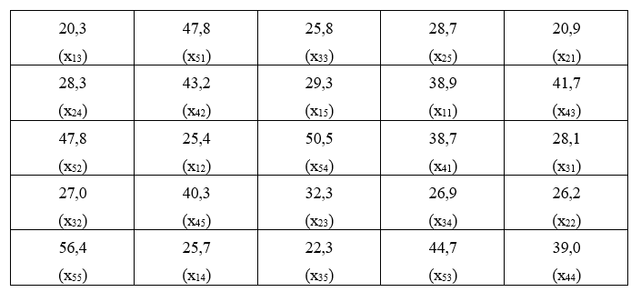

## 5.1 CARACTERIZAÇÃO

O **delineamento inteiramente casualizado (DIC)** é o mais simples de todos os delineamentos experimentais, e os experimentos instalados de acordo com este delineamento são chamados de experimentos interiamente casualizados ou experimentos inteiramente ao acaso.

Este delineamento apresenta as seguintes características:

1. Leva em consideração os princípios da **repetição** e da **casualização**, deixando de lado o *princípio do controle local* e, portanto, as repetições não são organizadas em blocos.

2. Os tratamentos são designados às parcelas de forma inteiramente casual, com qualquer número de repetições.

---

**As principais vantagens desse delineamento são as seguintes:**

1) Flexibilidade, uma vez que o número de repetições pode variar de um tratamento para outro, sem causar sérios problemas na análise.

2) Proporciona o maior número de graus de liberdade possível para o resíduo.
    
--

**As principais desvantagens desse delineamento são:**
   
1) As parcelas experimentais devem ser homogêneas.
  
2) Leva a uma alta estimativa da variância residual $QM_{Res}$, uma vez que todas as variações, exceto aquela devido ao efeito de tratamentos, são tomadas como variação do acaso.

---

Para a instalação desse experimento devemos ter certeza da homogeneidade das condições experimentais. 

Este delineamento é bastante utilizado em ensaios de laboratório e em ensaios com vasos, realizados dentro de casas de vegetação, em que as condições experimentais podem ser perfeitamente controladas.

A distribuição casual dos tratamentos a todas as parcelas do experimento é a principal característica deste delineamento. 

---

Por exemplo, num experimento no delineamento inteiramente casualizado com $I = 5$ tratamentos (A, B, C, D e E) e $J = 4$ repetições (1 a 4), a casualização dos tratamentos seria feita sorteando-se para cada uma das $(20)$ parcelas do experimento uma combinação de tratamento e repetição $(5 \times 4)$, ou seja:

$$\begin{matrix}
A1 & A2 & A3 & A4 \\
B1 & B2 & B3 & B4 \\
C1 & C2 & C3 & C4 \\
D1 & D2 & D3 & D4 \\
E1 & E2 & E3 & E4 
\end{matrix}$$

Assim, um sorteio para distribuição dos tratamentos às parcelas poderia ser o seguinte:

---


```{r}
i <- 5
j <- 4
tratamentos <-  rep(LETTERS[1:i], j)
repeticoes <- rep(1:j, rep(i,j))
parcelas <- paste0(tratamentos, repeticoes)
set.seed(1235)
sorteio <- sample(parcelas, size = 20, replace = FALSE)
matrix(sorteio, ncol=5, byrow = TRUE)
```


Resultado do sorteio

$$\begin{matrix}
E3 & B3 & C1 & E4 & E1\\
D3 & D1 & D4 & C3 & C4\\
A4 & B2 & B1 & B4 & A2\\
E2 & D2 & C2 & A1 & A3
\end{matrix}$$

---

### 5.2 MODELO MATEMÁTICO

Todo delineamento experimental possui um modelo matemático que o representa, e deve ser levado em conta na análise de variância, **aceitando algumas hipóteses básicas necessárias para a validade da análise.** 

No caso do $DIC$, o modelo matemático é definido como:

$$y_{ij}= \mu + \tau_i + \epsilon_{ij}$$

onde:

$y_{ij}$ é o valor observado na parcela que recebeu o tratamento *i* na repetição *j*;

$\mu$ é a média geral do experimento;

$\tau_i$ é o efeito devido ao tratamento *i* que foi aplicado à parcela;

$\epsilon_{ij}$ é o efeito dos fatores não controlados na parcela que recebeu o tratamento *i* na repetição *j*.

---

### 5.3 HIPÓTESES BÁSICAS PARA APLICAÇÃO DA ANÁLISE DE VARIÂNCIA

As hipóteses básicas que devemos admitir para tornar válida a aplicação da análise de variância são as seguintes:

1) **Aditividade**: Os efeitos dos fatores do modelo são aditivos.
  
2) **Independência**: Os erros (desvios) $\epsilon_{ij}$, devido aos efeitos de fatores não controlados ou acaso devem ser independentes.
  
3) **Homocedasticidade (homogeneidade de variâncias)**: Os erros (desvios) $\epsilon_{ij}$, devido ao acaso devem possuir variância comum $\sigma^2$
  
4) **Normalidade dos desvios**: Os erros ou desvios $\epsilon_{ij}$ devido ao acaso devem possuir distribuição normal de probabilidades.

---

Uma forma resumida de apresentar estas quatro pressuposições é apresentada a seguir:

$$
\epsilon_{ij} \overset{iid}{\tilde{} }N(0,\sigma^2)  \\
$$
  
Quando as hipóteses básicas não são satisfeitas, como no caso mais frequente a **homocedasticidade**, deve-se utilizar uma transformação dos dados para contormar o problema.

---

**Principais Transformações**

**1. Raiz Quadrada:** $y'=\sqrt{y}$

Geralmente utilizada para **dados de contagem**, que frequentemente seguem a distribuição de *Poisson*, em que a **média e a variância são iguais**. Exemplo, número de ácaros por folha, número de frutos atacados, número de plantas doentes por parcela, etc. No caso de ocorrência de valores nulos ou baixos, recomenda-se $y'=\sqrt{y+0,5}$ ou $y'=\sqrt{y+1}$.

**2. Arco Seno:** $y'=arcoseno\sqrt{\frac{y}{100}}$

Recomendada para **dados de porcentagem**, proveniente de contagem, que geralmente seguem a distribuição **binomial**, como exemplo, $\%$ de plantas atacadas, $\%$ de germinação, etc.

**3. Transformação Logarítmica:** $y'=log{(y)}$

Quando é constatada uma certa **proporcionalidade entre as médias e os desvios padrões** dos tratamentos. Exemplo: No caso de contagem de insetos, se a população é numerosa, as contagens serão altas para a testemunha e para os tratamentos que não controlam a praga, enquanto que, para os tratamentos que controlam a praga, a amplitude de variação será baixa.

Quando houver zeros entre as contagens, utiliza-se $y'=log(y+1)$.

---

### 5.4 OBTENÇÃO DA ANÁLISE DE VARIÂNCIA

Para a obtenção da análise de variância, vamos considerar um experimento inteiramente casualizado com **I** tratamentos e **J** repetições.

|Trat `\` Rep | $1$| $2$|...| $j$|...| $J$|Total|
|:---|:---:|:---:|:---:|:---:|:---:|:---:|:---:|:---:|
| $1$| $y_{11}$| $y_{12}$|...| $y_{1j}$|...| $y_{1J}$| $T_1 = \sum_{j=1}^J y_{1j}$|
| $2$| $y_{21}$| $y_{22}$|...| $y_{2j}$|| $y_{2J}$| $T_2 = \sum_{j=1}^J y_{2j}$|
|...|...|...|...|...|...|...|...|
| $i$| $y_{i1}$| $y_{i2}$|...| $y_{ij}$|---| $y_{iJ}$| $T_i = \sum_{j=1}^J y_{ij}$|
|...|...|...|...|...|...|...|...|
| $I$| $y_{I1}$| $y_{I2}$|...| $y_{Ij}$|...| $y_{IJ}$| $T_I = \sum_{j=1}^J y_{Ij}$|
|**Total**||||||| $G = \sum_{i=1}^I\sum_{j=1}^J y_{ij}$|

---
De acordo com o modelo matemático deste delineamento, o valor observado na parcela que recebeu o tratamento *i* na repetição *j* é representado por:

$$y_{ij}= \mu + \tau_i + \epsilon_{ij}$$

Porém, os parâmetros do modelo são desconhecido. Assim, devemos incialmente, obter estimativas desses parâmetros.

O método utilizado para obtenção das estimativas desses parâmetros é chamado de **Método dos Mínimos Quadrados**, e consiste em obter as estimativas que minimizam a soma dos quadrados dos erros $\epsilon_{ij}$

Utilizamos o **Métodos dos Mínimos Quadrados**, para minimizar a soma dos quadrados dos erros $\epsilon_{ij}$:

$$\epsilon_{ij}= y_{ij} - \mu - \tau_i$$

$$\epsilon_{ij}^2= (y_{ij} - \mu - \tau_i)^2$$

$$\sum_{i=1}^I\sum_{j=1}^J\epsilon_{ij}^2=\sum_{i=1}^I\sum_{j=1}^J( y_{ij} - \mu - \tau_i)^2$$
---

Fazendo $z=\sum_{i=1}^I\sum_{j=1}^j\epsilon_{ij}^2$, derivando em relação a $\mu$ e em relação $\tau_i$ e igualando as equações a $0$, temos:

$$\begin{cases} \sum_{i=1}^I\sum_{j=1}^Jy_{ij} - IJ\hat{m} -J\sum_{i=1}^I \hat{\tau_i} =0 \\ \sum_{j=1}^Jy_{ij}-J\hat{m}-J\hat{\tau_i}=0 \end{cases}$$

Impondo a restrição $\sum_{i=1}^I \hat{\tau_i}=0$, temos:

$$\begin{cases} \sum_{i=1}^I\sum_{j=1}^Jy_{ij} - IJ\hat{m} =0 \\ \sum_{j=1}^Jy_{ij}-J\hat{m}-J\hat{\tau_i}=0 \end{cases}$$
Então:
$$\hat{m} = \frac{\sum\limits_{i=1}^I\sum\limits_{j=1}^Jy_{ij}}{IJ}=\frac{G}{IJ}$$
e, fazendo $T_i=\sum_{j=1}^Jy_{ij}$, sendo o total para o tratamento específico *i*:

$$
\hat{\tau_i} =\frac{T_i}{J} - \hat{m}
$$

---

**Podemos agora obter as somas de quadrados:**

**1. Soma de Quadrados Total**: $SQ_{Total}$ - é definida como a soma dos quadrados dos desvios em relação à média aritmética:

$$SQ_\text{Total} = \sum_{i=1}^I\sum_{j=1}^J(y_{ij} - \hat{m})^2$$
Manipulando algebricamente, temos:

$$SQ_\text{Total} = \sum_{i=1}^I\sum_{j=1}^Jy_{ij}^2 - \frac{G^2}{IJ}$$

Ao fazermos 

$C = \frac{G^2}{IJ}$ 

temos portanto:

$$SQ_\text{Total} = \sum_{i=1}^I\sum_{j=1}^Jy_{ij}^2 - C$$

---

**2. Soma de Quadrados de Tratamentos**: $SQ_\text{Trat}$ - é definida como a soma dos quadrados dos efeitos dos tratamentos:

$$SQ_\text{Trat} = \frac{\sum_{i=1}^IT_i^2}{J} - C$$

Lembrando que:

$$T_i^2 = \left ( \sum_{j=1}^J{y_{ij}} \right)^2$$

e

$$C = \frac{G^2}{IJ}$$


---
**3. Soma de Quadrados do resíduo**: $SQ_\text{Resíduo}$ - é definida como a soma dos quadrados do efeito do acaso. Lembrando que no delineamento inteiramente casualizado a variância total é dividida em duas partes, uma devido ao efeito dos tratamentos e outra devido ao efeito dos fatores não controlados ou acaso (Resíduo), então, a soma de quadrados do resíduo pode ser obtida por diferença, ou seja:

$$SQ_\text{Resíduo} = SQ_\text{Total} - SQ_\text{Trat}$$

Podemos, a seguir, montar o seguinte quadro de análise de variância:

Fontes de Variação | $GL$ | $SQ$ | $QM$ | $F$ 
:---|:---:|:---:|:---:|:---:
Tratamento | $I-1$| $SQ_\text{Trat}$ | $\frac{SQ_\text{Trat}}{(I-1)}$ | $\frac{QM_\text{Trat}} {QM_\text{Resíduo}}$
Resíduo | $I(J-1)$| $SQ_\text{Res}$ | $\frac{SQ_\text{Res}}{[I(J-1)]}$ | 
**Total** | ** $IJ-1$ **| $SQ_\text{Total}$ |  | 

As hipóteses testadas são:

$$\begin{cases} H_0: \tau_i = 0, i=1,2,...,I. \\ 
H_1: \text{pelo menos um valor } \tau_i \neq 0
\end{cases}$$


---

**CRITÉRIO DO TESTE**: Comparamos o valor $F$ calculado para tratamentos com o valor de $F$ tabelado em função do número de graus de liberdade (GL) de tratamentos e do resíduo, ao nível $\alpha$ de significância.

Se $F_{Trat} > F_{Tab}$, concluímos que o teste é significativo, portanto, rejeitamos $H_0$ e devemos concluir que existe diferença significativa entre os efeitos dos tratamentos testados em relação às variáveis (característica) em estudo.

---

### 5.5 EXEMPLO DE APLICAÇÃO

Num experimento inteiramente casualizado, de competição de variedades de mandioca, realizado numa área perfeitamente homogênea quanto às condições experimentais, foram utilizadas $5$ repetições das seguintes variedades:

T1: IAC-5

T2: IAC-7

T3: IAC-11

T4: IRACEMA

T5: MANTIQUEIRA


---
A designação dos tratamentos às parcelas no campo, juntamente com as produções, expressa em t/ha, foi a seguinte:



**Dados originais**:[DOWNLOAD](https://github.com/arpanosso/experimentacao-agricola-unesp-fcav/raw/master/data/dados_prod_mandioca.xlsx)

---

Com estes dados, podemos organizar o quadro seguinte:

Tratamentos|Rep.1|Rep.2|Rep.3|Rep.4|Rep. 5|Total
:---|:---:|:---:|:---:|:---:|:---:|---:
1 - IAC_5|38,9|25,4|20,3|25,7|29,3|139,6
2 - IAC_7 |20,9|26,2|32,3|28,3|28,7|136,4
3 - IAC_11|28,1|27,0|25,8|26,9|22,3|130,1
4 - IRACEMA|38,7|43,2|41,7|39,0|40,3|202,9
5 - MANTIQUEIRA|47,8|47,8|44,7|50,5|56,4|247,2
**Total**|---|---|---|---|---|856,2

As hipóteses que desejamos testar são:

$$\begin{cases} 
 H_0: \text{As variedades testadas não diferem entre si quanto à produção.} \\
 H_1: \text{As variedades testadas diferem entre si quanto à produção.}
\end{cases}$$

---

**Cálculo das Somas de Quadrados**

**a) Soma de Quadrados Total**:

$$SQ_\text{Total} = \sum_{i=1}^I\sum_{j=1}^Jy_{ij}^2 - C \\
SQ_\text{Total} = \sum_{i=1}^I\sum_{j=1}^Jy_{ij}^2 - \frac{G^2}{IJ} \\
SQ_\text{Total} = (38,9^2+25,4^2+...+56,4^2) - \frac{856,2^2}{5\times5}\\
SQ_\text{Total} = 2509,46$$
---

**b) Soma de Quadrados devido ao efeito de Tratamentos**:

$$SQ_\text{Trat} = \frac{\sum_\limits{i=1}^IT_i^2}{J} - C \\
SQ_\text{Trat} = \frac{T_1^2+T_2^2+...+T_I^2}{J} - \frac{G^2}{IJ}\\
SQ_\text{Trat} = \frac{139,6^2+136,4^2+...+247,2^2}{5} - \frac{856,2^2}{5\times5}\\ 
SQ_\text{Trat}= 2135,94$$

--
**Soma de Quadrados do Resíduo**:
$$SQ_\text{Res} = SQ_\text{Total} - SQ_\text{Trat} \\
SQ_\text{Res} = 2509,46 - 2135,94 = 373,52$$

---

Então, podemos montar o seguinte quadro de análise de variância:

Fontes de Variação |GL | SQ | QM | F 
:---|:---:|:----:|:----:|:---:
Tratamento | $4$| $2135,94$ | $533,99$ | $28,59$**
Resíduo | $20$| $373,52$ | $18,68$ | -
**Total** | $24$| $2509,46$| - | - |- 

Valores de $F$ da tabela para $(4 \times 20\;GL)$:
$$\begin{cases} 5\%=2,87 \\ 1\%=4,43 \end{cases}$$

[Tabela F a 5%](https://github.com/arpanosso/experimentacao-agricola-unesp-fcav/blob/master/img/aula03/f_5p.png)

[Tabela F a 1%](https://github.com/arpanosso/experimentacao-agricola-unesp-fcav/blob/master/img/aula03/f_1p.png)

---

**Conclusão**: O teste $F$ foi significativo ao nível de $1\%$ de probabilidade, indicando que devemos rejeitar $H_0$ e concluir que as variedades diferem entre si em relação à produção de mandioca, com um grau de confiança de $99\%$ de probabilidade.

Conclusões específicas sobre o comportamento das variedades, devemos utilizar um teste de comparação de médias (comparações múltiplas).


---

**a) Cálculo das médias de cada tratamento e erros padrões das médias**:

$$\hat{m_1} = \frac{T_1}{J} = \frac{139,6}{5} = 27,9\;t/ha\\
\hat{m_2} = \frac{T_2}{J}= \frac{136,4}{5} = 27,3\;t/ha\\
\hat{m_3} = \frac{T_3}{J}= \frac{130,1}{5} = 26,0\;t/ha\\
\hat{m_4} = \frac{T_4}{J}= \frac{202,9}{5} = 40,6\;t/ha\\
\hat{m_5} =\frac{T_5}{J}= \frac{247,2}{5} = 49,4\;t/ha$$

E o erro padrão das médias será:

$$s(\hat{m_1}) = s(\hat{m_2})=s(\hat{m_3})=s(\hat{m_4})=s(\hat{m_5})= \\\ = \sqrt{\frac{QM_\text{Res}}{J}} = \sqrt{\frac{18,68}{5}} = 1,93 \; t/ha$$
---
**b) Aplicação do teste de Tukey para a comparação das médias de tratamentos**

**b.1) Cálculo do valor de $\Delta$**:

$$
q_{(5\;Trat \times 20 GL\;Resíduo)}(5\%) = 4.23
$$
[Tabela das amplitudes totais studentizadas de Tukey a 5%](https://github.com/arpanosso/experimentacao-agricola-unesp-fcav/blob/master/img/aula04/tTukey.png)

Então, temos:

$$\Delta = q \times \sqrt{\frac{QM_{Res}}{J}} \\ 
\Delta = 4,23 \times 1,93 \\
\Delta = 8,2\;t/ha$$

---

**b.2) Organizar as médias em ordem decrescente**:

$$\hat{m_5} = 49,4\;t/ha\\
\hat{m_4} = 40,6\;t/ha\\
\hat{m_1} = 27,9\;t/ha\\
\hat{m_2} = 27,3\;t/ha\\
\hat{m_3} = 26,0\;t/ha$$

**b.3) Cálculo das estimativas de contrastes entre duas médias**:

|| $\hat{m_4}$| $\hat{m_1}$| $\hat{m_2}$| $\hat{m_3}$|
|:---:|:---:|:---:|:---:|:---:|:---:|
| $\hat{m_5}$| $8,8^{*}$| $21,5^{*}$| $22,1^{*}$| $23,4^{*}$|
| $\hat{m_4}$|| $12,7^{*}$| $13,3^{*}$| $14,6^{*}$|
| $\hat{m_1}$||| $0,60^{ns}$| $1,9^{ns}$|
| $\hat{m_2}$|||| $1,3^{ns}$|

---

**b.4) Conclusão**: Médias seguidas pela mesma letra, não diferem entre si, pelo teste de Tukey ao nível de $5\%$ de probabilidade. 

$$\hat{m_5} = 49,4\;a\\
\hat{m_4} = 40,6\;b\\
\hat{m_1} = 27,9\;c\\
\hat{m_2} = 27,3\;c\\
\hat{m_3} = 26,0\;c$$

**Médias seguidas pela mesma letra não diferem entre sim pelo teste de Tukey ao nível de 5% de significância**

Portanto, a melhor variedade é a Mantiqueira, pois difere de todas as outras pelo teste de Tukey e apresenta maior produção de mandioca.

---

**c) Cálculo do coeficiente de variação do experimento:**

$$\hat{m} = \frac{G}{IJ} = \frac{856,2}{5 \times 5} = 34,2 \;t/ha \\
s = \sqrt{QM_{res}} = \sqrt{18,64} = 4,32\;t/ha \\
CV = 100 \times \frac{s}{\hat{m}} = 100 \times \frac{4,32}{34,2} = 12,63\%$$

---
Utilizando o R para obtermos o quadro da análise de variância, os dados estão disponíveis em:  [mandioca.txt](https://raw.githubusercontent.com/arpanosso/experimentacao-agricola-unesp-fcav/master/img/aula05/mandioca.txt)


```{r}
# Carregando o pacote para a análise
library(ExpDes.pt)

# Caminho dos dados
url<-"https://raw.githubusercontent.com/arpanosso/experimentacao-agricola-unesp-fcav/master/img/aula05/mandioca.txt"

# Lendo o arquivo de dados
dados<-read.table(url, h = TRUE)

# verificando os 6 primeiros registros
head(dados)

# Análise de variância e teste de Tukey com a função dic
trat <- as.factor(dados$Trat) # Criando o vetor de tratamentos
resp <- dados$Y # Criando o vetor com a variável resposta

# Utilizando a função
dic(trat, resp, mcomp = "tukey")
```

---
```{r,echo=FALSE}
dic(trat, resp, mcomp = "tukey")
```

---
class: inverse,middle, center

## 5.6 
## DELINEAMENTO INTEIRAMENTE CASUALIZADO 
## COM NÚMERO DIFERENTE DE REPETIÇÕES 
## POR TRATAMENTO


---
#### 5.6.1 INTRODUÇÃO

Muitas vezes pode acontecer de chegarmos ao final do experimento e não conseguirmos obter os dados de algumas parcelas do experimento. 

Quando isso ocorre, dizemos que temos **parcelas perdidas**.

Algumas razões para a ocorrência de parcelas perdidas:

+ morte das plantas responsáveis pela parcela;
+ falha do experimentador na coleta dos dados (erro de anotação);
+ perda da ficha onde estão anotados os dados da parcela;
+ a parcela apresenta um valor muito discrepante dos demais e não é considerada para efeito de análise;
+ impossibilidade de acesso à parcela, ou ao bloco devido à condições meteorológicas;
+ falha no equipamento (muito comum na utilização de sensores).

---

### 5.6.2 OBTENÇÃO DA ANÁLISE DE VARIÂNCIA

Todo o delineamento experimental é estruturado para que haja um perfeito balanceamento, e a perda de parcelas causa uma quebra neste balanceamento, acarretando modificações no método de análise estatística.


Para ilustrar o procedimento de análise de um experimento inteiramente casualizado, não balanceado, vamos utilizar o exemplo seguinte, referente a dados adaptados do trabalho de **CARDOSO FILHO (1974)** e se referem a produção de matéria seca de cultivares de sorgo, em t/ha.

---

Experimento de produção de matéria seca de cultivares de sorgo, em t/ha. Para os cultivares, *H* = *Híbrido* e *V* = *Variedade*.

```{r echo=FALSE}
library(knitr)
library(kableExtra)
tb <-data.frame(Cultivares=c("NK300H","Sordan67H","Pionner988H","Pionner93H","SartV","Total"),
                Rep.1=c("10.27","9.77","9.86","21.22","20.20",""),
                Rep.2=c("11.55","9.96","9.59","20.62","20.55",""),
                Rep.3=c("11.68","11.94","10.43","22.33","22.12",""),
                Rep.4=c("11.38","10.18","9.99","19.89","20.78",""),
                Rep.5=c("11.20","10.43","--","21.00","20.90",""),
                Rep.6=c("11.24","10.49","--","--","20.92",""),
                Totais=c("67.32","62.77","39.87","105.06","125.47","400.49")
                  )
kable(tb) %>%
#kable_styling(bootstrap_options = c("striped", "hover", "condensed", "responsive"))
kable_styling(bootstrap_options = "striped", full_width = F, position = "center")
```

**Dados originais**:[DOWNLOAD](https://github.com/arpanosso/experimentacao-agricola-unesp-fcav/raw/master/data/dados_prod_sorgo.xlsx)

As hipóteses testadas são:

$$\begin{cases} H_0: \text{As cultivares não diferem entre si quanto à produção de matéria seca.}\\ 
H_1: \text{As cultivares diferem entre si quanto à produção de matéria seca.}
\end{cases}$$

---

**a) Cálculo das Somas de Quadrados**:

**a.1) Cálculo da Soma de Quadrados Total**:

$$SQ_\text{Total} = \sum_{i=1}^I\sum_{j=1}^Jy_{ij}^2 - C \\
SQ_\text{Total} = \sum_{i=1}^I\sum_{j=1}^Jy_{ij}^2 - \frac{G^2}{N} \\
SQ_\text{Total} = (10,27^2+11,55^2+...+20,92^2) - \frac{400,49^2}{( 5 \times 6 - 3)}\\
SQ_\text{Total} = 710,1902$$

---

**a.2) Cálculo da Soma de Quadrados de Tratamentos**:

Como os tratamento não são igualmente repetidos, devemos calcular a $SQ_\text{Trat}$ por:

$$SQ_\text{Trat} =\left[ {\frac{T_1^2}{r_1}+\frac{T_2^2}{r_2}+...+\frac{T_I^2}{r_I}} \right] - \frac{G^2}{N}$$
onde,

$$N=\sum_{i=1}^Ir_i$$

Assim, no nosso exemplo, temos:

$$SQ_\text{Trat} =\left[ {\frac{62,32^2}{6}+\frac{62,77^2}{6}+\frac{39,87^2}{4}+\frac{105,06^2}{5}+\frac{125,47^2}{6}} \right] - \frac{400,49^2}{27}\\ 
SQ_\text{Trat}= 700,2677$$

---

**a.2) Cálculo da Soma de Quadrados do Resíduo**:

$$SQ_\text{Res} = SQ_\text{Total} - SQ_\text{Trat} \\
SQ_\text{Res} = 710,1902 - 700,2677 \\
SQ_\text{Res} = 9,9225$$

---

Então, podemos montar o seguinte quadro de análise de variância:


```{r echo=FALSE}
tb <-data.frame("FV"=c("Tratamento","Resíduo","Total"),
                GL=c("4","22","26"),
                SQ=c("700,2677","9,9225","710,1902"),
                QM=c("175,0669","0,4510","--"),
                "F"=c("388,17**","--","--")
                )
kable(tb) %>%
#kable_styling(bootstrap_options = c("striped", "hover", "condensed", "responsive"))
kable_styling(bootstrap_options = "striped", full_width = F, position = "center")
```

Valores de $F$ da tabela para (4 x 22 GL):
$$\begin{cases} 5\%=2,82 \\ 1\%=4,31 \end{cases}$$

**Conclusão**: O teste F foi significativo ao nível de 1% de probabilidade, indicando que devemos rejeitar $H_0$ e concluir que as cultivares de sorgo possuem efeitos diferentes sobre a produção de matéria seca, com um grau de confiança de $99\%$ de probabilidade.

Para tirar conclusões mais específicas sobre o comportamento das cultivares, devemos utilizar um teste de compração de médias.

---

#### 5.6.3 CÁLCULO DAS MÉDIAS E ERROS PADRÕES DAS MÉDIAS:

A média do Tratamento $i$ é dada por:

$$
\hat{m_i} = \frac{T_i}{r_i},
$$

e seu erro padrão, por:

$$s(\hat{m_i})=\frac{s}{\sqrt{r_i}} = \sqrt{\frac{QM_{Resíduo}}{r_i}}$$
---
Então, no nosso exemplo, temos:

$$\hat{m_1} = \frac{T_1}{r_1}=\frac{67,32}{6}=11,22\;t/ha\\
\hat{m_2} = \frac{T_2}{r_2}=\frac{62,77}{6}=10,46\;t/ha\\
\hat{m_3} = \frac{T_3}{r_3}=\frac{39,87}{4}=9,97\;t/ha\\
\hat{m_4} = \frac{T_4}{r_4}=\frac{105,06}{5}=21,01\;t/ha\\
\hat{m_5} = \frac{T_5}{r_5}=\frac{125,47}{6}=20,91\;t/ha$$

E os erros padrões dessas médias serão:

$$s(\hat{m_1})=s(\hat{m_2})=s(\hat{m_5})=\sqrt{\frac{0,4510}{6}} = 0,27\;t/ha.\\
s(\hat{m_3})=\sqrt{\frac{0,4510}{4}} = 0,34\;t/ha.\\
s(\hat{m_4})=\sqrt{\frac{0,4510}{5}} = 0,30\;t/ha.$$

---
#### 5.6.4 TESTE DE TUKEY PARA COMPARAÇÃO DAS MÉDIAS

Como os tratamentos não possuem o mesmo número de repetições, vamos ter diversos casos a considerar:

Para a aplicação do teste de Tukey, devemos colocar as médias em ordem decresecente, acompanhadas do número de repetições com que foram calculadas, ou seja

$$\hat{m_4}=21,01 \:\:\:\:\:\: r_4=5\\
\hat{m_5}=20,91 \:\:\:\:\:\: r_5=6\\
\hat{m_1}=11,22 \:\:\:\:\:\: r_1=6\\
\hat{m_2}=10,46 \:\:\:\:\:\: r_2=6\\
\hat{m_3}=9,97 \:\:\:\:\:\:\:\: r_3=4$$
---
**a. Comparação entre médias com 6 repetições entre si:**

Neste caso, como as médias são igualmente repetidas, a dms é dada por:

$$
q_{(5\times 22\;GLres)} = 4,20
$$
$$
\Delta=4,20\times\sqrt{\frac{0,4510}{6}}=1,15\;t/ha
$$

Os contrastes que envolvem comparações são:

$$\hat{Y_1} = \hat{m_5} - \hat{m_1} = 9,69^*\;t/ha \\
\hat{Y_2} = \hat{m_5} - \hat{m_2} = 10,45^*\;t/ha \\
\hat{Y_3} = \hat{m_1} - \hat{m_2} = 0,76^{ns}\;t/ha$$

---

**b. Comparação entre médias com 6 repetições com média com 5 repetições:**

Neste caso, a DMS $(\Delta)$ será calculada por:

$$
\Delta = q\times\sqrt{\frac{1}{2} \times \hat{V(\hat{Y})}}
$$

onde

$$\hat{V(\hat{Y})}= \left( \frac{1}{6}+\frac{1}{5} \right)\times 0,4510 = 0,1654$$

Portanto:

$$
\Delta = 4,20\times\sqrt{\frac{1}{2}\times 0,1654} = 1,21\;t/ha
$$

Os contrastes que envolvem comparações são:

$$\hat{Y_4} = \hat{m_4} - \hat{m_1} = 9,79^*\;t/ha \\
\hat{Y_5} = \hat{m_4} - \hat{m_2} = 10,55^*\;t/ha \\
\hat{Y_6} = \hat{m_4} - \hat{m_5} = 0,10^{ns}\;t/ha$$
---
**c. Comparação entre médias com 6 repetições com média com 4 repetições:**

Neste caso, a dms será calculada por:

$$\Delta = q\times\sqrt{\frac{1}{2}\times\hat{V(\hat{Y})}}$$
onde
$$
\hat{V(\hat{Y})}= \left( \frac{1}{6}+\frac{1}{4} \right)\times 0,4510 = 0,1879
$$

Portanto:

$$
\Delta = 4,20\times\sqrt{\frac{1}{2}\times 0,1879} = 1,29\;t/ha
$$

Os contrastes que envolve comparações são:

$$\hat{Y_7} = \hat{m_1} - \hat{m_3} = 1,25^{ns}\;t/ha \\
\hat{Y_8} = \hat{m_2} - \hat{m_3} = 0,49^{ns}\;t/ha \\
\hat{Y_9} = \hat{m_5} - \hat{m_3} = 10,94^{*}\;t/ha$$

---

**d. Comparação entre médias com 5 repetições com média com 4 repetições:**

Neste caso, a dms será calculada por:

$$
\Delta = q\times\sqrt{\frac{1}{2}\hat{V(\hat{Y})}}
$$


$$\hat{V(\hat{Y})}= \left( \frac{1}{5}+\frac{1}{4} \right)\times 0,4510 = 0,2030$$

Portanto:

$$\Delta = 4,20\times \sqrt{\frac{1}{2}\times 0,2030} = 1,34\;t/ha$$

O contraste que envolvem comparação é:

$$
\hat{Y_{10}} = \hat{m_4} - \hat{m_3} = 11,04^{*}\;t/ha 
$$


---

Podemos agora montar um quadro com todos os contrastes:

|| $\hat{m_5}$| $\hat{m_1}$| $\hat{m_2}$| $\hat{m_3}$|
|:---:|:---:|:---:|:---:|:---:|:---:|
| $\hat{m_4}$| $0,10^{ns}$| $9,79^{*}$| $10,55^{*}$| $11,04^{*}$|
| $\hat{m_5}$|| $9,69^{*}$| $10,45^{*}$| $10,94^{*}$|
| $\hat{m_1}$||| $0,76^{ns}$| $1,25^{ns}$|
| $\hat{m_2}$|||| $0,49^{ns}$|


$$\hat{m_4}=21,01 \; a\\
\hat{m_5}=20,91 \; a\\
\hat{m_1}=11,22 \; b\\
\hat{m_2}=10,46 \; b\\
\hat{m_3}=9,97 \; b$$

---

Resumo dos resultados obtidos no Teste de Tukey:

```{r echo=FALSE}
tb <-data.frame(Cultivares=c("NK300H","Sordan67H","Pionner988H","Pionner93H","SartV"),
                Médias=c("11.22","10.46","9.97","21.01","20.91"),
                Tukey = c("b","b","b","a","a"),
                Erros_Padrões=c("0.27","0.27","0.34","0.30","0.27")
                )
names(tb)<-c("Cultivares","Médias","Tukey","Erros padrões")
kable(tb) %>%
#kable_styling(bootstrap_options = c("striped", "hover", "condensed", "responsive"))
kable_styling(bootstrap_options = "striped", full_width = F, position = "center")
```

---

#### 5.6.5 CÁLCULO DO COEFICIENTE DE VARIAÇÃO DO EXPERIMENTO

$$\hat{m} = \frac{G}{N} = \frac{400,49}{27} = 14,82\;t/ha \\
s = \sqrt{QM_{Res}}=\sqrt{0,4510}=0,6716\;t/ha\\$$

Portanto:
$$
CV=100\times \frac{s}{\hat{m}} = 100\times \frac{0,6716}{14,83}=4,53\%
$$


---

Utilizando o R para obtermos o quadro da análise de variância, os dados estão disponíveis online em [sorgo.txt](https://raw.githubusercontent.com/arpanosso/ExpAgr_2020/master/dados/sorgo.txt).


```{r, eval=FALSE}
# Carregando o pacote para a análise
library(ExpDes.pt)

# Caminho dos dados
url<-"https://raw.githubusercontent.com/arpanosso/ExpAgr_2020/master/dados/sorgo.txt"

# Lendo o arquivo de dados
dados<-read.table(url,h=T,sep="\t")

# Análise de variância e teste de Tukey com a função dic
trat <- dados$Trat[!is.na(dados$Y)] 
massa_seca <- dados$Y[!is.na(dados$Y)] 

# Utilizando a função
dic(trat,massa_seca,mcomp = "tukey", sigT = .01)
```

---
```{r, echo=FALSE}
library(ExpDes.pt)
url<-"https://raw.githubusercontent.com/arpanosso/ExpAgr_2020/master/dados/sorgo.txt"
dados<-read.table(url,h=T,sep="\t")
trat <- dados$Trat[!is.na(dados$Y)] 
massa_seca <- dados$Y[!is.na(dados$Y)] 
dic(trat,massa_seca,mcomp = "tukey", sigT = .01)
```

---
class: center, middle, inverse

## 5.6.6 
## APLICAÇÃO DO TESTE t DE STUDENT 
## A UM CONTRASTE

---
Para exemplificar, vamos estudar o seguinte contraste:

$$
Y=m_1+m_2+m_3+m_4-4m_5
$$

que permite testar se a média dos híbridos difere da média da variedade. Neste caso, as hipóteses a serem testada serão:

$$\begin{cases}  H_0:\frac{m_1+m_2+m_3+m_4}{4}=m_5 \\
H_1: \frac{m_1+m_2+m_3+m_4}{4} \neq m_5 \end{cases}$$

A estimativa do contraste será:
$$\hat{Y} = \hat{m_1}+\hat{m_2}+\hat{m_3}+\hat{m_4}-4\hat{m_5} \\
\hat{Y} = 11,22+10,46+9,97+21,01-4\cdot20,91 \\
\hat{Y} = -30,98$$

---

A estimativa da variância do contraste será:

$$\hat{V}(\hat{Y}) = \left(\frac{c_1^2}{r_1}+\frac{c_2^2}{r_2}+...+\frac{c_I^2}{r_I} \right)s^2 \\
\hat{V}(\hat{Y}) = \left(\frac{1^2}{6}+\frac{1^2}{6}+\frac{1^2}{4}+\frac{1^2}{5}+\frac{(-4)^2}{6} \right)0,4510 \\
\hat{V}(\hat{Y}) = 1,5560$$

---

Assim, o erro padrão do contraste será:

$$
s(\hat{Y})=\sqrt{\hat{V}(\hat{Y})} = \sqrt{1,5560}=1,25
$$

e o valor da estatística do teste t será:

$$t_{obs} = \frac{\hat{Y}}{s(\hat{Y})}=\frac{-30,98}{1.25}=-24,78^{**} \\
t_{tab (22 GLres)} \begin{cases}5\%=2,07\\1\%=2,82 \end{cases}$$

**Conclusão**: Como $|t_{obs}| > t_{tab}$, rejeitamos $H_0$ e concluímos que a média do grupo de híbridos diferem da média da variedade SART, sendo que, em médias, a variedade possui maior produção de matéria seca que os híbridos.


---
```{r}
library(agricolae)
m <- tapply(massa_seca,trat,mean,na.rm=TRUE)
r <- tapply(massa_seca,trat, .nac<-function(x) {x<-na.omit(x);length(x)})
QMRes <- 0.4510
glRes <- 22
```

---
```{r}
#Híbridos vs Variedades
m
c1<-c(1,1,1,-4,1) # atribua os coeficientes de acordo com a ordem das médias
(Y1=sum(m*c1))
(tobs=Y1/sqrt(sum(c1^2/r)*QMRes))
(tc5=qt(1-0.05/2,glRes))
(tc1=qt(1-0.01/2,glRes))
```

---

```{r,fig.width=15,fig.height=13,echo=FALSE}
# Construção do Gráfico para interpretação
curve(dt(x,glRes),-30,9,xlab="t",ylab="densidade",
      las=1,cex.lab=2)
abline(v=0)
abline(v=c(tc5,-tc5,tc1,-tc1),col=2,lty=2)
abline(v=tobs,col=4,lty=1)
text(2.8,.1,expression(paste(alpha,"=2.5%")),cex=2)
text(4,.02,expression(paste(alpha,"=0.5%")),cex=2)
text(-2.8,.1,expression(paste(alpha,"=2.5%")),cex=2)
text(-4,.02,expression(paste(alpha,"=0.5%")),cex=2)
text(tobs,.05,"tobs",cex=2)
```

---

class: middle, inverse, center

## 5.6.7  
## TESTE DE DUNCAN 
## PARA A COMPARAÇÃO DAS MÉDIAS


---

Para a aplicação do teste de Duncan, devemos colocar as médias em ordem decresecente, acompanhadas do número de repetições com que foram calculadas, ou seja

$$\hat{m_4}=21,01 \:\:\:\:\:\: r_4=5\\
\hat{m_5}=20,91 \:\:\:\:\:\: r_5=6\\
\hat{m_1}=11,22 \:\:\:\:\:\: r_1=6\\
\hat{m_2}=10,46 \:\:\:\:\:\: r_2=6\\
\hat{m_3}=9,97 \:\:\:\:\:\:\:\: r_3=4\\$$

**Amplitude total estudentizada (z), encontradas na tabela para uso no teste de Duncan, ao nível de $5\%$ de significância**.

$n'$ | $n (22)$
:---:|:---:
$5$ | $3,24$
$4$ | $3,17$
$3$ | $3,08$
$2$ | $2,93$ 

---

**a) Contrastes que abrangem 5 médias**:

$$\hat{Y_1}=\hat{m_4}-\hat{m_3} = 21,01-9,97 = 11,04\;t/ha$$

$$\hat{V}(\hat{Y_1})= \left( \frac{1}{r_4} + \frac{1}{r_3}\right)s^2 = \left( \frac{1}{5} + \frac{1}{4}\right)0,4510 = 0,2030$$

$$D_5 = z_\alpha \times \sqrt{\frac{1}{2}\hat{V}(\hat{Y})} \\
D_5 = 3,24 \times \sqrt{\frac{1}{2} \times 0,2030} \\
D_5 = 1,03\; t/ha$$

Como $\hat{Y_1} > D_5'$, rejeita-se $H_0$, o contraste é significativo, indicando que $\hat{m_4}$ difere de $\hat{m_3}$.

---

**b) Contrastes que abrangem 4 médias**:

$$\begin{cases} \hat{Y_2}=\hat{m_4}-\hat{m_2} = 21,01-10,46 = 10,55\;t/ha \\
\hat{Y_3}=\hat{m_5}-\hat{m_3} = 20,91-9,97 = 10,94\;t/ha \end{cases}$$

$$\hat{V}(\hat{Y_2})= \left( \frac{1}{r_4} + \frac{1}{r_2}\right)s^2 = \left( \frac{1}{5} + \frac{1}{6}\right)0,4510 = 0,1654\\
D_4' = z_\alpha \sqrt{\frac{1}{2}\hat{V}(\hat{Y_2})}= 3,17\sqrt{\frac{1}{2}\cdot0,1654} = 0,91\; t/ha \\$$


Como $\hat{Y_2} > D_4'$, rejeita-se $H_0$, o contraste é significativo, indicando que $\hat{m_4}$ difere de $\hat{m_2}$.

---

$$\hat{V}(\hat{Y_3})= \left( \frac{1}{r_5} + \frac{1}{r_3}\right)s^2 = \left( \frac{1}{6} + \frac{1}{4}\right)0,4510 = 0,1879\\
D'_4 = z_\alpha \sqrt{\frac{1}{2}\hat{V}(\hat{Y_3})}= 3,17\sqrt{\frac{1}{2}\cdot0,1879} = 0,97\; t/ha \\$$


Como $\hat{Y_3} > D''_4$, rejeita-se $H_0$, o contraste é significativo, indicando que $\hat{m_5}$ difere de $\hat{m_3}$.

---

**c) Contrastes que abrangem 3 médias**:

$$\begin{cases} \hat{Y_4}=\hat{m_4}-\hat{m_1} = 21,01-11,22 = 9,79\;t/ha \\
\hat{Y_5}=\hat{m_5}-\hat{m_2} = 20,91-10,46 = 10,45\;t/ha \\
\hat{Y_6}=\hat{m_4}-\hat{m_1} = 11,22-9,97 = 1,25\;t/ha \end{cases}$$


$$\hat{V}(\hat{Y_4})= \left( \frac{1}{r_4} + \frac{1}{r_1}\right)s^2 = \left( \frac{1}{5} + \frac{1}{6}\right)0,4510 = 0,1654\\
D'_3 = z_\alpha \sqrt{\frac{1}{2}\hat{V}(\hat{Y_4})}= 3,08\sqrt{\frac{1}{2}\cdot0,1654} = 0,89\; t/ha \\$$
Como $\hat{Y_4} > D'_3$, rejeita-se $H_0$, o contraste é significativo, indicando que $\hat{m_4}$ difere de $\hat{m_1}$.

$$D_3 = z_\alpha \sqrt{\frac{QM_{Res}}{r}} = 3,08 \sqrt{\frac{0,4510}{6}} = 0,84\; t/ha$$

Como $\hat{Y_5} > D_3$, rejeita-se $H_0$, o contraste é significativo, indicando que $\hat{m_5}$ difere de $\hat{m_2}$.

---

$$\hat{V}(\hat{Y_6})= \left( \frac{1}{r_1} + \frac{1}{r_3}\right)s^2 = \left( \frac{1}{6} + \frac{1}{4}\right)0,4510 = 0,1879\\
D''_3 = z_\alpha \sqrt{\frac{1}{2}\hat{V}(\hat{Y_C})}= 3,08\sqrt{\frac{1}{2}\cdot0,1879} = 0,94\; t/ha$$

Como $\hat{Y_6} > D''_3$, rejeita-se $H_0$, o contraste é significativo, indicando que $\hat{m_1}$ difere de $\hat{m_3}$.


---


**d) Contrastes que abrangem 2 médias**:

$$\begin{cases} 
\hat{Y_7}=\hat{m_4}-\hat{m_5} = 21,01-20,91 = 0,10\;t/ha \\
\hat{Y_8}=\hat{m_5}-\hat{m_1} = 20,91-11,22 = 9,69\;t/ha \\
\hat{Y_9}=\hat{m_1}-\hat{m_2} = 11,22-10,46 = 0,76\;t/ha \\
\hat{Y_{10}}=\hat{m_2}-\hat{m_3} = 10,46-9,97 = 0,49\;t/ha 
\end{cases}$$

$$\hat{V}(\hat{Y_7})= \left( \frac{1}{r_4} + \frac{1}{r_5}\right)s^2 = \left( \frac{1}{5} + \frac{1}{6}\right)0,4510 = 0,1654\\
D_2' = z_\alpha \sqrt{\frac{1}{2}\hat{V}(\hat{Y_7})}= 2,93\sqrt{\frac{1}{2}\cdot0,1654} = 0,84\; t/ha$$

Como $\hat{Y_7} < D'_2$, não rejeita-se $H_0$, o contraste não é significativo, indicando que $\hat{m_4}$ não difere de $\hat{m_5}$. As médias devem receber a mesma letra (ou ser unidas por uma barra).

---

$$D_2 = z_\alpha \sqrt{\frac{QM_{Res}}{r}} = 2,93 \sqrt{\frac{0,4510}{6}} = 0,80\; t/ha$$
Como $\hat{Y_8} > D_2$, rejeita-se $H_0$, o contraste é significativo, indicando que $\hat{m_5}$ difere de $\hat{m_1}$.

Como $\hat{Y_9} < D_2$, não rejeita-se $H_0$, o contraste não é significativo, indicando que $\hat{m_1}$ não difere de $\hat{m_2}$. As médias devem ser unidas por uma barra.

$$\hat{V}(\hat{Y_{10}})= \left( \frac{1}{r_2} + \frac{1}{r_3}\right)s^2 = \left( \frac{1}{6} + \frac{1}{4}\right)0,4510 = 0,1879\\
D''_2 = z_\alpha \sqrt{\frac{1}{2}\hat{V}(\hat{Y_{10}})}= 2,93\sqrt{\frac{1}{2}\cdot0,1879} = 0,90\; t/ha \\$$
Como $\hat{Y_{10}} < D''_2$, não rejeita-se $H_0$, o contraste é não significativo, indicando que $\hat{m_2}$ não difere de $\hat{m_3}$. As médias devem ser unidas por uma barra.

---

```{r echo=FALSE}
tb <-data.frame(Cultivares=c("Pionner93H","SartV","NK300H","Sordan67H","Pionner988H"),
                Médias=c("21.01 a","20.91 a","11.22 b","10.46 bc","9.97 c"))
kable(tb) %>%
#kable_styling(bootstrap_options = c("striped", "hover", "condensed", "responsive"))
kable_styling(bootstrap_options = "striped", full_width = F, position = "center")
```


---

### Utilizando o R


```{r,eval=FALSE}
library(ExpDes.pt)
url<-"https://raw.githubusercontent.com/arpanosso/ExpAgr_2020/master/dados/sorgo.txt"
dados<-read.table(url,h=T,sep="\t")
trat <- dados$Trat[!is.na(dados$Y)] 
massa_seca <- dados$Y[!is.na(dados$Y)] 
dic(trat,massa_seca,mcomp = "duncan", sigT = .01)
```


---


```{r,echo=FALSE}
library(ExpDes.pt)
url<-"https://raw.githubusercontent.com/arpanosso/ExpAgr_2020/master/dados/sorgo.txt"
dados<-read.table(url,h=T,sep="\t")
trat <- dados$Trat[!is.na(dados$Y)] 
massa_seca <- dados$Y[!is.na(dados$Y)] 
dic(trat,massa_seca,mcomp = "duncan")
```
