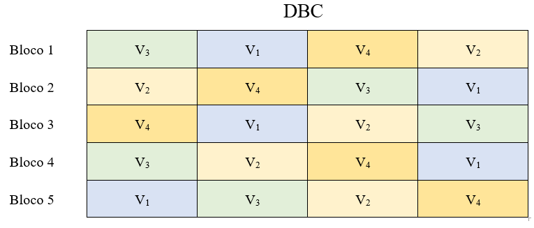
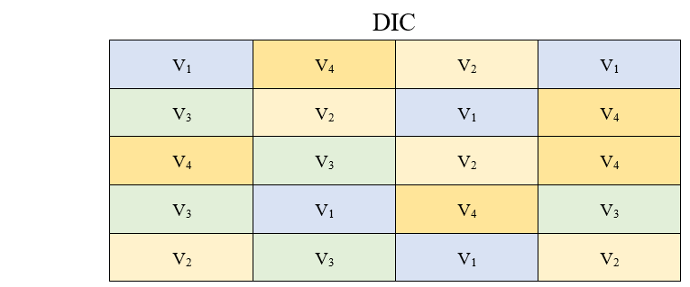
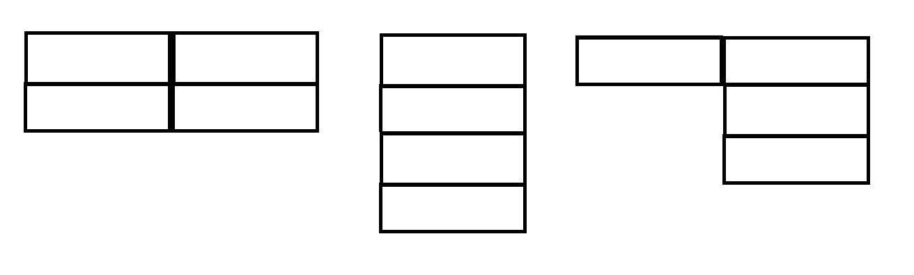

# 7. DELINEAMENTO EM BLOCOS CASUALIZADOS

## 7.1. CARACTERIZAÇÃO

O delineamento em blocos casualizados (DBC) é o mais utilizado dos delineamentos experimentais, e os experimentos instalados de acordo com esse delineamento são denominados de **experimentos em blocos casualizados** ou **experimentos em blocos ao acaso**. Além dos princípios da ***repetição*** e da ***casualização***, leva em conta também o princípio do ***controle local***.

Sempre que houver dúvidas a respeito da homogeneidade das condições experimentais é conveniente usar o **princípio do controle local**, estabelecendo blocos com parcelas homogêneas.

**As principais características deste delineamento são**:

1. As parcelas são distribuídas em grupos ou blocos (princípio do controle local) de tal forma que elas sejam o mais uniforme possível dentro de cada bloco.

2. O número de parcelas por bloco deve ser igual ao número de tratamentos (blocos completos casualizados).

3. Os tratamentos são designados às parcelas de forma casual, sendo essa casualização feita dentro de cada bloco.

Esse delineamento é mais eficiente que o delineamento inteiramente casualizado, e essa eficiência depende da uniformidade das parcelas dentro de cada bloco, podendo inclusive, haver diferenças acentuadas de um bloco para outro.

Então, por exemplo, se temos um experimento em blocos casualizados em que desejamos estudar o efeito de $4$ variedades (V1, V2, V3 e V4), sendo cada uma delas repetidas $5$ vezes, teremos o seguinte plano experimental:



Note que dentro de cada bloco temos as variedades sorteadas ao acaso. Caso este mesmo ensaio fosse montado no delineamento inteiramente casualizados (DIC), o sorteio seria feito em todas as parcelas do experimento, e os tratamentos não seriam agrupados em blocos. Por exemplo, no delineamento inteiramente casualizado teríamos:



E eficiência do delineamento em blocos casualizados depende de uniformidade das parcelas dentro de cada bloco. De um bloco para outro, pode haver variação.

A forma e a distribuição dos blocos no campo depende apenas da uniformidade das condições experimentais. 

Os blocos podem ser retangulares, quadrados ou irregulares:

 

Os blocos podem ser espalhados em toda a área de estudo, ou então agrupados um ao lado do outro. Geralmente se coloca um bloco ao lado do outro para facilitar a condução do experimento.

Os blocos são utilizados para controlar pequenas diferenças que ocorrem entre as parcelas experimentais, tais como, diferenças de fertilidade do solo, diferenças de disponibilidade de água, diferenças de luminosidade (no caso de casas de vegetação), etc.

**As principais vantagens desse delineamento são:**

1. Controla as diferenças que ocorrem nas condições experimentais de um bloco para outro.

2. Permite, dentro de certos limites, utilizar qualquer número de tratamentos e blocos.

3. Nos conduz a uma estimativa mais exata para a variância residual.

4. A análise de variância é relativamente simples, sendo apenas um pouco mais demorada que a do delineamento inteiramente casualizado, pois possui uma causa de variação a mais (Blocos).

**As principais desvantagens desse delineamento são:**

1. Pela utilização do princípio do controle local há uma diminuição no número de graus de liberdade do resíduo.

2. A exigência de homogeneidade dentro do bloco limita o número de tratamentos, que não pode ser muito grande.

## 7.2. MODELO MATEMÁTICO

Para podermos analisar um experimento em qualquer delineamento, necessitamos conhecer o modelo matemático do mesmo, e aceitar algumas hipóteses básicas necessárias para a validade da análise de variância.

O modelo matemático do delineamento em blocos casualizados é o seguinte:

$$
x_{ij} = \mu +\tau_i + \beta_j+\epsilon_{ij}
$$

onde, 
$x_{ij}$ representa o valor esperado na parcela que recebeu o tratamento $i$ e que se encontra no bloco $j$.

$\mu$ é a média geral do experimento.

$\tau_i$ é o efeito devido ao tratamento *i* que foi aplicado à parcela.

$\beta_j$ é o efeito devido ao bloco *j* em que se encontra a parcela.

$\epsilon_{ij}$ é o efeito dos fatores não controlados ou acaso na parcela que recebeu o tratamento *i* e que se encontra no bloco *j*.

## 7.3. HIPÓTESES BÁSICAS

As hipóteses básicas para a validade da análise de variância são as mesmas já vistas para o delineamento inteiramente casualizado, ou seja:

**Aditividade**: Os efeitos dos fatores do modelo são aditivos
  
**Independência**: Os erros (desvios) $\epsilon_{ij}$, devido aos efeitos de fatores não controlados ou acaso devem ser independentes
  
**Homocedasticidade (homogeneidade de variâncias)**: Os erros (desvios) $\epsilon_{ij}$, devido ao acaso devem possuir variância comum $\sigma^2$
  
**Normalidade dos desvios**: Os erros ou desvios $\epsilon_{ij}$ devido ao acaso devem possuir distribuição normal de probabilidades.
  
  
Uma forma resumida de apresentar estas quatro pressuposições é apresentada a seguir:

$$
\epsilon_{ij} \overset{iid}{\tilde{}} N(0,\sigma^2) \\
$$

Os erros ou desvios $\epsilon_{ij}$ são independentes e identicamente distribuídos, de acordo com uma distribuição normal, com média zero e variância comum $\sigma^2$.


## 7.4. OBTENÇÃO DA ANÁLISE DE VARIÂNCIA

Para a obtenção da análise de variância, vamos considerar um experimento genérico em blocos casualizados com $I$ tratamentos e $J$ blocos. Os dados obtidos podem ser dispostos num quadro como o seguinte:

|Tratamentos|1|2|...|$j$|...|$J$|Total|
|-----------|-|-|---|-|---|-|-----|
|1|$x_{11}$|$x_{12}$|...|$x_{1j}$|...|$x_{1J}$| $T_1=\sum_{j=1}^Jx_{1j}$ |
|2|$x_{21}$|$x_{22}$|...|$x_{2j}$|...|$x_{2J}$| $T_2=\sum_{j=1}^Jx_{2j}$ |
|...| | |...| |...| |  |
|$i$|$x_{i1}$|$x_{i2}$|...|$x_{ij}$|...|$x_{iJ}$| $T_i=\sum_{j=1}^Jx_{ij}$ |
|...| | |...| |...| |  |
|$I$|$x_{I1}$|$x_{I2}$|...|$x_{Ij}$|...|$x_{IJ}$| $T_I=\sum_{j=1}^Jx_{Ij}$ |
|**Total**|$B_1=\sum_{i=1}^Ix_{i1}$ | $B_2=\sum_{i=1}^Ix_{i2}$|...| $B_j=\sum_{i=1}^Ix_{ij}$|...|$B_J=\sum_{i=1}^Ix_{iJ}$ | $G=\sum_{i=1}^I\sum_{j=1}^Jx_{ij}$ |

Pelo método dos mínimos quadrados, devemos obter as estimativas de $\mu$, $\tau_i$ e $\beta_j$ que minimizam a soma de quadrados dos erros do modelo:

$$
x_{ij} = \mu +\tau_i + \beta_j+\epsilon_{ij}
$$

Então, temos:

$$
\hat{m} = \frac{\sum_{i=1}^I\sum_{j=1}^Jx_{ij}}{IJ}=\frac{G}{IJ} \\
\hat{t_i}=\frac{T_i}{J}-\hat{m}=\hat{m_i}-\hat{m} \\
\hat{b_j}=\frac{B_j}{I}-\hat{m}=\hat{m_j}-\hat{m}
$$

Podemos agora obter as somas de quadrados para cada um desses efeitos. As somas de quadrados total e devido ao efeito de tratamentos são obtidas da mesma maneira que no delineamento inteiramente casualizado:

$$
SQ_{Total}=\sum_{i=1}^{I}\sum_{j=1}^Jx_{ij}-C\\
SQ_{Trat}=\frac{1}{J}\sum_{i=1}^IT_i^2-C \\
onde,\; C=\frac{G^2}{IJ}
$$

A soma de quadrados devido ao efeito de blocos é obtida por:
$$
SQ_{Blocos} = I\hat{b_1^2}+I\hat{b_2^2}+...+I\hat{b_J^2} \\
SQ_{Blocos} = I(\hat{b_1^2}+\hat{b_2^2}+...+\hat{b_J^2})\\
SQ_{Blocos} = I\left[ \left(\frac{B_1}{I}-\hat{m} \right)^2+\left(   \frac{B_2}{I}-\hat{m} \right)^2+...+\left( \frac{B_J}{I}-\hat{m} \right)^2 \right]\\
SQ_{Blocos} = I\left[ \left(\frac{B_1^2}{I^2}-2\hat{m}\frac{B_1}{I}+\hat{m}^2 \right)+\left(\frac{B_2^2}{I^2}-2\hat{m}\frac{B_2}{I}+\hat{m}^2
\right)+...+\left(  \frac{B_J^2}{I^2}-2\hat{m}\frac{B_J}{I}+\hat{m^2}\right) \right] \\
SQ_{Blocos} =\left[\left(\frac{B_1^2}{I}+\frac{B_2^2}{I}+...+\frac{B_J^2}{I}\right)-2\hat{m}(B_1+B_2+...+B_J)+ IJ\hat{m}^2 \right] \\
SQ_{Blocos} = \frac{1}{I}(B_1^2+B_2^2+...+B_J^2)-2\hat{m}G+IJ\frac{G^2}{(IJ)^2}\\
SQ_{Blocos} =\frac{1}{I}\sum_{j=1}^JB_j^2-C
$$

A soma de quadrados devido ao efeito dos fatores não controlados ou acaso ($SQ_{Resíduo}$), é obtida por diferença:

$$
SQ_{Resíduo} = SQ_{Total} - SQ_{Trat} - SQ_{Blocos}
$$


Causas de Variação |GL | SQ | QM | F 
-------------------|---|----|----|---
Tratamentos | $I-1$| $SQ_{Trat}$ | $SQ_{Trat}$/(I-1) | $QM_{Trat}$/$QM_{Res}$
Blocos | $J-1$| $SQ_{Blocos}$ | $SQ_{Blocos}$/(J-1) | $QM_{Blocos}$/$QM_{Res}$
Resíduo | $(I-1)(J-1)$| $SQ_{Res}$ | $SQ_{Res}$/[(I-1)(J-1)] | 
**Total** | $IJ-1$| $SQ_{Total}$ |  | 

**HIPÓTESES TESTADAS:**

**Para Tratamentos**:
$$
\begin{cases} H_0: t_i=0, i=1,2, ...,I. \\
H_1:pelo\;menos\;um \;valor\;t_i \neq 0
\end{cases}
$$

**Para Blocos**:

$$
\begin{cases} H_0: \beta_j=0, j=1,2, ...,J. \\
H_1:pelo\;menos\;um \;valor\;\beta_j \neq 0
\end{cases}
$$

**CRITÉRIO DO TESTE**: 

**Para Tratamentos**:

Comparamos o valor $F$ calculado para tratamentos com o valor de $F$ tabelado em função do número de GL de Tratamentos e GL do resíduo, ao nível $\alpha$ de significância. 

Se $F_{Trat} > F_{Tab}$, concluímos que o teste é significativo, portanto, rejeitamos $H_0$ e devemos concluir que existe diferença significativa entre os efeitos dos tratamentos testados em relação à variáveis (característica) em estudo.

**Para Blocos**:

Pra Blocos, a comparação é feita entre o valor de $F$ calculado com o $F$ tabelado em função do número de GL de Blocos e GL do resíduo, ao nível $\alpha$ de significância.

Se $F_{Blocos} > F_{Tab}$, concluímos que o teste é significativo, portanto, rejeitamos $H_0$ e devemos concluir que os blocos possuem efeitos diferentes em relação à característica em estudo, ou seja, os blocos foram eficientes no controle da heterogeneidade local.

## 7.5. EXEMPLO DE APLICAÇÃO

No trabalho "Influência do genótipo e da adubação sobre algumas características fenotípicas de *Zea mays* L (Milho)", realizado por BARBOSA (1976), foram utilizadas 4 cultivares de milho:

$C_1$ = OPACO 2

$C_2$ = PIRANÃO

$C_3$ = COMPOSTO FLINT

$C_4$ = AGROCERES AG-152

O ensaio foi montado de acordo com o delineamento em blocos casualizados, sendo utilizados $5$ blocos para controlar as diferenças de fertilidade do solo entre terraços.

Os resultados obtidos para a produção em *kg/ha*, foram os seguintes e podem ser encontrados online em: 

[milho](https://github.com/arpanosso/ExpAgr_2020/blob/master/dados/milho.txt).

```{r echo=F}
caminho<-"https://raw.githubusercontent.com/arpanosso/ExpAgr_2020/master/dados/milho.txt"
dados<-read.table(caminho,h=T,sep="\t")
md<-matrix(dados$y,ncol=5,byrow = T)
md<-cbind(md,apply(md,1,sum))
md<-rbind(md,apply(md,2,sum))
md<-as.data.frame(md)
names(md)<-c("Bloco1","Bloco2","Bloco3","Bloco4","Bloco5","Total")
Tratamentos<-c(levels(as.factor(dados$trat))[c(3,4,2,1)],"Total")
tb<-cbind(Tratamentos,md)
library(knitr)
library(kableExtra)

kable(tb) %>%
  kable_styling(bootstrap_options = "striped", full_width = F)%>%
  row_spec(5:5, bold = T, color = "black", background = "lightgray") %>%
  column_spec(7, bold = T, color = "black", background = "lightgray")
```
**Dados originais**:[DOWNLOAD](https://github.com/arpanosso/experimentacao-agricola-unesp-fcav/raw/master/data/dados_prod_milho.xlsx)

As hipóteses que desejamos testar são as seguintes:

$$
\begin{cases} H_0: As\;cultivares\;testadas\;não\;diferem\;entre\;si\;em\;relação\;à\;produção\;da\;cultura\;do\;milho. \\
H_1: As\;cultivares\;testadas\;diferem\;entre\;si\;em\;relação\;à\;produção\;da\;cultura\;do\;milho.
\end{cases}
$$

Para obtenção da análise de variância, devemos, inicialmente, obter as Somas de Quadrados:

**a) Soma de quadrados total**:

$$
SQ_{Total} = \sum_{i=1}^I\sum_{j=i}^Jx_{ij}^2 - C \\
SQ_{Total} = \sum_{i=1}^I\sum_{j=i}^Jx_{ij}^2 - \frac{G^2}{IJ} \\
SQ_{Total} = (2812^2+2296^2+...+3501^2) - \frac{96051^2}{4\cdot5}\\
SQ_{Total} = 47817032,90
$$

**b) Soma de quadrados devido ao efeito de tratamentos**:

$$
SQ_{Trat} = \frac{\sum_{i=1}^IT_i^2}{J} - C \\
SQ_{Trat} = \frac{T_1^2+T_2^2+...+T_I^2}{J} - \frac{G^2}{IJ}\\
SQ_{Trat} = \frac{15601^2+21362^2+33905^2+25183^2}{5} - \frac{96051^2}{4\cdot5}\\ SQ_{Trat}= 35402021,70
$$

**c) Soma de quadrados devido ao efeito de blocos**:

$$
SQ_{Blocos} = \frac{\sum_{j=1}^JB_j^2}{I} - C \\
SQ_{Blocos} = \frac{B_1^2+B_2^2+...+B_J^2}{I} - \frac{G^2}{IJ}\\
SQ_{Blocos} = \frac{16381^2+15500^2+20632^2+21782^2+21756^2}{4} - \frac{96051^2}{4\cdot5}\\ SQ_{Blocos}= 9221681,20
$$

**d) Soma de quadrados do resíduo**:

$$
SQ_{Res} = SQ_{Total} - SQ_{Trat} - SQ_{Blocos}\\
SQ_{Res} = 47817032,9-35402021,7-9221681,2=3193330,00
$$

Então podemos montar o seguinte quadro de análise de variância:

```{r echo=FALSE}
library(knitr)
library(kableExtra)
tb <-data.frame("Causas de Variação"=c("Tratamento","Blocos","Resíduo","Total"),
                GL=c("3","4","12","19"),
                SQ=c("35402021,7","9221681,2","3193330,00","47817032,9"),
                QM=c("11800673,9","2305420,3","266110,83","--"),
                "F"=c("44,34**","8,66**","--","--")
                )
kable(tb) %>%
#kable_styling(bootstrap_options = c("striped", "hover", "condensed", "responsive"))
kable_styling(bootstrap_options = "striped", full_width = F, position = "center")
```

Valores de F da tabela para tratamentos (3 x 12 GL):$\begin{cases} 5\%=3,49 \\ 1\%=5,95 \end{cases}$

Valores de F da tabela para blocos (4 x 12 GL):$\begin{cases} 5\%=3,26 \\ 1\%=5,41 \end{cases}$

**Conclusões**:

**a) Para Tratamentos**: O teste F foi significativo ao nível de $1\%$ de probabilidade, indicando que devemos rejeitar $H_0$ e concluir que as cultivares diferem entre si em relação à produção da cultura do milho, com um grau de confiança superior a $99\%$ de probabilidade.

**b) Para Blocos**: O teste F foi significativo ao nível de $1\%$ de probabilidade, indicando que devemos rejeitar $H_0$ e concluir que as diferenças de fertilidade do solo entre terraços apresentaram efeitos diferentes sobre a produção do milho, com um grau de confiança superior a $99\%$ de probabilidade.

Para tirar conclusões mais específicas sobre o comportamento das cultivares, devemos utilizar um teste de comparação de médias.

**a) Cálculo das médias de cada tratamento e erros padrões das médias**:

Então, no nosso exemplo, temos:
$$
\hat{m_1} = \frac{T_1}{J}=\frac{15601}{5}=3120,20\;kg/ha\\
\hat{m_2} = \frac{T_2}{J}=\frac{21362}{5}=4272,40\;kg/ha\\
\hat{m_3} = \frac{T_3}{J}=\frac{33905}{5}=6781,00\;kg/ha\\
\hat{m_4} = \frac{T_4}{J}=\frac{25183}{5}=5036,60\;kg/ha\\
$$

Erro padrão dessas médias será:

$$
s(\hat{m}) = \frac{s}{\sqrt{J}}=\sqrt{\frac{QM_{Res}}{J}} =\sqrt{\frac{266110,83}{5}}=230,70\;kg/ha
$$

**b) Aplicação do teste de Tukey **:

**b.1. Cálculo do valor de $\Delta$**:

$$
q_{(4\;trat\times12\;GLres)}(5\%) = 4,20\\
s=\sqrt{QM_{Res}}=515,8593,\;com\; r=5 \\
DMS=q\cdot\sqrt{\frac{QM_{Res}}{r}}=4,20\cdot\sqrt{\frac{266110,83}{5}}=968,94\;kg/ha
$$

**b.2. Cálculo das estimativas dos contrastes entre duas médias**:

|   |$\hat{m_3}$|$\hat{m_4}$|$\hat{m_2}$|$\hat{m_1}$|
|-----------|-----------|-----------|-----------|-----------|
|$\hat{m_3}$| - | 1744,4\* | 2508,60\* |  3660,80\* |
|$\hat{m_4}$| - | - | 764,20 |  1916,40\* |
|$\hat{m_2}$| - | - | - | 1152,20\* |

**b.3. Conclusão**: Médias seguidas de pela mesma letra não diferem entre si pelo teste de Tukey, ao nível de 5% de probabilidade.

$$
\hat{m_3} = 6781,00\;kg/ha\;\;\;\;-a\\
\hat{m_4} = 5036,60\;kg/ha\;\;\;\;-b\\
\hat{m_2} = 4272,40\;kg/ha\;\;\;\;-b\\
\hat{m_1} = 3120,20\;kg/ha\;\;\;\;-c\\
$$

Portanto, a melhor cultivar foi o Composto Flint, pois diferiu das demais pelo teste de Tukey e apresentou maior produtividade.

**c) Cálculo do coeficiente de variação do experimento**:
$$
\hat{m}=\frac{G}{IJ}=\frac{96051}{4\cdot5}=4802,55\;kg/ha\\
s=\sqrt{QM_{Res}}=\sqrt{226110,83}=515,8593\;kg/ha\\
CV=\frac{100\cdot s}{\hat{m}}=\frac{100\cdot515,8593}{4802,55}=10,74\%
$$

**Aplicação no R**


```{r}
caminho<-"https://raw.githubusercontent.com/arpanosso/ExpAgr_2020/master/dados/milho.txt"
dados<-read.table(caminho,h=T,sep="\t")
head(dados)

# Extraindo os fatores e a variável resposta
trat<-as.factor(dados$trat)
bloco<-as.factor(dados$bloco)
y<-dados$y

# Definindo o modelo matemático
modelo<-aov(y~trat+bloco)
anova(modelo)

#Comparação de Médias pelo teste de Tukey
require("agricolae")
glRes<-df.residual(modelo)
QMres<-deviance(modelo)/glRes
tukey <- HSD.test(modelo,"trat", group=TRUE,console=TRUE)

bar.group(tukey$groups,
          las=1,
          ylim=c(0,max(y)*1.10),
          xlab="Cultivares",
          ylab="Produção (kg por ha)",
          main="Teste de Tukey (5%)");box()

# Cálculo do CV
cv<-100*sqrt(QMres)/mean(y)
paste(round(cv,2),"%",sep="")

```

Utilizando o pacote "ExpDes.pt"

```{r}
# Carregando o pacote para a análise
library(ExpDes.pt)

# verificando os 6 primeiros registros
head(dados)

# Análise de variância e teste de Tukey com a função dbc
trat <- dados$trat # Criando o vetor de tratamentos
bloco <- dados$bloco # Criando o vetor dos blocos
y <- dados$y # Criando o vetor com a variável resposta

# Utilizando a função
dbc(trat,bloco,y,mcomp = "tukey")
```


## 7.6. DELINEAMENTO EM BLOCOS CASULIZADOS COM UMA PARCELA PERDIDA

### 7.6.1. INTRODUÇÃO

O Delineamento em blocos casualizados é balanceado de tal forma que todos os blocos possuem todos os tratamentos. Assim, se ocorrer uma perda de parcela, há uma quebra neste balanceamento, pois se, por exemplo, perdermos a parcela $x_{ij}$ o tratamento $i$ não conterá o efeito do bloco $j$. Essa quebra de balaceamento leva a sérias complicações no método de análise de variância.

Um método de facilitar a análise consiste em obter uma estimativa da parcela perdida. Esta estimativa não representa o valor que seria obtido, pois ningém pode saber qua seria este valor, mas é um artifício de cálculo bastante simple que conduz ao mesmo resultado que se chegaria, por processos mais complexos, considerando apenas os dados realmente obtidos (blocos incompletos).

### 7.6.2. ESTIMATIVA DA PARCELA PERDIDA
              
|  ||||Blocos||||
|:-----------|:-:|:-:|:---:|:-:|:---:|:-:|-----:|
|**Tratamentos**  |**1**|**2**|...|$j$|...|$J$|**Total**|
|1|$x_{11}$|$x_{12}$|...|$x_{1j}$|...|$x_{1J}$| $T_1$ |
|2|$x_{21}$|$x_{22}$|...|$x_{2j}$|...|$x_{2J}$| $T_2$ |
|...| | |...| |...| |  |
|$i$|$x_{i1}$|$x_{i2}$|...|$x_{ij} = NA$ |...|$x_{iJ}$| $T+x_{ij}$ |
|...| | |...| |...| |  |
|$I$|$x_{I1}$|$x_{I2}$|...|$x_{Ij}$|...|$x_{IJ}$| $T_I$ |
|**Total**|$B_1$ | $B_2$|...| $B+x_{ij}$|...|$B_J$ |$G'+x_{ij}$ |

* **NA** = é a parcela perdida

De acordo com o modelo matemático, temos:

$$
x_{ij}= \mu+\tau_{i}+\beta_{j}+\epsilon_{ij}
$$

A estimativa da parcela perdida é obtida tornando mínimo o efeito dos fatores não contralados ou acaso na parcela.

Então, utilizando o método dos quadrados mínimos, obtém-se:

$$
x_{ij} = \frac{IT+JB-G'}{(I-1)(J-1)}
$$

onde


$I$ é o número de tratamentos do experimento.

$J$ é o número de blocos do experimento.

$T$ é a soma das parcelas existentes no tratamento que perdeu a parcela.

$B$ é a soma das parcelas existentes no bloco que perdeu a parcela.

$G'$ é a soma das parcelas existentes no experimento.

### 7.6.3. OBTENÇÃO DA ANÁLISE DE VARIÂNCIA

Uma vez obtida a estimativa da parcela perdida, substituímos o seu valor no quadro de dados, e calculamos as somas de quadrados da maneira usual. Então, com o valor estimado da parcela perdidada obtemos:

$T_{i}=T+x_{ij}$

$B_{j}=B+x_{ij}$

$G=G'+x_{ij}$

$C=\frac{G^2}{IJ}$

$SQ_{Total}=\sum_{i=1}^I\sum_{j=1}^Jx_{ij}^2-C$

$SQ_{Trat}=\frac{1}{J}\sum_{i=1}^IT_{i}^2-C$

$SQ_{Blocos}=\frac{1}{I}\sum_{j=1}^JB_{j}^2-C$

$SQ_{Res}=SQ_{Total}-SQ_{Trat}-SQ_{Blocos}$

O método dos mínimos quadrados torna mínima a soma de quadrados do resíduo, a qual fica corretamente estimada, porém, causa uma superestimação na soma de quadrados de tratamentos e de blocos.

Então, a soma de quadrados de tratamentos deve ser ajustada. Para isso, devemos calcular o fator de correção, representado por $U$, e dado por:

$$
U_{T}=F.C. =\frac{I-1}{I}\left(x_{ij}-\frac{B}{I-1}\right)^2
$$

Onde:

$x_{ij}$ é a estimativa da parcela perdida.

$I$ é o número de tratamentos do experimento.

$B$ é a soma dos parcelas existentes no bloco que perdeu a parcela.

E a soma de quadrados de tratamentos ajustada será:

$SQ_{Trat(Aj.)}=SQ_{Trat}-U$

Embora, na prática não seja necessário, caso haja interesse, pode-se também, fazer a correção da soma de quadrado de blocos por meio da expressão:

$SQ_{Blocos(Aj.)}=SQ_{Blocos}-U_B$

Onde:

$$
U_B=\frac{J-1}{J}\left(x_{ij}-\frac{T}{J-1}\right)^2
$$

A seguir montamos o quadro de análise de variância, **lembrando que há uma perda de um grau de liberdade** para o total e para o resíduo, devido à estimativa da parcela perdida.

Então, o quadro de análise de variância será:

Causas de Variação |GL | SQ | QM | F 
-------------------|---|----|----|---
Tratamentos (Ajust.) | $I-1$| $SQ_{Trat}-U$ | $SQ_{Trat(Aj.)}$/(I-1) | $QM_{Trat}$/$QM_{Res}$
Blocos | $J-1$| $SQ_{Blocos}-U_B$ | $SQ_{Blocos}$/(J-1) | $QM_{Blocos}$/$QM_{Res}$
Resíduo | $(I-1)(J-1)-1$| $SQ_{Res}$ | $SQ_{Res}$/[(I-1)(J-1)-1] | 
**Total** | **$IJ-2$**| -- |  | 

Os valores de F calculados são comparados com os valores de F tabelados para se verificar se o teste é significativo ou não.

### 7.6.4. MÉDIAS DE TRATAMENTOS

As médias de tratamentos são obtidas de maneiral usual, ou seja:

$\hat{m}_k=\frac{T_k}{J}$ para os tratamentos que não perderam parcela.

$\hat{m}_i=\frac{T+x_{ij}}{J}$ para o tratamento que perdeu a parcela.

### 7.6.5. ERROS PADRÕES DAS MÉDIAS DE TRATAMENTOS

**a) Para as médias dos tratamentos que não perderam parcela.**

$$
s(\hat{m})=\frac{s}{\sqrt{J}}=\sqrt{\frac{QM_{Res}}{J}}
$$

**b) Para a média do tratamento que perdeu parcela.**

$$
s(\hat{m})= \sqrt{\hat{V}(\hat{m})},\; onde \\
\hat{V}(\hat{m}) = \left[ \frac{1}{J}+\frac{I}{J(J-1)(I-1)} \right]s^2
$$

### 7.6.6. COMPARAÇÃO DAS MÉDIAS PARA O TESTE DE TUKEY

Temos dois casos a considerar;

**a) Comparação entre médias dos tratamentos sem parcela perdida:**

$$
\hat{Y} = \hat{m}_k-\hat{m}_{k'} \\
\hat{V}(\hat{Y})=\frac{2}{J}s^2
$$

Então, para a aplicação do teste de Tukey, temos:

$$
\Delta = dms=q\sqrt{\frac{1}{2}\cdot\frac{2}{J}s^2}=q\frac{s}{\sqrt{J}}
$$

**b) Comparações entre as médias dos tratamentos sem parcela perdida $(k)$ com média do tratamento que perdeu parcela $(i)$:**

$$
\hat{Y} = \hat{m}_k-\hat{m}_{i} \\
\hat{V}(\hat{Y})=\left[\frac{2}{J}+\frac{I}{J(I-1)(J-1)} \right]s^2
$$

então, para a aplicação do teste de Tukey, temos:

$$
\Delta = dms = q\sqrt{\frac{1}{2}\hat{V}(\hat{Y})}
$$

### 7.6.7. EXEMPLO DE APLICAÇÃO

Para exemplificar a análise de variância de um experimento em blocos casualizados com parcela perdida, vamos analisar os dados obtidos pelo trabalho intitulado "Estudos dos Efeitos do Promalin sobre frutos de macieiras (*Malus* spp) cultivares Brasil e Rainha", realizado por MESTRINER (1980). Foram utiizados 5 tratamentos:

$T_1$ - 12.5 ppm de promalin em plena floração

$T_2$ - 25.0 ppm de promalin em plena floração 

$T_3$ - 50.0 ppm de promalin em plena floração

$T_4$ - 12.5 ppm de promalin em plena floração + 12.5 ppm de promalin no início da frutificação

$T_5$ - Testemunha

Os resultados obtidos para peso médio de frutos da macieira, em gramas, foram os seguintes, e podem ser encontrados online em [macieira](https://raw.githubusercontent.com/arpanosso/ExpAgr_2020/master/dados/macieira.txt).

```{r echo=F}
caminho<-"https://raw.githubusercontent.com/arpanosso/ExpAgr_2020/master/dados/macieira.txt"
dados<-read.table(caminho,h=TRUE)
md<-matrix(dados$y,ncol=4,byrow = T)
md<-cbind(md,apply(md,1,sum,na.rm=T))
md<-rbind(md,apply(md,2,sum,na.rm=T))
md<-as.data.frame(md)
names(md)<-c("Bloco1","Bloco2","Bloco3","Bloco4","Total")
Tratamentos<-c(levels(as.factor(dados$trat)),"Total")
tb<-cbind(Tratamentos,md)
library(knitr)
library(kableExtra)

kable(tb) %>%
  kable_styling(bootstrap_options = "striped", full_width = F) %>%
  row_spec(5, bold = T, color = "white", background = "red") %>%
  column_spec(3, bold = T, color = "white", background = "red")%>%
  row_spec(6, bold = T, color = "black", background = "lightgray") %>%
  column_spec(6, bold = T, color = "black", background = "lightgray")

```

Em vermelho descamos o tratamento e o bloco que perderam a parcela.


**Dados originais**:[DOWNLOAD](https://github.com/arpanosso/experimentacao-agricola-unesp-fcav/raw/master/data/dados_prod_macieira.xlsx)

As hipóteses que desejamos testar são:
$$
\begin{cases} H_0:\;As\;doses\;de\;Promalin\;não\;influenciam\;no\;peso\;médio\;de\;frutos\;de\;macieira\\
H_1: \;As\;doses\;de\;Promalin\;possuem\;efeitos \;diferentes\;sobre\;o\;peso\;médio\;de\;frutos\;de\;macieira
\end{cases}
$$

**a) estimativa da parcela perdida**

$$
x_{ij} = \frac{IT+JB-G'}{(I-1)(J-1)} \\
x_{52} = \frac{5\cdot455,46+4\cdot552,44-2693,78}{(5-1)(4-1)} = 149,44\;g
$$

A seguir, colocamos esse valor no quado de dados, e recalculamos os totais:

$T_{5}=T+x_{52}=455,46+149,44=604,90$

$B_{2}=B+x_{52}=552,44+149,44=701,88$

$G=G'+x_{52}=2693,78+149,44=2843,22$


```{r echo=F}
caminho<-"https://raw.githubusercontent.com/arpanosso/ExpAgr_2020/master/dados/macieira.txt"
dados<-read.table(caminho,h=TRUE)
dados$y[is.na(dados$y)]<-149.44
md<-matrix(dados$y,ncol=4,byrow = T)
md<-cbind(md,apply(md,1,sum,na.rm=T))
md<-rbind(md,apply(md,2,sum,na.rm=T))
md<-as.data.frame(md)
names(md)<-c("Bloco1","Bloco2","Bloco3","Bloco4","Total")
Tratamentos<-c(levels(as.factor(dados$trat)),"Total")
tb<-cbind(Tratamentos,md)

kable(tb) %>%
  kable_styling(bootstrap_options = "striped", full_width = F) %>%
  row_spec(6, bold = T, color = "black", background = "lightgray") %>%
  column_spec(6, bold = T, color = "black", background = "lightgray")

```


**b) Cálculo das somas de Quadrados**

**b.1) Soma de Quadrados Total:**

$$
SQ_{Total}=\sum_{i=1}^I \sum_{j=1}^J x_{ij}^2 - C \\
SQ_{Total}=[142,36^2+\cdots+149,44^2+\cdots+150,22^2]-\frac{2843,22^2}{5\cdot4} \\
SQ_{Total}=816,5390
$$


**b.2) Soma de Quadrados de Tratamentos:**
$$
SQ_{Trat}=\frac{1}{J}\sum_{i=1}^IT_{i}^2-C \\
SQ_{Trat}=\frac{1}{4}[571,21^2+\cdots+604,9^2]-\frac{2843,22^2}{5\cdot4}=463,9483
$$


**b.3) Soma de Quadrados de Blocos:**
$$
SQ_{Blocos}=\frac{1}{I}\sum_{j=1}^JB_{j}^2-C \\
SQ_{Blocos}=\frac{1}{5}[726,74^2+701,88^2+714,42^2+700,18^2]-\frac{2843,22^2}{5\cdot4}=91,9078
$$


**b.4) Soma de Quadrados de Resíduos:**

$$
SQ_{Res}=SQ_{total}-SQ_{Trat}-SQ_{Blocos} \\
SQ_{Res}=816,5390-463,9483-91,9078=260,6829
$$

**c) Correção da soma de quadrados de tratamentos**:

$$
U_{T}=\frac{I-1}{I}\left(x_{ij}-\frac{B}{I-1}\right)^2 \\
U_{T}=\frac{5-1}{5}\left(149,44-\frac{455,46}{4-1}\right)^2=102,6951
$$

Portanto, temos:

$SQ_{Trat(Aj.)}=SQ_{Trat}-U_T=463,9483-102,6951=361,2532$

**d) Correção da soma de quadrados de blocos**:

$$
U_B=\frac{J-1}{J}\left(x_{ij}-\frac{T}{J-1}\right)^2 \\
U_{T}=\frac{4-1}{4}\left(149,44-\frac{552,44}{5-1}\right)^2=4,2483
$$

Portanto, temos:

$SQ_{Bloco(Aj.)}=SQ_{Bloco}-U_T=91,9078-4,2483=87,6594$

Então podemos montar o seguinte quadro de análise de variância:

```{r echo=FALSE}
library(knitr)
library(kableExtra)
tb <-data.frame("Causas de Variação"=c("Tratamento","Blocos","Resíduo","Total"),
                GL=c("4","3","11","18"),
                SQ=c("361,2532","87,6594","260,6829","--"),
                QM=c("90,3133","29,21981","23,6984","--"),
                "F"=c("3,81*","1,23ns","--","--")
                )
names(tb)<-c("Causas de Variação","GL","SQ","QM","F")
kable(tb) %>%
#kable_styling(bootstrap_options = c("striped", "hover", "condensed", "responsive"))
kable_styling(bootstrap_options = "striped", full_width = F, position = "center")
```

Valores de F da tabela para tratamentos (4 x 11 GL):$\begin{cases} 5\%=3,36 \\ 1\%=5,67 \end{cases}$

Valores de F da tabela para blocos (3 x 11 GL):$\begin{cases} 5\%=3,59 \\ 1\%=6,22 \end{cases}$

**Conclusões**: O teste F foi significativo ao nível de $5\%$ de probabilidade, indicando que devemos rejeitar $H_0$ e concluir que as doses de Promalin possuem efeitos diferentes sobre o peso médio dos frutos de maçã, com um grau de confiança superior a $95\%$ de probabilidade.

Para tirar conclusões mais específicas sobre o comportamento dos inseticidas, podemos aplicar um teste de comparação de médias.

**a) Cálculo das médias de tratamentos**:

$$
\hat{m_1} = \frac{T_1}{J}=\frac{571,21}{4}=142,80\;g\\
\hat{m_2} = \frac{T_2}{J}=\frac{552,10}{4}=138,03\;g\\
\hat{m_3} = \frac{T_3}{J}=\frac{554,97}{4}=138,74\;g\\
\hat{m_4} = \frac{T_4}{J}=\frac{560,04}{4}=140,01\;g\\
\hat{m_5} = \frac{T_5}{J}=\frac{604,90}{4}=151,23\;g\\
$$

**b) Cálculo dos erros padrões das médias de tratamentos**:

Para as médias dos tratamentos que não perderam parcela, temos:

$$
s(\hat{m})=\sqrt{\frac{QM_{Res}}{J}}=\sqrt{\frac{23,6984}{4}}=2,43\;g,\;k=(1,2,3,4)
$$

Para média do tratamento que perdeu a parcela, o erro padrão será:

$$
s(\hat{m}_5)=\sqrt{\left(\frac{1}{J}+\frac{I}{J(J-1)(I-1)}\right)s^2}\\
s(\hat{m}_5)=\sqrt{\left( \frac{1}{4}+\frac{5}{4(4-1)(5-1)}\right)23,6984}=2,90\;g
$$


**c) Aplicação do teste de Tukey para comparação das médias de tratamentos**:

**c.1) Cálculo do valor de $\Delta$ para comparações entre médias de tratamentos que não perderam parcela**:

$q_{(5\times11GLRes)} = 4,57, s=\sqrt{QM_{Res}}=4,8681\;\;\;\;\;\;\;\ r=4$

Então, temos:

$$
\Delta = dms = q\sqrt{\frac{QM_{Res}}{r}}=4,57\sqrt{\frac{23,6984}{4}}=11,12\;g
$$
**c.2) Cálculo do $\Delta$ para comparações entre médias dos tratamentos que não perderam parcela e a média do tratamento que perdeu a parcela $\hat{m}_5$**:

$$
\hat{Y} = \hat{m}_k-\hat{m}_{i} \\
\hat{V}(\hat{Y})=\left[\frac{2}{J}+\frac{I}{J(I-1)(J-1)} \right]s^2
$$

Então, temos:

$$
\Delta = dms =q\sqrt{\frac{1}{2}\hat{V}(\hat{Y})} \\
\Delta = dms =4,57\sqrt{\frac{1}{2}\left[\frac{2}{4}+\frac{5}{4(5-1)(4-1)} \right]23,6984}=12,23\;g
$$

**c.3) Cálculo das estimativas dos contrastes entre duas médias**:

|   |$\hat{m_1}$|$\hat{m_4}$|$\hat{m_3}$|$\hat{m_2}$|
|-----------|-----------|-----------|-----------|-----------|
|$\hat{m_5}$| 8,43 | 11,22 | 12,49\* |  13,2\* |
|$\hat{m_1}$| - | 2,79 | 4,06 |  4,77 |
|$\hat{m_4}$| - | - | 1,27 | 1,98 |
|$\hat{m_3}$| - | - | - | 0,71 |


**Conclusão**: Médias seguidas de pelo menos uma letra em comum não diferem entre si, pelo teste de Tukey, ao nível de 5% de probabilidade.

$$
\hat{m_5} = 151,23\;g\;\;\;\;-a\\
\hat{m_1} = 142,80\;g\;\;\;\;-ab\\
\hat{m_4} = 140,01\;g\;\;\;\;-ab\\
\hat{m_3} = 138,74\;g\;\;\;\;-b\\
\hat{m_2} = 138,03\;g\;\;\;\;-b
$$

Portanto, a melhor dose 12,5 ppm de promalin aplicada em plena floração (Traramento 1) ou em plena floração e no início da frutificação (Tratamento 4) não afeta o peso médio dos frutos, pois não difere da testemunha.

**d) Cálculo do coeficiente de variação do experimento**:

$$
\hat{m}=\frac{G}{IJ}=\frac{2843,22}{5\cdot4}=142,16\;g\\
s=\sqrt{QM_{Res}}=\sqrt{23,6984}=4,8681\;g\\
CV=\frac{100\cdot s}{\hat{m}}=\frac{100\cdot4,8681}{142,16}=3,42\%.
$$

Aplicação no R.


```{r}
caminho<-"https://raw.githubusercontent.com/arpanosso/ExpAgr_2020/master/dados/macieira.txt"
dados<-read.table(caminho,h=TRUE)

# Extraindo os fatores e a variável resposta
trat<-as.factor(dados$trat)
bloco<-as.factor(dados$bloco)
y<-dados$y
B<-tapply(y,bloco,sum,na.rm=TRUE)[is.na(B<-tapply(y,bloco,sum))]

# Definindo o modelo para análise preliminar com a parcela perdida
modelo<-aov(y~trat+bloco)
anova(modelo)

# Estimando a parcela perdida
xij<-predict(modelo,newdata = dados$bloco<-as.factor(bloco))[is.na(y)]

# valor estimado
xij

# Substituindo a parcela perdida pelo valor estimado
y[is.na(y)]<-xij

# Definindo o novo modelo
modeloC<-aov(y~trat+bloco)
anava<-anova(modeloC)

# Calculando o fator de correção para o ajuste das soma de quadrados dos tratamentos
I<-length(levels(trat))
QMRes<-anava$`Mean Sq`[3]
(U<-(I-1)/(I)*(xij-B/(I-1))^2)

anava$Df[3]<-anava$Df[3]-1
anava$`Sum Sq`[1]<-anava$`Sum Sq`[1]-U
anava$`Mean Sq`<-anava$`Sum Sq`/anava$Df
anava$`F value`[1]<-anava$`Mean Sq`[1]/anava$`Mean Sq`[3]
anava$`Pr(>F)`[1]<-pf(anava$`Pr(>F)`[1],anava$Df[1],anava$Df[3])
anava$`F value`[2]<-anava$`Mean Sq`[2]/anava$`Mean Sq`[3]
anava$`Pr(>F)`[2]<-pf(anava$`Pr(>F)`[2],anava$Df[2],anava$Df[3])
anava

## Comparações múltiplas para as médias Tukey
require("agricolae")
tukey <- HSD.test(modelo,"trat", group=TRUE,console=TRUE)
bar.group(tukey$groups,
          las=1,
          ylim=c(0,max(y)*1.10),
          xlab="Cultivares",
          ylab="Produção (kg por ha)",
          main="Teste de Tukey (5%)");box()

# Cálculo do CV
QMRes<-anava$`Mean Sq`[3]
cv<-100*sqrt(QMRes)/mean(y)
round(cv,2)
```


