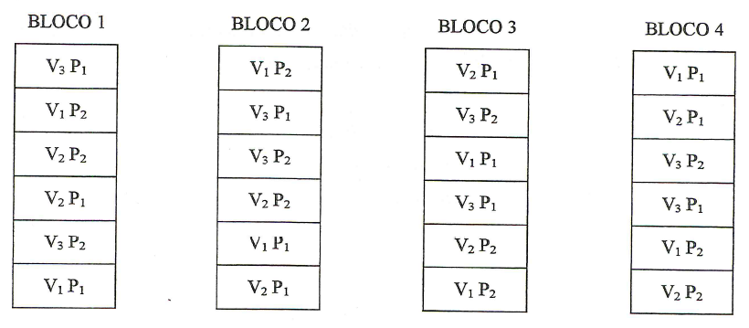

#### Introdução

Os experimentos simples, realizados de acordo com o delineamento inteiramente casualizado (DIC) ou em blocos casualizados (DBC), são utilizados para testar os efeitos de apenas um  tipo de **tratamento**, ou **fator**, sendo os demais mantidos constantes.

Assim, por exemplo, num experimento de comparação de inseticidas em relação ao controle de uma determinada praga, devemos manter constante a dosagem, o método de aplicação, os tratos culturais, etc.

Porém, há casos em que necessitamos testar simultaneamente os efeitos de dois ou mais tipos de tratamentos (fatores) para obtermos resultados de interesse prático. Por exemplo, supondo que desejamos testar $3$ inseticidas, $2$ métodos de aplicação e $4$ dosagens, teremos então um **experimento fatorial** de $3\times2\times4$.

Os experimentos fatoriais são aqueles que nos permitem estudar, simultaneamente, os efeitos de dois ou mais tipos de fatores.  Assim, eles devem ser instalados em um dos delineamentos já estudados (DIC, DBC, etc.).

---

Estes experimentos são utilizados em quase todos os campos de investigação e são bastante úteis em pesquisas iniciais, nas quais pouco se conhece a respeito de uma série de fatores.  

**O número de tratamentos nos experimentos fatoriais consiste de todas as combinações possíveis dos níveis dos fatores**.

Por exemplo, se estamos interessados em testar o efeito de $3$ inseticidas, cada um dos quais em $4$ doses, teremos os $12$ tratamentos seguintes.

$$\begin{array}{} 
I_1 D_1  & I_2D_1  & I_3D_1 \\
I_1D_2  & I_2D_2  & I_3D_2 \\
I_1D_3  & I_2D_3  & I_3D_3 \\ 
I_1D_4  & I_2D_4  & I_3D_4 \end{array}$$

Neste caso, representamos o esquema fatorial como: $\text{Fatorial }3 \times 4$ com $3$ inseticidas e $4$ dosagens.

**As subdivisões de um fator são denominados NÍVEIS desse fator**. 

Então, no exemplo anterior, o fator **Inseticida** ocorrem em **3 níveis**, e o fator **Dosagem** ocorre em **4 níveis**.

---

Assim, no ensaio acima, podemos obter conclusões sobre qual o melhor inseticida, qual a melhor dosagem e qual a melhor dosagem para cada inseticida.

Vamos então apresentar algumas definições necessárias ao bom entendimento dos ensaios fatoriais. 

Supondo que temos $2$ fatores **A** e **B** cada um dos quais em dois níveis $(0 \text{ e } 1)$, presença e ausência, respectivamente, e que os resultados obtidos foram os seguintes:

|  | $B_0$| $B_1$| Total|
|:---:|:---:|:---:|:---:|
| $A_0$| $3$ | $7$|  $10$
| $A_1$| $9$ | $18$ | $27$ 
|**Total**| $12$ | $25$|  $37$

[DOWNLOAD](https://github.com/arpanosso/experimentacao-agricola-unesp-fcav/raw/master/data/interação.xlsx)

---

#### Efeito simples de um fator

É uma medida da variação que ocorre com a variável resposta (característica em estudo) correspondente a variação nos níveis desse fator, em cada um dos níveis do outro fator.

Efeito de $A$ dentro de $B_0 = A_1B_0-A_0B_0 = 9 -3 = 6$ 

Efeito de $A$ dentro de $B_1 = A_1B_1-A_0B_1 = 18-7 = 11$ 

Efeito de $B$ dentro de $A_0 = A_0B_1-A_0B_0=7-3=4$ 

Efeito de $B$ dentro de $A_1 = A_1B_1-A_1B_0 = 18-9=9$

---

#### Efeito principal de um fator

É uma medida da variação  que ocorre com a variável resposta correspondente às variações nos níveis em média de todos os níveis do outro fator.

--

**Efeito Principal de A**

$$
A = \frac{\text{Ef. de A d. }B_0+\text{Ef. de A d. }B_1}{2}=\frac{6+11}{2}=8,5
$$
ou ainda:

$A = \frac{A_1B_0+A_1B_1}{2}-\frac{A_0B_0+A_0B_1}{2} = \frac{9+18}{2}-\frac{3+7}{2} = 13,5-5,0=8,5$

--

**Efeito Principal de B**

$$
B = \frac{\text{Ef. de B d. }A_0+\text{Ef. de B d. }A_1}{2}=\frac{4+9}{2}=6,5
$$

ou ainda:

$B = \frac{A_0B_1+A_1B_1 }{2}-\frac{A_0B_0+A _1B_0}{2}  = \frac{7+18}{2}-\frac{3+9}{2} = 12,5-6,0=6,5$

**Portanto, o efeito principal de um fator é a média dos efeitos simples desse fator.**

---

#### Efeito da interação entre fatores

É uma medida da variação que ocorre com o efeito simples de um fator ao passar de um nível a outro do outro fator.

**Efeito da Interação** $A \times B$

$$A \times B = \frac{A\;d.\;B_1-A\;d.\;B_0}{2} = \frac{(A_1B_1-A_0B_1)-(A_1B_0-A_0B_0)}{2}=\frac{11-6}{2}=2,5$$

**Efeito da Interação** $B \times A$

$B \times A = \frac{B\;d.\;A_1-B\;d.\;A_0}{2} = \frac{(A_1B_1-A_1B_0)-(A_0B_1-A_0B_0)}{2}=\frac{9-4}{2} =  2,5$

Note que o efeito da Interação $A \times B = B \times A$.

---

#### Vantagens dos experimentos fatoriais

- Permite estudar os efeito simples, o efeito principal e o efeito da interação entre fatores.

- Todas as parcelas experimentais entram no cálculo dos efeitos principais e interações, razão pela qual as médias dos níveis dos fatores são calculadas com um maior número de repetições.

#### Desvantagens dos experimentos fatoriais

- A análise estatística é trabalhosa, e a interpretação dos resultados torna-se mais difícil à medida que aumentam o número de fatores e de níveis.

- Como os tratamentos devem conter todas as combinações possíveis dos fatores em seus diversos níveis, o número de tratamentos aumenta rapidamente, e às vezes devido à exigência de homogeneidade dentro dos blocos, não podemos utilizar o delinemamento em blocos completos casualizados.

- Sendo os tratamentos constituídos de todas as combinações possíveis dos fatores em seus diversos níveis, para que haja um balanceamento estatístico, às vezes algumas das combinações não tem interesse prático, mas devem ser mantidas para não quebrar o balanceamento.

---

#### Classificação dos experimentos fatoriais

**Fatoriais de série $2^N$**

Nesta série são enquadrados os experimentos fatoriais em que são estudados os efeitos de $N$ fatores cada um em $2$ níveis.

BASE = Nº de Níveis  
EXPOENTE = Nº de Fatores

Exemplos:
$$2^2 \Rightarrow \text{2 Fatores em 2 Níveis} \\
2^3 \Rightarrow \text{3 Fatores em 2 Níveis} \\
2^4 \Rightarrow \text{4 Fatores em 2 Níveis}$$

etc.

---

**Fatoriais de série $3^N$**

Nesta série são enquadrados os experimentos fatoriais em que são estudados os efeitos de $N$ fatores cada um em $3$ níveis.

Exemplos:
$$3^2 \Rightarrow \text{2 Fatores em 3 Níveis} \\
3^3 \Rightarrow \text{3 Fatores em 3 Níveis} \\
3^4 \Rightarrow \text{4 Fatores em 3 Níveis}$$
etc.


**Fatoriais de série mista**

Nesta série são enquadrado os fatoriais em que os fatores ocorrem em número diferente de níveis:

Exemplo: 
$$4\times 3\times 2 \Rightarrow \begin{cases} \text{1º Fator em 4 Níveis }\\ \text{2º Fator em 3 Níveis } \\ 
\text{3º Fator em 2 Níveis } 
\end{cases}$$


---

#### Casualização dos tratamentos

Para exemplificar a casualização dos tratamentos, vamos supor um experimento fatorial $3 \times 2$, com $3$ variedades de milho $(V_1,V_2,V_3)$ e $2$ níveis de adubação com $P_2O_5$ $(P_1 \text{ e } P_2)$. Se o experimento fosse instalado de acordo com o delineamento em blocos casualizados, com $4$ repetições, teríamos:



---

O esquema da análise de variância preliminar deste ensaio será o seguinte:

```{r echo=FALSE}
library(kableExtra)
library(knitr)
tb<-data.frame(CV=c("Tratamentos","Blocos","Resíduos","Total"),
               GL=c(5,3,15,23))
names(tb)<-c("Causas de Variação","GL")
kable(tb)%>%
 kable_styling(bootstrap_options = "striped", full_width = F) %>% 
  row_spec(4, bold = T)
```

Após a análise de variância preliminar, os graus de liberdade de tratamentos devem ser desdobrados de acordo com o esquema fatorial $3 \times 2$, da seguinte maneira:

```{r echo=FALSE}
tb<-data.frame(CV=c("Variedades (V)","Adubação (P)","Interação (VxP)","(Tratamentos)","Blocos","Resíduos","Total"),
               GL=c("2","1","2","5","3","15","23"))
names(tb)<-c("Causas de Variação","GL")
kable(tb)%>%
 kable_styling(bootstrap_options = "striped", full_width = F) %>% 
  row_spec(c(4,7), bold = T)
```

---

#### Análise de variância de um experimento fatorial com $2$ fatores com interação não significativa

Para a obtenção da análise de variância, vamos utlizar os dados adaptados do trabalho "Ensaios em condições de casa-de-vegetação para controle químico do 'damping-off' em *Eucalyptus saligna* Sm.", realizado por KRUGNER; CARVALHO (1971) e publicado em IPEF, n 2/3 p. 97-113. O ensaio foi realizado no delineamento inteiramente casualizado, com $3$ repetições e foram estudados os efeitos sobre a altura média das mudas de *Eucalytus saligna*, dos fatores:

**Tratamento do solo (S)**, sendo:  
$S_1=\text{Vapam}$  
$S_2=\text{Brometo de metila}$  
$S_3=\text{PCNB}$  
$S_4=\text{Testemunha}$  

**Pulverização** com fungicida em pós-emergência, sendo:  
$F_0 = \text{Sem fungicida}$   
$F_1 = \text{Com fungicida}$

---

Os dados podem ser encontrados online em [solofungi.txt](https://raw.githubusercontent.com/arpanosso/ExpAgr_2020/master/dados/solofungi.txt)

As alturas médias de mudas (*cm*) $28$ dias após a semeadura foram:

|Tratamentos|Rep.1|Rep.2|Rep.3|Total
|:---|:---:|:---:|:---:|---:|
| $S_1F_0$|4,65|5,18|5,52|15,35
| $S_1F_1$|4,86|4,81|4,51|14,18
| $S_2F_0$|4,55|5,16|6,00|15,71
| $S_2F_1$|4,73|5,51|5,09|15,33
| $S_3F_0$|2,68|2,65|2,56|7,89
| $S_3F_1$|2,90|2,71|2,93|8,54
| $S_4F_0$|3,48|2,75|3,06|9,29
| $S_4F_1$|2,65|2,47|2,83|7,95
|**Total** ||||	**94,24**


**Dados originais**:[DOWNLOAD](https://github.com/arpanosso/experimentacao-agricola-unesp-fcav/raw/master/data/dados_altura_mudas.xlsx)

---

#### Obtenção da análise de variância

O ensaio foi montado de acordo com o delineamento inteiramente casualizado, e, portanto, a análise de variância preliminar, obtida de maneira usual, foi a seguinte:

$$\begin{aligned}
SQ_{Total} &= (4,65^2+5,18^2+ \dots +2,83^2) - \frac{94,24^2}{8 \times 3} \\
           & = 403,2566 - 370,0491 \\
           &= 33,2075 \\
\\
\\
SQ_{Trat} &= \frac{1}{3}(15,35^2+14,18^2+ \dots +7,95^2) - \frac{94,24^2}{8 \times 3} \\
           & = 401,0061 - 370,0491 \\
           &= 31,0170 \\
\\
\\
SQ_{Res} &= SQ_{Total} - SQ_{Trat} \\
           & = 33,2075 - 31,0170 \\
           &= 2,1905
\end{aligned}$$

---

Quadro da análise de variância preliminar:

```{r echo=FALSE}
tb<-data.frame(CV=c("Tratamentos","Resíduos","Total"),
               GL=c(7,16,23),
               SQ=c("31,0170","2,1905","33,20175"),
               QM=c("4,4310","0,1369",""),
               "F"=c("32,37**","",""))
names(tb)<-c("Causas de Variação","GL","SQ","QM","F")
kable(tb) %>%
 kable_styling(bootstrap_options = "striped", full_width = F) %>% 
  row_spec(3, bold = T)
```

**Conclusão**: O teste $F$ foi significativo ao nível de $1\%$ de probabilidade, logo, rejeitamos a hipótese da nulidade $(H_0)$, e concluímos que os tratamentos possuem efeitos diferentes sobre a altura das mudas de *Eucalyptus saligna*, com um grau de confiança superior a $99\%$ de probabilidade.

---

Devemos agora desdobrar a soma de quadrados e os graus de liberdade de tratamentos para estudar os efeitos principais e a interação entre os fatores.

Para facilitar os cálculos, utilizamos um quadro auxiliar como o seguinte:

| $(3)$| $S_1$| $S_1$| $S_1$| $S_1$|**Total (F)**|
|:---|:---:|:---:|:---:|:---:|:---:|
| $F_0$| $15,35$| $15,71$| $7,89$| $9,29$|**48,24**|
| $F_1$| $14,18$| $15,33$| $8,54$| $7,95$|**46,00**|
|**Total (S)**|**29,53**|**31,04**|**16,43**|**17,24**|**94,24**|

Então, as somas de quadrados são obtidas da seguinte maneira:

---

**1. Soma de quadrados devido ao efeito de Tratamento do Solo:**
$$\begin{aligned}
SQ_\text{Ef Trat Solo} &= \frac{1}{r_s}(T_{S_1}^2+T_{S_2}^2+T_{S_3}^2+T_{S_4}^2) - C \\
                  &= \frac{1}{6}(29,53^2+31,04^2+16,43^2+17,24^2) - \frac{94,24^2}{8 \times 3} \\
                  &= 30,3951
\end{aligned}$$

---

**2. Soma de quadrados devido ao efeito de Fungicidas:**

$$\begin{aligned}
SQ_\text{Ef Fung} &= \frac{1}{r_F}(T_{F_0}^2+T_{F_1}^2) - C \\
                  &= \frac{1}{12}(48,24^2+46,00^2) - \frac{94,24^2}{8 \times 3} \\
                  &= 0,2091
\end{aligned}$$

---

**3. Soma de quadrados devido ao efeito da Interação Tratamento do Solo x Fungicida:**

$$\begin{aligned}
SQ_{Interação\;S\times F} &= SQ_{S,F}-SQ_{Ef.Trat.Solo}-SQ_{Ef.Fungicida} \\ \\
& \text{assim, calculamos } SQ_{S,F}: \\ 
SQ_{S,F} &= \frac{1}{r_{SF}}(T_{S_1F_0}^2+T_{S_1F_1}^2+\cdots +T_{S_4F_1}^2) - C \\
                  &= \frac{1}{3}(15,35^2+14,18^2+\cdots + 7,95^2) - \frac{94,24^2}{8 \times 3} \\
                  &= 31,0170 
\end{aligned}$$

Portanto,

$$
\begin{aligned}
SQ_{Interação\;S\times F} &= SQ_{S,F}-SQ_{S}-SQ_{F} \\
SQ_{Interação\;S\times F} &= 31,0170-30,3951-0,2091 \\
&= 0,4128
\end{aligned}
$$

Observe que $SQ_{S,F} = SQ_{Trat}$

---

Portanto, temos o seguinte quadro de análise de variância:

```{r echo=FALSE}
tb<-data.frame(CV=c("Tratamento de solo (S)","Fungicida (F)","Interação (SxF)","(Tratamentos)","Resíduos","Total"),
               GL=c("3","1","3","7","16","23"),
               SQ=c("30,3951","0,2091","0,4128","31,0170","2,1905","33,2075"),
               QM=c("10,1317","0,2091","0,1376","","0,1369",""),
               "F"=c("74,00**","1,53ns","1,01ns","","",""))
names(tb)<-c("Causas de Variação","GL","SQ","QM","F")
kable(tb)%>%
 kable_styling(bootstrap_options = "striped", full_width = F) %>% 
  row_spec(c(4,6), bold = T)
```

Valores de $F$ da tabela para Trat. do solo $(3 \times 16 GL)$: $\begin{cases}5\%=3,24 \\ 1\%=5,29 \end{cases}$

Valores de $F$ da tabela para Fungicida $(1 \times 16 GL)$: $\begin{cases}5\%=4,49 \\ 1\%=8,53 \end{cases}$

Valores de $F$ da tabela para Interação $S\times F$ $(3 \times 16 GL)$: $\begin{cases}5\%=3,24 \\ 1\%=5,29 \end{cases}$

---

**Conclusões**

**Para efeito de Tratamento do solo**: O teste foi significativo ao nível de $1\%$ de probabilidade, indicando que devemos rejeitar $H_0$ e concluir que os tratamentos do solo possuem efeitos diferentes sobre a altura de mudas de eucalipto.

**Para efeito de Fungicida**: O teste não foi significativo ao nível de $5\%$ de probabilidade, indicando que não devemos rejeitar $H_0$ e concluir que a aplicação ou não de fungicida em pós-emergência não possui efeito sobre a altura de mudas de eucalipto.

**Para efeito da Interação (S $\times$ F)**: O teste não foi significativo ao nível de $5\%$ de probabilidade, indicando que não devemos rejeitar $H_0$ e concluir que os tratamentos de solo agem de maneira independente do fungicida sobre a altura das mudas de eucalipto.

Portanto, como a Interação $S\times F$ foi não significativa, podemos estudar os efeitos principais dos fatores independentemente um do outro.

Para complementar a análise de variância, e obter conclusões mais específicas sobre o efeito de cada um dos fatores, podemos utilizar os testes de comparação de médias.

---

#### Cálculo das médias de Tratamento do Solo e erros padrões das médias

$$\hat{m_{S_1}} = \frac{T_{S_1}}{r_{S_1}}=\frac{29,53}{6}=4,92\;cm \\
\hat{m_{S_2}} = \frac{T_{S_2}}{r_{S_2}}=\frac{31,04}{6}=5,17\;cm \\
\hat{m_{S_3}} = \frac{T_{S_3}}{r_{S_3}}=\frac{16,43}{6}=2,74\;cm \\
\hat{m_{S_4}} = \frac{T_{S_4}}{r_{S_4}}=\frac{17,24}{6}=2,87\;cm$$

O erro padrão destas médias será:

$$
s(\hat{m})=\sqrt{\frac{QM_{Res}}{r_S}}=\sqrt{\frac{0,1369}{6}} = 0,15\;cm
$$

---

**Teste de Tukey para comparar as médias de tratamento do solo**

$$
DMS=q_{(4\times 16)} \times s(\hat{m})=4,05 \times 0,15 = 0,61\; cm
$$

|-| $\hat{m_{S_1}}$| $\hat{m_{S_4}}$| $\hat{m_{S_3}}$|
|:---|:---:|:---:|:---:|
| $\hat{m_{S_2}}$| $0,25$| $2,30^*$| $2,43^*$|
| $\hat{m_{S_1}}$|-| $2,05^*$| $2,18^*$|
| $\hat{m_{S_4}}$|-|-| $0,13$|


ou ainda:

$$\hat{m_{S_2}} = 5,17\;a\\
\hat{m_{S_1}} = 4,92\;a\\
\hat{m_{S_4}} = 2,87\;b\\
\hat{m_{S_3}} = 2,74\;b$$

**Conclusão**: Médias seguidas pela mesma letra não diferem entre si pelo teste de Tukey ao nível de $5\%$ de probabilidade.


---

#### Cálculo das médias de Fungicidas e erros padrões das médias

$$\hat{m_{F_0}} = \frac{T_{F_0}}{r_{F_0}}=\frac{48,24}{12}=4,02\;cm \\
\hat{m_{F_1}} = \frac{T_{F_1}}{r_{F_1}}=\frac{46,00}{12}=3,83\;cm$$

O erro padrão destas médias será:

$$
s(\hat{m})=\sqrt{\frac{QM_{Res}}{r_F}}=\sqrt{\frac{0,1369}{12}} = 0,11\;cm
$$

**Teste de Tukey para comparar as médias de Fungicidas**

Note que não houve diferença significativa entre os tratamentos com e sem fungicidas e, portanto, não há necessidade de se comparar essas médias. Porém, caso quiséssemos compara-lás pelo teste de Tukey, teríamos:

$$DMS=q_{(2\times1 6)}\cdot s(\hat{m})=3.00 \times 0,11 = 0,32\; cm \\
\hat{Y}=\hat{m}_{F_0}-\hat{m}_{F_1}=4,02-3,83=0,19 \; cm$$

Portanto, como $\hat{Y}< DMS \Rightarrow \hat{m}_{F_0}$ não difere de $\hat{m}_{F_1}$

---

#### Cálculo do coeficiente de variação do experimento

$$CV=100 \times \frac{\sqrt{QM_{res}}}{\hat{m}}=100 \times \frac{0,3700}{3,9267} = 9,42\%$$
---


**Utilizando as funções básicas e o pacote agricolae**
```{r}
# Carregando o pacote para análise de variância
library(agricolae)
library(tidyverse)

# Definindo o caminho do banco de dados
caminho<-"https://raw.githubusercontent.com/arpanosso/ExpAgr_2020/master/dados/solofungi.txt"

# Entrada da dados
dados<-read.table(caminho,h=TRUE)

#Guardando os fatores (tratamentos de solo e fungicidas) e a variável resposta (y)
solos<-as.factor(dados$S)
fungicida<-as.factor(dados$F)
y<-dados$y
```

---

```{r, fig.width=13,fig.height=6,warning=FALSE,error=FALSE,message=FALSE}
# Gráfico da interação
dados %>% 
  group_by(S,F) %>% 
  summarise(Y = mean(y)) %>% 
  ggplot(aes(x=S, y=Y,col=as.factor(F)))+
  geom_line()+
  labs(x="Tratamentos do solo",y="Altura de plantas (cm)",col="Fungicida") +
  theme_bw()
```

---

```{r, fig.width=13,fig.height=6,warning=FALSE,error=FALSE,message=FALSE}
dados %>% 
  group_by(S,F) %>% 
  summarise(Y = mean(y)) %>% 
  ggplot(aes(x=F, y=Y,col=as.factor(S)))+
  geom_line()+
  labs(x="Fungicida",y="Altura de plantas (cm)",col="Tratamento do solo")
```


---
**Utilizando ao pacote {ExpDes.pt}**

```{r}
# Carregando o pacote para análise de variância
library(ExpDes.pt)

# Definindo o caminho do banco de dados
caminho<-"https://raw.githubusercontent.com/arpanosso/ExpAgr_2020/master/dados/solofungi.txt"

# Entrada da dados
dados<-read.table(caminho,h=TRUE)

#Guardando os fatores (tratamentos de solo e fungicidas) e a variável resposta (y)
solos<-dados$S
fungicida<-dados$F
y<-dados$y
```

---

```{r}
# Utilizando a função fat2.dic do pacote ExpDes.pt
fat2.dic(solos,fungicida,y,fac.names = c("Trat_Solo", "Fungicida"))
```


