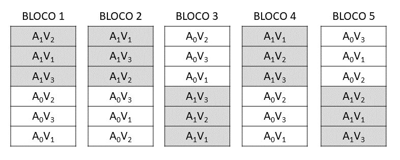
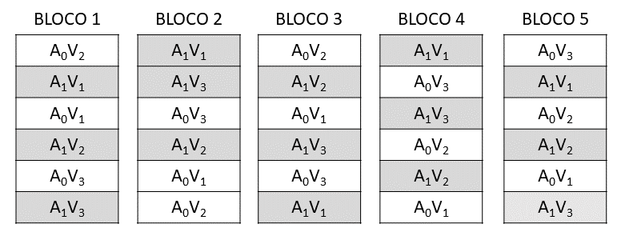

# Introdu??o

Os experimento em parcelas subdivididas, tamb?m conhecidos como "Split-plot", s?o utilizados quado, num mesmo ensaio, queremos testar os efeitos de 2 ou mais fatores, mas em condi??es experimentais um pouco diferentes daquelas utilizadas nos experimentos fatoriais.

Por exemplo: 

  * 4 Variedades e 3 N?veis de Aduba??o  
  * 3 N?veis de Irriga??o e 4 N?veis de Aduba??o  
  * 3 Espa?amentos e 4 densidades de Semeadura  
  etc.  
      
As unidade experimentais ou parcelas, s?o divididas em partes menores e iguais, chamadas de subparcelas. 

As parcelas podem ser ditribu?das de acordo com um delineamento qualquer, ou seja, inteiramente ao acaso ou blocos casualizados. A principal caracter?stica deste delineamento ? a casualiiza??o dos tratamentos, que ? feita em 2 est?gios.

  * No primeiro est?gio, ? feita a casualiza??o dos n?veis do fator testado, nas parcelas, de acordo com o delineamento adotado.
  * No segundo est?gio, em cada parcela, ? eita a casualiza??o dos n?veis do fator que ser? testados na subparcelas.
  
  Denominamos de tratamentos principais ou tratamento prim?rios, ?queles que s?o colocados nas parcelas, e de tratamento secund?rios ou subtratamentos ?queles que s?o colocados nas subparcelas.
  
  Nesses experimento, temos 2 res?duos: O **res?duo a**, que serve como base de compara??o para os tratamentos principais. e o **res?duo b**, que serve como base de compara??o para os tratamentos secund?rios e para a intera??o $P \times S$.
  
  Em consequ?ncia do tipo de casualiza??o feia, o erro experimentao devido aos tratamentos secund?rios (QM Res?duo b), geralmente ? menor que o erro experimental devido aos tratamentos principais (QM Res?duo a).
  
  Dessa maneira, os efeitos dos tratamentos principais s?o determinados com menor precis?o que os efeitods dos tratamentos secund?rios.
  
  Assim, por exemplo, num experimento em parcelas subdivididas, com os fatores: Aduba??o (tratamento principal-I) e Variedades (tratamento secund?rio-K), sendo utilzizados 2 n?veis de Aduba??o ($A_0\; e\; A_1$) e 3 Variedades ($V_1\;V_2\;e\; V_3$), o esquema de casualiza??o os tratamento , se o experimento fosse montado de acordo com o DBC, com 5 blocos (J), seria o seguinte.


  
O esquema de an?lise de vari?ncia deste ensaio seria o seguinte:

```{r echo=FALSE}
require(kableExtra)
df<-data.frame(CV=c("Blocos","Aduba??o (A)","Res?duo a",
         "(Parcelas)","Variedades (V)","Intera??o (A x V)","Res?duo b","Total"),
               GL=c("4 (J-1) ","1 (I-1)","4 (J-1)(I-1)","( 9 ) (IJ-1)","2 (K-1) ","2 (I-1)(K-1)","16 I(K-1)(J-1)","29 (IJK-1)"))
names(df) <- c("Causas de Varia??o", "GL")
kable(df) %>% 
  kable_styling(bootstrap_options = "striped", full_width = FALSE) %>% 
  row_spec(c(4,8),bold=TRUE)
```

**Observa??o**: Caso este mesmo ensaio fosse montado de acordo com o esquema fatorial $2 \times 3$ em 5 blocos, a casualiza??o seria feita de modo diferente e, como exemplo, apresentamos o sorteio do delineamento seguinte:


e o esquema da an?lise de vari?ncia do experimento de acordo com o esqeuma fatorial $2 \times 3$, seria o seguinte:

```{r echo=FALSE}
require(kableExtra)
df<-data.frame(CV=c("Aduba??o (A)","Variedades (V)","Intera??o (A x V)",
                    "(Tratamentos)","Blocos","Res?duo","Total"),
               GL=c("1","2","2","( 5 )","4","20","29"))
names(df) <- c("Causas de Varia??o", "GL")
kable(df) %>% 
  kable_styling(bootstrap_options = "striped", full_width = FALSE) %>% 
  row_spec(c(4,7),bold=TRUE)
```

A an?lise de vari?ncia do experimento em parcelas subdivididas reflete a caracter?stica principal do delineamento: A an?lise dos tratamentos principais ? em blocos ao acaso, com os 2 n?veis de aduba??o repetidos em 5 blocos (parte superior do quadro de an?ise de vari?ncia), sendo a an?lise dos tratamentos secund?rios, a an?lise de 3 variedades distribu?dos ao acaso nas 3 psubparceas de cada uma das 10 parcelas.

# Obten??o da an?lise de vari?ncia

Para a obten??o da an?lise de vari?ncia de um experimento em parcelas subdivididas, vamos utilizar os dados obtidos do trabalho intitulado "Efeito de ?pocas de plantio, sobre v?rias caracter?sticas agron?micas na cultura da soja (*Glycine max*. (L.) Merril), variedades Santa Rosa e Vi?oja, e Jaboticabal, SP", realizado por K. YUYAMA (1976). Foram utilizadas 8 ?pocas de plantio (20/10/74, 30/10/74, 10/11/74, 20/11/74, 30/11/74, 10/12/47, 20/12/74 e 30/12/74) e duas variedade de soja ($V_1$ = Vi?oja e $V_2$ = Santa Rosa). O ensaio foi montado de acordo com o delineamento em parcelas subdivididas, com as ?pocas de plantio nas parcelas, e as variedades nas subparcelas. Os resultados obtidos para produ??o de gr?os ($t\;ha^{-1}$), foram os seguintes:

|Tratamentos|	Bloco 1	|Bloco 2	|Bloco 3	|Total |
|:---|:---:	|:---:|:---:|:---:|
|$E_1V_1$|	2.9166	|2.8833	|2.4750	|8.2749|
|$E_1V_2$|	2.6416	|3.6666	|3.6166	|9.9248|
|$E_2V_1$|	3.4889	|3.5833	|3.3333	|10.4055|
|$E_2V_2$|	4.0583	|4.3000	|2.9083	|11.2666|
|$E_3V_1$|  2.3166	|2.8666	|2.4916	|7.6748|
|$E_3V_2$|	3.4500	|3.7666	|3.5333	|10.7499|
|$E_4V_1$|	2.7916	|2.7583	|3.1916	|8.7415|
|$E_4V_2$|	3.4166	|2.7416	|3.5083	|9.6665|
|$E_5V_1$|	3.5583	|3.1583	|2.7916	|9.5082|
|$E_5V_2$|	3.5000	|3.1166	|3.0916	|9.7082|
|$E_6V_1$|	2.7833	|2.5166	|2.1250	|7.4249|
|$E_6V_2$|	2.5583	|2.5666	|2.0416	|7.1665|
|$E_7V_1$|	2.3000	|2.2083	|2.0666	|6.5749|
|$E_7V_2$|	1.4250	|1.9166	|1.8750	|5.2166|
|$E_8V_1$|	1.1666	|1.6916	|1.4666	|4.3248|
|$E_8V_2$|	2.0083	|1.7833	|1.7416	|5.5332|
|Total|	44.3800	|45.5242	|42.2576	|**132.1618**|

### Pelo quadro de dados do experimento, podemos obter as somas de quadrados Total e de Blocos, utilizando:
  * $I$ (n?mero de n?veis de tratamentos principais).
  * $J$ (n?mero de Blocos ou Repeti??es).
  * $K$ (n?mero de n?veis de tratamentos secund?rios).
  
Assim, temos:  

$$
\begin{align}
SQ_{Total} &= \sum_{i=1}^I \sum_{j=1}^J \sum_{k=1}^K x_{ijk}^2 - \frac{G^2}{IJK} \\
&=(2.9166^2+2.8833^2+\cdots +1.7416^2)-\frac{132.1618^2}{8\cdot 3\cdot 2}
\\
&= 25.6734\\ \\

e, \\ \\

SQ_{Blocos} &= \frac{1}{IK} \sum_{j = 1}^JB_j^2-C \\
&=\frac{1}{8\cdot2} (44.3800^2+45.5242^2+42.2576^2) -\frac{132.1618^2}{48} \\
&=0.3434
\end{align}
$$

Para a obten??o das demais somas de quadrados, ? conveniente montar os seguintes quadros auxiliares:

1. **Quadro auxiliar para obten??o dos totais de parcelas**.

|(2)|	Bloco 1	|Bloco 2|	Bloco 3|	Total|
|:---|:---:|:---:|:---:|:---:|
|$E_1$|	5.5582|	6.5499|	6.0916|	18.1997|
|$E_2$|	7.5472|	7.8833|	6.2416|	21.6721|
|$E_3$|	5.7666|	6.6332|	6.0249|	18.4247|
|$E_4$|	6.2082|	5.4999|	6.6999|	18.408|
|$E_5$|	7.0583|	6.2749|	5.8832|	19.2164|
|$E_6$|	5.3416|	5.0832|	4.1666|	14.5914|
|$E_7$|	3.7250|	4.1249|	3.9416|	11.7915|
|$E_8$|	3.1749|	3.4749|	3.2082|	9.8580|
|Total| |44.38|	45.5242|	42.2576|	132.1618|

Pelo quado de totais de parcelas, obtemos:
$$
\begin{align}
SQ_{Parcelas} &= \frac{1}{K}[T_{E_1B_1}^2+T_{E_1B_2}^2+\cdots+T_{E_iB_j}^2]-C \\
&=\frac{1}{2}[5.5582^2+6.5499^2+\cdots+3.2082^2]-363.8904 \\
&= 21.4149 \\
\\
SQ_{?pocas} &= \frac{1}{JK}(T_{E_1}^2+T_{E_2}^2+\cdots +T_{E_I}^2) - C\\
&= \frac{1}{3\cdot2}(18.1997^2+21.6721^2+\cdots +9.8580^2) - 363.8904\\
&=19.0482 \\
\\
SQ_{Res(a)}& = SQ_{Parcelas} - SQ_{?pocas}- SQ_{Blocos} \\
& = 21.4149-19.0482-0.3434 \\
& = 2.0233
\end{align}
$$

2. **Quadro auxiliar para obten??o dos totais de tratamentos principais x tratamento secund?rios**.

|(3)	|$V_1$|	$V_2$|	Total|
|:---	|:---:|:---:|	:---:|
|$E_1$|	8.2749|	9.9248|	18.1997|
|$E_2$|	10.4055|	11.2666|	21.6721|
|$E_3$|	7.6748|	10.7499|	18.4247|
|$E_4$|	8.7415|	9.6665|	18.408|
|$E_5$|	9.5082|	9.7082|	19.2164|
|$E_6$|	7.4249|	7.1665|	14.5914|
|$E_7$|	6.5749|	5.2166|	11.7915|
|$E_8$|	4.3248|	5.5332|	9.858|
|Total|	62.9295|	69.2323|	132.1618|

Por este quadro, calcularemos a Soma de quadrados devido ao tratamento secund?rio e devido ? intera??o Prim?rio x Secund?rio.


$$
\begin{align}
SQ_{Variedades} &= \frac{1}{IJ}[T_{V_1}^2+T_{V_2}^2+\cdots+T_{V_K}^2]-C \\
&=\frac{1}{8\cdot3}[62.9295^2+69.2323^2]-363.8904 \\
&= 0.8276 \\
\\
SQ_{E,V} &= \frac{1}{J}[T_{E_1V_1}^2+T_{E_1V_2}^2+\cdots+T_{E_IV_K}^2]-C \\
&=\frac{1}{3}[8.2749^2+9.9248^2+\cdots+5.5332^2]-363.8904 \\
&= 21.9127 \\
\\
SQ_{Intera??o\;E \times V} &= SQ_{E,V}-SQ_{E}
-SQ_{V}\\
&=21.9127-19.0482-0.8276\\
&=2.0370
\end{align}
$$
Obtidas as somas de quadrados, podemos montar o seguinte quadro de an?lise de vari?ncia:

```{r echo=FALSE}
require(kableExtra)
df<-data.frame(CV=c("Blocos","?pocas de Plantio (E)","Res?duo(a)",
         "(Parcelas)","Variedades (V)","Intera??o (E x V)","Res?duo(b)","Total"),
               GL=c("2","7","14","( 23 )","1","7","16","47"),
               SQ=c("0.3434","19.0482","2.0233","( 21.4149 )","0.8276","2.0370","1.3939","25.6734"),
               QM=c("0.1717","2.7212","0.1445","--","0.8276","0.2910","0.0871","--"),
                "F"=c("1.19","18.83**","--","--","9.50**","3.34*","--","--"))
names(df) <- c("Causas de Varia??o", "GL","SQ","QM","F")
kable(df) %>% 
  kable_styling(bootstrap_options = "striped", full_width = FALSE) %>% 
  row_spec(c(4,8),bold=TRUE)
```
Valores de F da tabela para ?pocas ($7\times14GL$): $\begin{cases} 5\%=2.76 \\ 1\%=4.28 \end{cases}$

Valores de F da tabela para Variedades ($1\times16GL$): $\begin{cases} 5\%=4.49 \\ 1\%=8.53 \end{cases}$

Valores de F da tabela para Intera??o E $\times$ V ($7\times16GL$): $\begin{cases} 5\%=2.66 \\ 1\%=4.03 \end{cases}$


### Conclus?es

**Para efeito de ?pocas**: O teste foi significativo ao n?vel de $1\%$ de probabilidade, indicando que devemos rejeitar a hip?tese da nulidade e concluir que as ?pocas de plantio diferem entre si em rela??o ? produ??o da cultura da soja.

**Para efeito de Variedades**: O teste foi significativo ao n?vel de $1\%$ de probabilidade, indicando que devemos rejeitar a hip?tese da nulidade e concluir que asvariedades testadas diferem entre si em rela??o ? produ??o da cultura da soja.

**Para efeito da Intera??o E $\times$ V**: O teste foi significativo ao n?vel de $5\%$ de probabilidade, indicando que devemos rejeitar a hip?tese $H_0$ e concluir que os fatores ?pocas de plantio e variedades agem conjuntamente sobre a produ??o da cultura da soja, ou seja, ?pocas de plantio e variedades n?o agem de maneira independente.

Como a intera??o E$\times$V foi significativa, devemos desdobrar os graus de liberdade da intera??o para estudar os efeitos de um fator em cada um dos n?veis do outro fator.

## 1. Desdobramento da intera??o E $\times$ V para estudar os efeitos de Variedades dentro de cada ?poca de plantio (V d. E):

Para obten??o das somas de quadrados, utilizamos o quadro auxiliar:

|(3)	|$V_1$|	$V_2$|	Total|
|:---	|:---:|:---:|	:---:|
|$E_1$|	8.2749|	9.9248|	18.1997|
|$E_2$|	10.4055|	11.2666|	21.6721|
|$E_3$|	7.6748|	10.7499|	18.4247|
|$E_4$|	8.7415|	9.6665|	18.408|
|$E_5$|	9.5082|	9.7082|	19.2164|
|$E_6$|	7.4249|	7.1665|	14.5914|
|$E_7$|	6.5749|	5.2166|	11.7915|
|$E_8$|	4.3248|	5.5332|	9.858|
|Total|	62.9295|	69.2323|	132.1618|

Ent?o, temos:

$$
\begin{align}
SQ_{V\;d.\;E_1} &= \frac{1}{3}[8.2749^2+9.9248^2]-\frac{18.1997^2}{2\cdot3}=0.4537 \\
SQ_{V\;d.\;E_2} &= \frac{1}{3}[10.4055^2+11.26668^2]-\frac{21.6721^2}{2\cdot3}=0.1236 \\
SQ_{V\;d.\;E_3} &= \frac{1}{3}[7.6748^2+10.7499^2]-\frac{18.4247^2}{2\cdot3}=1.5760 \\
SQ_{V\;d.\;E_4} &= \frac{1}{3}[8.7415^2+9.6665^2]-\frac{18.4080^2}{2\cdot3}=0.1426 \\
SQ_{V\;d.\;E_5} &= \frac{1}{3}[9.5082^2+9.7082^2]-\frac{19.2164^2}{2\cdot3}=0.0067 \\
SQ_{V\;d.\;E_6} &= \frac{1}{3}[7.4249^2+7.1665^2]-\frac{14.5914^2}{2\cdot3}=0.0111 \\
SQ_{V\;d.\;E_7} &= \frac{1}{3}[6.5749^2+5.2166^2]-\frac{11.7915^2}{2\cdot3}=0.3075 \\
SQ_{V\;d.\;E_8} &= \frac{1}{3}[4.3248^2+5.5332^2]-\frac{9.8580^2}{2\cdot3}=0.2434
\end{align}
$$

**Verifica??o**:

$$
SQ_{Variedade}+SQ_{Intera??o\;E \times V} = SQ_{V\;d.E_1}+SQ_{V\;d.E_2}+SQ_{V\;d.E_3}+SQ_{V\;d.E_4}+SQ_{V\;d.E_5}+SQ_{V\;d.E_6}+SQ_{V\;d.E_7}+SQ_{V\;d.E_8}
$$

```{r echo=FALSE}
require(kableExtra)
df<-data.frame(CV=c("Variedades d. E1","Variedades d. E2","Variedades d. E3","Variedades d. E4","Variedades d. E5","Variedades d. E6","Variedades d. E7","Variedades d. E8","Res?duo(b)"),
               GL=c(1,1,1,1,1,1,1,1,16),
               SQ=c("0.4537","0.1236","1.5760","0.1426","0.0067","0.0111","0.3075","0.2434","1.3939"),
               QM=c("0.4537","0.1236","1.5760","0.1426","0.0067","0.0111","0.3075","0.2434","0.0871"),
               "F"=c("5.21*","1.42","18.09**","1.64","0.08","0.13","3.53","2.79","--")
               )
names(df) <- c("Causas de Varia??o", "GL","SQ","QM","F")
kable(df) %>% 
  kable_styling(bootstrap_options = "striped", full_width = FALSE) %>% 
  row_spec(9,bold=TRUE)
```
Valores de F da Variedades d. E ($1\times16GL$): $\begin{cases} 5\%=4.49 \\ 1\%=8.53 \end{cases}$

**Conclus?o**: Os valores de F foram significativos para V d. E1 e V d. E3, indicando que existe diferen?a entre as variedades apenas quando plantadas nestas duas ?pocas em rela??o ? produ??o da cultura da soja.

## 2. Desdobramento da intera??o E $\times$ V para estudar os efeitos de ?pocas dentro de cada Variedade (E d. V):

$$
\begin{align}
SQ_{E\;d.\;V_1} &= \frac{1}{3}[8.2749^2+10.4055^2+\cdots+4.3248^2]-\frac{62.9295^2}{8\cdot3}=8.1726 \\
SQ_{E\;d.\;V_2} &= \frac{1}{3}[9.9248^2+11.2666^2+\cdots+5.5332^2]-\frac{69.2323^2}{8\cdot3}=12.9126
\end{align}
$$

Como neste caso, estamos comparando tratamento principais dentro de tratamento secund?rios, est?o envolvidos a compara??o o Res?duo (a) e o Res?duo (b). Ent?o, para aplicarmos o teste F, devemos obter um res?duo m?dio (vari?ncia complexa), dado por:

$$
QM_{Res.M?dio}=\frac{QM_{Res(a)}+(b-1)QM_{Res(b)}}{b},
$$

onde $b$ ? o n?mero de tratamentos secund?rios.

Neste caso, o n?mero de graus de liberdade ($n'$), associado a este Res?duo M?dio, pode ser obtido pla f?rmula de **SATTERTHWAITE**:

$$
n'=\frac{[QM_{Res(a)}+(b-1)QM_{Res(b)}]^2} {\frac{[QM_{Res(a)}]^2}{GL_{Res(a)}}+\frac{[(b-1)QM_{Res(b)}]^2}{GL_{Res(b)}}}
$$

Ent?o, no nosso exemplo, temos:

$$
QM_{Res.M?dio}=\frac{0.1445+(2-1)\cdot0.0871}{2}=0.1158
$$

e o n?mero de gruas de liberdade associado a este res?duo ser?:

$$
n'=\frac{[0.1445+(2-1) \cdot 0.0871]^2} {\frac{[0.1455]^2}{14}+\frac{[(2-1) \cdot 0.0871]^2}{16}}=27.29
$$
Ent?o, podemos montar o seguinte quadro de an?lise de vari?ncia.

```{r echo=FALSE}
require(kableExtra)
df<-data.frame(CV=c("?pocas d. V1","?pocas d. V2","Res?duo M?dio"),
               GL=c(7,7,27),
               SQ=c("8.1726","12.9126","--"),
               QM=c("1.1675","1.8447","0.1158"),
               "F"=c("10.08**","15.93**","--")
               )
names(df) <- c("Causas de Varia??o", "GL","SQ","QM","F")
kable(df) %>% 
  kable_styling(bootstrap_options = "striped", full_width = FALSE) %>% 
  row_spec(3,bold=TRUE)
```

Valores de F da ?pocas d. V ($7\times27GL$): $\begin{cases} 5\%=2.73 \\ 1\%=3.39 \end{cases}$

**Conclus?o**: Os valores de F foram significativos para ?pocas d. V1 e ?pocas d. V2, indicando que existe diferen?a entre as ?pocas de plantio para ambas as variedades em rela??o ? produ??o da cultura da soja.

Portanto, para verificar qual ? a melhor ?poca de plantio para da variedade de soja, devemos aplicar testes de compara??es de m?dias.

## C?lculo das m?dias

A partir do quadro de totais, vamos construir a tabela de m?dias

**Quadro de Totais**

|(3)	|$V_1$|	$V_2$|	Total|
|:---	|:---:|:---:|	:---:|
|$E_1$|	$8.2749\div3$|	$9.9248\div3$|	$18.1997\div6$|
|$E_2$|	$10.4055\div3$|	$11.2666\div3$|	$21.6721\div6$|
|$E_3$|	$7.6748\div3$|	$10.7499\div3$|	$18.4247\div6$|
|$E_4$|	$8.7415\div3$|	$9.6665\div3$|	$18.408\div6$|
|$E_5$|	$9.5082\div3$|	$9.7082\div3$|	$19.2164\div6$|
|$E_6$|	$7.4249\div3$|	$7.1665\div3$|	$14.5914\div6$|
|$E_7$|	$6.5749\div3$|	$5.2166\div3$|	$11.7915\div6$|
|$E_8$|	$4.3248\div3$|	$5.5332\div3$|	$9.858\div6$|
|Total|	$62.9295\div24$|	$69.2323\div24$|	$132.1618\div48$|


**Quadro de m?dias**  

|(3)	|$V_1$|	$V_2$|	M?dias (E)|
|:---	|:---:|:---:|	:---:|
|$E_1$|	2.7583|	3.3083|	3.0333|
|$E_2$|	3.4685|	3.7555|	3.6120|
|$E_3$|	2.5583|	3.5833|	3.0708|
|$E_4$|	2.9138|	3.2222|	3.0680|
|$E_5$|	3.1694|	3.2361|	3.2027|
|$E_6$|	2.4750|	2.3888|	2.4319|
|$E_7$|	2.1916|	1.7389|	1.9653|
|$E_8$|	1.4416|	1.8444|	1.9653|
|M?dias (V)|	2.6221|	2.8847|	2.7534|

## C?lculo dos erros padr?es:
### a) Tratamentos principais (?pocas)
$$
s(\hat{m}_E)=\frac{s_a}{\sqrt{r_E}}=\frac{\sqrt{QM_{Res(a)}}}{\sqrt{r_E}}=\sqrt{\frac{0.1445}{6}}= 0.1552\;t\;ha^{-1}
$$

### b) Tratamentos secund?rios (Variedades)
$$
s(\hat{m}_V)=\frac{s_b}{\sqrt{r_V}}=\frac{\sqrt{QM_{Res(b)}}}{\sqrt{r_V}}=\sqrt{\frac{0.087}{24}}= 0.0871\;t\;ha^{-1}
$$

### c) Tratamentos secund?rios (Variedades) dentro de tratamentos principais (?pocas)

$$
s(\hat{m}_{V\;d.E})=\frac{s_b}{\sqrt{r_{V\;d.E}}}=\frac{\sqrt{QM_{Res(b)}}}{\sqrt{r_{V\;d.E}}}=\sqrt{\frac{0.0871}{3}}= 0.1704\;t\;ha^{-1}
$$

### d) Tratamentos principais (?pocas) dentro de tratamentos secund?rios (Variedades) 

Note, apsera de serem as mesmas m?dias, do item anterior, a compara??o ? diferente, ent?o no erro padr?o delas, devemos utilizar o $QM_{Res?duo\;M?dio}$:

$$
s(\hat{m}_{E\;d.V})=\frac{s_{m?dio}}{\sqrt{r_{E\;d.V}}}=\frac{\sqrt{QM_{Res.M?dio}}}{\sqrt{r_{E\;d.V}}}=\sqrt{\frac{0.1158}{3}}= 0.1965\;t\;ha^{-1}
$$
## Teste de Tukey para comparar m?dias de tratamentos principais (?pocas) dentro de tratamentos secund?rios (variedades)

O valor da diferen?a m?nima significativa pelo teste de Tukey ($5\%$) ser?:

$$
DMS=q\cdot\sqrt{\frac{QM_{Res.M?dio}}{r_{E\;d.V}}},\\
\text{considerando:}\;q(8\;?pocas \times 27\;GL\;REs.M?dio,5\%)=4.64 \\
r=3\\
\text{Ent?o, temos:}\\
DMS=4.64\cdot0.1965=0.9116\;t\;ha^{-1}
$$

Resumo do teste de Tukey:

|	|$V_1$|	$V_2$|	
|:---	|:---|:---|
|$E_1$|	2.7583 abc|	3.3083 a|	
|$E_2$|	3.4685 a|	3.7555 a|	
|$E_3$|	2.5583 abc|	3.5833 a|	
|$E_4$|	2.9138 abc|	3.2222 ab|	
|$E_5$|	3.1694 ab|	3.2361 ab|	
|$E_6$|	2.4750  bc|	2.3888  bc|	
|$E_7$|	2.1916    cd|	1.7389   c|	
|$E_8$|	1.4416     d|	1.8444   c|	


## C?lculo dos coeficientes de varia??o do experimento

Como temos 2 res?duos, teremos tamb?m, dois coeficientes de varia??o:

a) Coeficiente de varia??o para parcelas:

$$
CV_a = 100\frac{s_a}{\hat{m}}=100\frac{\sqrt{0.1445}}{2.7534} = 13.81\%
$$

b) Coeficiente de varia??o para subparcelas:

$$
CV_b = 100\frac{s_b}{\hat{m}}=100\frac{\sqrt{0.0871}}{2.7534} = 10.72\%
$$


```{r}
require(ExpDes.pt)
caminho<-"https://raw.githubusercontent.com/arpanosso/ExpAgri08/master/sojapsub.txt"
d<-read.table(caminho,h=T)
psub2.dbc(d$E,d$V,d$Bloco,d$Y,fac.names = c("?pocas","Variedades"))

d<-read.table("irriga.txt",h=T)
IR<-d$Irriga?.?.o
AD<-d$Aduba?.?.o
rep<-d$rep
y<-d$Y
psub2.dic(IR,AD,rep,y,fac.names = c("Irriga??o","Aduba??o"))

```


