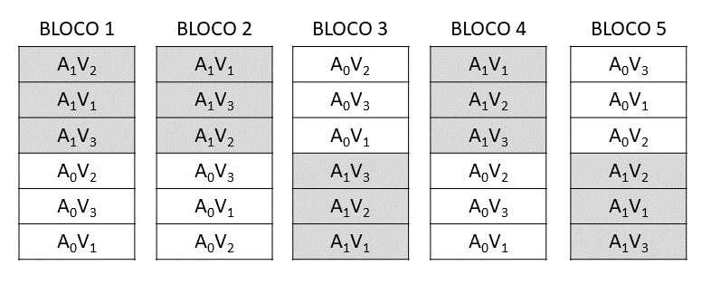

### Experimento em Parcelas Subdivididas

Os experimentos em parcelas subdivididas, também conhecidos como "Split-plot", são utilizados quando, em um mesmo ensaio, queremos testar os efeitos de $2$ ou mais fatores, mas em condições experimentais um pouco diferentes daquelas utilizadas nos experimentos fatoriais.

Por exemplo: 

  * $4$ Variedades e $3$ Níveis de Adubação  
  * $3$ Níveis de Irrigação e $4$ Níveis de Adubação  
  * $3$ Espaçamentos e $4$ densidades de Semeadura  
  etc.  
   
Como principal característica temos que as unidades experimentais (parcelas), são divididas em partes menores e iguais, chamadas de subparcelas. 

---

As **parcelas** podem ser ditribuídas de acordo com um delineamento qualquer, ou seja, inteiramente ao acaso ou blocos casualizados. A principal característica deste delineamento é a casualização dos tratamentos, que é feita em $2$ estágios.

  * No primeiro estágio, é feita a casualização dos níveis do fator testado, nas parcelas, de acordo com o delineamento adotado.
  
  * No segundo estágio, em cada parcela, é feita a casualização dos níveis do fator que será testados na subparcelas.
  
Denominamos de **tratamentos principais** ou tratamento **primários**, aqueles que são colocados nas parcelas, e de **tratamento secundários** ou **subtratamentos** aqueles que são colocados nas subparcelas.
  
Nesses experimento, temos  $2$ resíduos: O **Resíduo a**, que serve como base de comparação para os tratamentos principais, e o **Resíduo b**, que serve como base de comparação para os tratamentos secundários e para a interação $P \times S$.

Em consequência do tipo de casualização feita, o erro experimental devido aos tratamentos secundários ( $QM$ Resíduo b), geralmente é menor que o erro experimental devido aos tratamentos principais ( $QM$ Resíduo a).
  
Dessa maneira, os efeitos dos tratamentos principais são determinados com menor precisão que os efeitos dos tratamentos secundários.
  
---

Assim, por exemplo, num experimento em parcelas subdivididas, com os fatores: Adubação (tratamento principal - $a$ ) e Variedades (tratamento secundário - $b$ ), sendo utilizados $2$ níveis de Adubação $(A_0\; e\; A_1)$ e $3$ Variedades $(V_1\;V_2\;e\; V_3)$, o esquema de casualização dos tratamento, se o experimento fosse montado de acordo com o DBC, com $5$ blocos $(r)$, seria o seguinte.



---

O esquema de análise de variância deste ensaio seria o seguinte:

```{r echo=FALSE}
require(kableExtra)
df<-data.frame(CV=c("Blocos","Adubação (A)","Resíduo a",
         "(Parcelas)","Variedades (V)","Interação (A x V)","Resíduo b","Total"),
               GL=c("4 (r-1) ","1 (a-1)","4 (a-1)(r-1)","( 9 ) (ar-1)","2 (b-1) ","2 (a-1)(b-1)","16 a(b-1)(r-1)","29 (abr-1)"))
names(df) <- c("Causas de Variação", "GL")
kable(df) %>% 
  kable_styling(bootstrap_options = "striped", full_width = FALSE) %>% 
  row_spec(c(4,8),bold=TRUE)
```

---

**Observação**: Caso este mesmo ensaio fosse montado de acordo com o esquema fatorial $2 \times 3$ em $5$ blocos, a casualização seria feita de modo diferente e, como exemplo, apresentamos o sorteio do delineamento seguinte:


---

e o esquema da análise de variância do experimento de acordo com o esquema fatorial $2 \times 3$, seria o seguinte:

```{r echo=FALSE}
require(kableExtra)
df<-data.frame(CV=c("Adubação (A)","Variedades (V)","Interação (A x V)",
                    "(Tratamentos)","Blocos","Resíduo","Total"),
               GL=c("1","2","2","( 5 )","4","20","29"))
names(df) <- c("Causas de Variação", "GL")
kable(df) %>% 
  kable_styling(bootstrap_options = "striped", full_width = FALSE) %>% 
  row_spec(c(4,7),bold=TRUE)
```

A análise de variância do experimento em parcelas subdivididas reflete a característica principal do delineamento: A análise dos tratamentos principais é em blocos ao acaso, com os $2$ níveis de adubação repetidos em $5$ blocos (parte superior do quadro de análise de variância), sendo a análise dos tratamentos secundários, a análise de $3$ variedades distribuídos ao acaso nas $3$ subparcelas de cada uma das $10$ parcelas.

---

### Obtenção da análise de variância

Para a obtenção da análise de variância de um experimento em parcelas subdivididas, vamos utilizar os dados obtidos do trabalho intitulado "Efeito de épocas de plantio, sobre várias características agronômicas na cultura da soja (*Glycine max*. (L.) Merril), variedades Santa Rosa e Viçoja, e Jaboticabal, SP", realizado por K. YUYAMA (1976). Foram utilizadas $8$ épocas de plantio:  
  + 20/10/74  
  + 30/10/74  
  + 10/11/74  
  + 20/11/74  
  + 30/11/74  
  + 10/12/47  
  + 20/12/74  
  + 30/12/74  

e duas variedade de soja ($V_1$ = Viçoja e $V_2$ = Santa Rosa). 

O ensaio foi montado de acordo com o delineamento em parcelas subdivididas, com as épocas de plantio nas parcelas, e as variedades nas subparcelas. Os resultados obtidos para produção de grãos $(t\;ha^{-1})$, foram os seguintes:

---

|Tratamentos|	Bloco 1	|Bloco 2	|Bloco 3	|Total |
|:---|:---:	|:---:|:---:|:---:|
| $E_1V_1$|	2,9166	|2,8833	|2,4750	|8,2749|
| $E_1V_2$|	2,6416	|3,6666	|3,6166	|9,9248|
| $E_2V_1$|	3,4889	|3,5833	|3,3333	|10,4055|
| $E_2V_2$|	4,0583	|4,3000	|2,9083	|11,2666|
| $E_3V_1$|  2,3166	|2,8666	|2,4916	|7,6748|
| $E_3V_2$|	3,4500	|3,7666	|3,5333	|10,7499|
| $E_4V_1$|	2,7916	|2,7583	|3,1916	|8,7415|
| $E_4V_2$|	3,4166	|2,7416	|3,5083	|9,6665|
| $E_5V_1$|	3,5583	|3,1583	|2,7916	|9,5082|
| $E_5V_2$|	3,5000	|3,1166	|3,0916	|9,7082|
| $E_6V_1$|	2,7833	|2,5166	|2,1250	|7,4249|
| $E_6V_2$|	2,5583	|2,5666	|2,0416	|7,1665|
| $E_7V_1$|	2,3000	|2,2083	|2,0666	|6,5749|
| $E_7V_2$|	1,4250	|1,9166	|1,8750	|5,2166|
| $E_8V_1$|	1,1666	|1,6916	|1,4666	|4,3248|
| $E_8V_2$|	2,0083	|1,7833	|1,7416	|5,5332|
| Total|	44,3800	|45,5242	|42,2576	|**132,1618**|

---

**Dados originais**:[DOWNLOAD](https://github.com/arpanosso/experimentacao-agricola-unesp-fcav/raw/master/data/dados_prod_soja.xlsx)

Pelo quadro de dados do experimento, podemos obter as somas de quadrados Total e de Blocos, utilizando:  

* $a$ (número de níveis de Tratamentos Principais = 8).  

* $r$ (número de Blocos ou repetições = 3).  

* $b$ (número de níveis de Tratamentos Secundários = 2).  
  
Assim, temos:  

$$
\begin{align}
SQ_\text{Total} &= \sum_{i=1}^a \sum_{j=1}^b \sum_{k=1}^r y_{ijk}^2 - \frac{G^2}{abr} \\
&=(2,9166^2+2,8833^2+\cdots +1,7416^2)-\frac{132,1618^2}{8\times 2 \times 3}
\\
&= 25,6734
\end{align}
$$

---

$$
\begin{align}
SQ_\text{Blocos} &= \frac{1}{ab} \sum_{k = 1}^rBloco_j^2-C \\
&=\frac{1}{8\times 2} (44,3800^2+45,5242^2+42,2576^2) -\frac{132,1618^2}{8\times 2 \times 3} \\
&=0,3434
\end{align}
$$

---
Para a obtenção das demais somas de quadrados, é conveniente montar os seguintes quadros auxiliares:

1. **Quadro auxiliar para obtenção dos totais de parcelas**.

| $(b = 2)$|	Bloco 1	|Bloco 2|	Bloco 3|	Total|
|:---|:---:|:---:|:---:|:---:|
| $E_1$|	5,5582|	6,5499|	6,0916|	18,1997|
| $E_2$|	7,5472|	7,8833|	6,2416|	21,6721|
| $E_3$|	5,7666|	6,6332|	6,0249|	18,4247|
| $E_4$|	6,2082|	5,4999|	6,6999|	18,408|
| $E_5$|	7,0583|	6,2749|	5,8832|	19,2164|
| $E_6$|	5,3416|	5,0832|	4,1666|	14,5914|
| $E_7$|	3,7250|	4,1249|	3,9416|	11,7915|
| $E_8$|	3,1749|	3,4749|	3,2082|	9,8580|
|Total| 44,38|	45,5242|	42,2576|	132,1618|

---

Pelo quado de totais de parcelas, obtemos:
$$
\begin{align}
SQ_\text{Parcelas} &= \frac{1}{b}[T_{E1Bloco1}^2+T_{E1Bloco2}^2+\cdots+T_{E_8Bloco_3}^2]-C \\
&=\frac{1}{2}[5,5582^2+6,5499^2+\cdots+3,2082^2]-363,8904 \\
&= 21,4149 \\
\\
SQ_\text{Épocas} &= \frac{1}{br}(T_{E1}^2+T_{E2}^2+\cdots +T_{E8}^2) - C\\
&= \frac{1}{2 \times 3}(18,1997^2+21,6721^2+\cdots + 9,8580^2) - 363,8904\\
&=19,0482 \\
\\
SQ_\text{Res(a)}& = SQ_\text{Parcelas} - SQ_\text{Épocas} - SQ_\text{Blocos} \\
& = 21,4149-19,0482-0,3434 \\
& = 2,0233
\end{align}
$$

---

2. **Quadro auxiliar para obtenção dos totais de tratamentos principais x tratamento secundários**.

|(r = 3)	| $V_1$|	$V_2$|	Total|
|:---	|:---:|:---:|	:---:|
| $E_1$|	8,2749|	9,9248|	18,1997|
| $E_2$|	10,4055|	11,2666|	21,6721|
| $E_3$|	7,6748|	10,7499|	18,4247|
| $E_4$|	8,7415|	9,6665|	18,408|
| $E_5$|	9,5082|	9,7082|	19,2164|
| $E_6$|	7,4249|	7,1665|	14,5914|
| $E_7$|	6,5749|	5,2166|	11,7915|
| $E_8$|	4,3248|	5,5332|	9,858|
| Total|	62,9295|	69,2323|	132,1618|

Por este quadro, calcularemos a Soma de quadrados devido ao tratamento secundário e devido à interação Primário x Secundário,

---

$$
\begin{align}
SQ_\text{Variedades} &= \frac{1}{ar}[T_{V1}^2 + T_{V2}^2]-C \\
&=\frac{1}{8 \times 3}[62,9295^2+69,2323^2]-363,8904 \\
&= 0,8276 \\
\\
SQ_{E,V} &= \frac{1}{r}[T_{E1V1}^2+T_{E1V2}^2+\cdots+T_{E8V2}^2]-C \\
&=\frac{1}{3}[8,2749^2+9,9248^2+\cdots+5,5332^2]-363,8904 \\
&= 21,9127 \\
\\
SQ_\text{Interação ExV} &= SQ_{E,V}-SQ_{E}
-SQ_{V}\\
&=21,9127-19,0482-0,8276\\
&=2,0370
\end{align}
$$

---

Obtidas as somas de quadrados, podemos montar o seguinte quadro de análise de variância:

```{r echo=FALSE}
require(kableExtra)
df<-data.frame(CV=c("Blocos","Épocas de Plantio (E)","Resíduo(a)",
         "(Parcelas)","Variedades (V)","Interação (E x V)","Resíduo(b)","Total"),
               GL=c("2","7","14","( 23 )","1","7","16","47"),
               SQ=c("0,3434","19,0482","2,0233","( 21,4149 )","0,8276","2,0370","1,3939","25,6734"),
               QM=c("0,1717","2,7212","0,1445","--","0,8276","0,2910","0,0871","--"),
                "F"=c("1,19","18,83**","--","--","9,50**","3,34*","--","--"))
names(df) <- c("Causas de Variação", "GL","SQ","QM","F")
kable(df) %>% 
  kable_styling(bootstrap_options = "striped", full_width = FALSE) %>% 
  row_spec(c(4,8),bold=TRUE)
```

Valores de F da tabela para Épocas $(7\times14GL)$: $\begin{cases} 5\%=2,76 \\ 1\%=4,28 \end{cases}$

Valores de F da tabela para Variedades $(1\times16GL)$: $\begin{cases} 5\%=4,49 \\ 1\%=8,53 \end{cases}$

Valores de F da tabela para Interação E $\times$ V $(7\times16GL)$: $\begin{cases} 5\%=2,66 \\ 1\%=4,03 \end{cases}$

---

### Conclusões

**Para efeito de Épocas**: O teste foi significativo ao nível de $1\%$ de probabilidade, indicando que devemos rejeitar a hipótese da nulidade e concluir que as épocas de plantio diferem entre si em relação à produção da cultura da soja.

**Para efeito de Variedades**: O teste foi significativo ao nível de $1\%$ de probabilidade, indicando que devemos rejeitar a hipótese da nulidade e concluir que as variedades testadas diferem entre si em relação à produção da cultura da soja.

**Para efeito da Interação E $\times$ V**: O teste foi significativo ao nível de $5\%$ de probabilidade, indicando que devemos rejeitar a hipótese $H_0$ e concluir que os fatores Épocas de plantio e variedades agem conjuntamente sobre a produção da cultura da soja, ou seja, Épocas de plantio e variedades não agem de maneira independente.

Como a interação $E\times V$ foi significativa, devemos desdobrar os graus de liberdade da interação para estudar os efeitos de um fator em cada um dos níveis do outro fator.


---

### 1. Desdobramento da interação  $E \times V$  para estudar os efeitos de Variedades dentro de cada Época de plantio (V d. E):

Para obtenção das somas de quadrados, utilizamos o quadro auxiliar:

|(r = 3)	| $V_1$|	$V_2$|	Total|
|:---	|:---:|:---:|	:---:|
| $E_1$|	8,2749|	9,9248|	18,1997|
| $E_2$|	10,4055|	11,2666|	21,6721|
| $E_3$|	7,6748|	10,7499|	18,4247|
| $E_4$|	8,7415|	9,6665|	18,408|
| $E_5$|	9,5082|	9,7082|	19,2164|
| $E_6$|	7,4249|	7,1665|	14,5914|
| $E_7$|	6,5749|	5,2166|	11,7915|
| $E_8$|	4,3248|	5,5332|	9,858|
|Total|	62,9295|	69,2323|	132,1618|

---

Então, temos:

$$
\begin{align}
SQ_{V\;d.\;E_1} &= \frac{1}{3}[8,2749^2+9,9248^2]-\frac{18,1997^2}{2\cdot3}=0,4537 \\
SQ_{V\;d.\;E_2} &= \frac{1}{3}[10,4055^2+11,26668^2]-\frac{21,6721^2}{2\cdot3}=0,1236 \\
SQ_{V\;d.\;E_3} &= \frac{1}{3}[7,6748^2+10,7499^2]-\frac{18,4247^2}{2\cdot3}=1,5760 \\
SQ_{V\;d.\;E_4} &= \frac{1}{3}[8,7415^2+9,6665^2]-\frac{18,4080^2}{2\cdot3}=0,1426 \\
SQ_{V\;d.\;E_5} &= \frac{1}{3}[9,5082^2+9,7082^2]-\frac{19,2164^2}{2\cdot3}=0,0067 \\
SQ_{V\;d.\;E_6} &= \frac{1}{3}[7,4249^2+7,1665^2]-\frac{14,5914^2}{2\cdot3}=0,0111 \\
SQ_{V\;d.\;E_7} &= \frac{1}{3}[6,5749^2+5,2166^2]-\frac{11,7915^2}{2\cdot3}=0,3075 \\
SQ_{V\;d.\;E_8} &= \frac{1}{3}[4,3248^2+5,5332^2]-\frac{9,8580^2}{2\cdot3}=0,2434
\end{align}
$$
---
**Verificação**:

$$SQ_{Variedade}+SQ_{Interação\;E \times V} = SQ_{V\;d.E_1}+SQ_{V\;d.E_2}+SQ_{V\;d.E_3}+SQ_{V\;d.E_4} + \\ + SQ_{V\;d.E_5}+SQ_{V\;d.E_6}+SQ_{V\;d.E_7}+SQ_{V\;d.E_8}$$

```{r echo=FALSE}
require(kableExtra)
df<-data.frame(CV=c("Variedades d. E1","Variedades d. E2","Variedades d. E3","Variedades d. E4","Variedades d. E5","Variedades d. E6","Variedades d. E7","Variedades d. E8","Resíduo(b)"),
               GL=c(1,1,1,1,1,1,1,1,16),
               SQ=c("0,4537","0,1236","1,5760","0,1426","0,0067","0,0111","0,3075","0,2434","1,3939"),
               QM=c("0,4537","0,1236","1,5760","0,1426","0,0067","0,0111","0,3075","0,2434","0,0871"),
               "F"=c("5,21*","1,42","18,09**","1,64","0,08","0,13","3,53","2,79","--")
               )
names(df) <- c("Causas de Variação", "GL","SQ","QM","F")
kable(df) %>% 
  kable_styling(bootstrap_options = "striped", full_width = FALSE) %>% 
  row_spec(9,bold=TRUE)
```

---

Valores de $F$ da Variedades d. E $(1\times16GL)$: $\begin{cases} 5\%=4,49 \\ 1\%=8,53 \end{cases}$

**Conclusão**: Os valores de F foram significativos para V d. E1 e V d. E3, indicando que existe diferença entre as variedades apenas quando plantadas nestas duas épocas em relação à produção da cultura da soja.

---

### 2. Desdobramento da interação $E \times V$  para estudar os efeitos de épocas dentro de cada Variedade (E d. V):

$$
\begin{align}
SQ_{E\;d.\;V_1} &= \frac{1}{3}[8,2749^2+10,4055^2+\cdots+4,3248^2]-\frac{62,9295^2}{8\times 3}=8,1726 \\
SQ_{E\;d.\;V_2} &= \frac{1}{3}[9,9248^2+11,2666^2+\cdots+5,5332^2]-\frac{69,2323^2}{8\times 3}=12,9126
\end{align}
$$

Como neste caso, estamos comparando tratamento principais dentro de tratamento secundários, estão envolvidos na comparação o Resíduo (a) e o Resíduo (b). 

Então, para aplicarmos o teste F, devemos obter um residuo médio (variância complexa), dado por:

$$QM_{Res.Médio}=\frac{QM_{Res(a)}+(b-1)QM_{Res(b)}}{b},$$

onde $b$ é o número de tratamentos secundários.

---

Neste caso, o número de graus de liberdade ($n'$), associado a este Resíduo Médio, pode ser obtido pla fórmula de **Satterthmaite**:

$$n'=\frac{[QM_{Res(a)}+(b-1)QM_{Res(b)}]^2} {\frac{[QM_{Res(a)}]^2}{GL_{Res(a)}}+\frac{[(b-1)QM_{Res(b)}]^2}{GL_{Res(b)}}}$$

Então, no nosso exemplo, temos:

$$
QM_{Res.Médio}=\frac{0,1445+(2-1)\cdot0,0871}{2}=0,1158
$$

e o número de gruas de liberdade associado a este resíduo será:

$$
n'=\frac{[0,1445+(2-1) \cdot 0,0871]^2} {\frac{[0,1455]^2}{14}+\frac{[(2-1) \cdot 0,0871]^2}{16}}=27.29
$$

---

Então, podemos montar o seguinte quadro de análise de variância.

```{r echo=FALSE}
require(kableExtra)
df<-data.frame(CV=c("Épocas d. V1","Épocas d. V2","Resíduo Médio"),
               GL=c(7,7,27),
               SQ=c("8,1726","12,9126","--"),
               QM=c("1,1675","1,8447","0,1158"),
               "F"=c("10,08**","15,93**","--")
               )
names(df) <- c("Causas de Variação", "GL","SQ","QM","F")
kable(df) %>% 
  kable_styling(bootstrap_options = "striped", full_width = FALSE) %>% 
  row_spec(3,bold=TRUE)
```

Valores de F da Épocas d. V $(7\times27GL)$: $\begin{cases} 5\%=2,73 \\ 1\%=3,39 \end{cases}$

**Conclusão**: Os valores de F foram significativos para Épocas d. V1 e Épocas d. V2, indicando que existe diferença entre as épocas de plantio para ambas as variedades em relação à produção da cultura da soja.

Portanto, para verificar qual é a melhor época de plantio para da variedade de soja, devemos aplicar testes de comparações de médias.

---

### Cálculo das médias

A partir do quadro de totais, vamos construir a tabela de médias

**Quadro de Totais**

|( r= 3)	| $V_1$|	$V_2$|	Total|
|:---	|:---:|:---:|	:---:|
| $E_1$|	$8,2749\div3$|	$9,9248\div3$|	$18,1997\div6$|
| $E_2$|	$10,4055\div3$|	$11,2666\div3$|	$21,6721\div6$|
| $E_3$|	$7,6748\div3$|	$10,7499\div3$|	$18,4247\div6$|
| $E_4$|	$8,7415\div3$|	$9,6665\div3$|	$18,408\div6$|
| $E_5$|	$9,5082\div3$|	$9,7082\div3$|	$19,2164\div6$|
| $E_6$|	$7,4249\div3$|	$7,1665\div3$|	$14,5914\div6$|
| $E_7$|	$6,5749\div3$|	$5,2166\div3$|	$11,7915\div6$|
| $E_8$|	$4,3248\div3$|	$5,5332\div3$|	$9,858\div6$|
|Total|	$62,9295\div24$|	$69,2323\div24$|	$132,1618\div48$|

---

**Quadro de médias**  

|(r = 3)	| $V_1$|	$V_2$|	Médias (E)|
|:---	|:---:|:---:|	:---:|
| $E_1$|	2,7583|	3,3083|	3,0333|
| $E_2$|	3,4685|	3,7555|	3,6120|
| $E_3$|	2,5583|	3,5833|	3,0708|
| $E_4$|	2,9138|	3,2222|	3,0680|
| $E_5$|	3,1694|	3,2361|	3,2027|
| $E_6$|	2,4750|	2,3888|	2,4319|
| $E_7$|	2,1916|	1,7389|	1,9653|
| $E_8$|	1,4416|	1,8444|	1,9653|
| Médias (V)|	2,6221|	2,8847|	2,7534|

---
### Cálculo dos erros padrões:

### a) Tratamentos principais (épocas)
$$s(\hat{m}_E)=\frac{s_a}{\sqrt{r_E}}=\frac{\sqrt{QM_{Res(a)}}}{\sqrt{r_E}}=\sqrt{\frac{0,1445}{6}}= 0,1552\;t\;ha^{-1}$$

### b) Tratamentos secundários (Variedades)

$$s(\hat{m}_V)=\frac{s_b}{\sqrt{r_V}}=\frac{\sqrt{QM_{Res(b)}}}{\sqrt{r_V}}=\sqrt{\frac{0,087}{24}}= 0,0602\;t\;ha^{-1}$$

---

### c) Tratamentos secundários (Variedades) dentro de tratamentos principais (Épocas)

$$s(\hat{m}_{V\;d.E})=\frac{s_b}{\sqrt{r_{V\;d.E}}}=\frac{\sqrt{QM_{Res(b)}}}{\sqrt{r_{V\;d.E}}}=\sqrt{\frac{0,0871}{3}}= 0,1704\;t\;ha^{-1}$$

### d) Tratamentos principais (Épocas) dentro de tratamentos secundários (Variedades) 

Note, apesar de serem as mesmas médias, do item anterior, a comparação é diferente, então no erro padrão delas devemos utilizar o $QM_{Resíduo\;Médio}$:

$$s(\hat{m}_{E\;d.V})=\frac{s_{médio}}{\sqrt{r_{E\;d.V}}}=\frac{\sqrt{QM_{Res.Médio}}}{\sqrt{r_{E\;d.V}}}=\sqrt{\frac{0,1158}{3}}= 0,1965\;t\;ha^{-1}$$
---
### Teste de Tukey para comparar médias de tratamentos principais (épocas) dentro de tratamentos secundários (variedades)

O valor da diferença mínima significativa pelo teste de Tukey ($5\%$) será:

$$dms=q\cdot\sqrt{\frac{QM_{Res.Médio}}{r_{E\;d.V}}},\\
\text{considerando:}\;q(8\;Épocas \times 27\;GL\;Res.Médio,5\%)=4,64 \\
r=3\\
\text{Então, temos:}\\
dms=4,64\cdot0,1965=0,9116\;t\;ha^{-1}$$

---

Resumo do teste de Tukey:

|	| $V_1$|	$V_2$|	
|:---	|:---|:---|
| $E_1$|	2,7583 abc|	3,3083 a|	
| $E_2$|	3,4685 a|	3,7555 a|	
| $E_3$|	2,5583 abc|	3,5833 a|	
| $E_4$|	2,9138 abc|	3,2222 ab|	
| $E_5$|	3,1694 ab|	3,2361 ab|	
| $E_6$|	2,4750  bc|	2,3888  bc|	
| $E_7$|	2,1916    cd|	1,7389   c|	
| $E_8$|	1,4416     d|	1,8444   c|	

---

### Cálculo dos coeficientes de variação do experimento

Como temos $2$ resíduos, teremos também, dois coeficientes de variação:

a) Coeficiente de variação para parcelas:

$$CV_a = 100\frac{s_a}{\hat{m}}=100\frac{\sqrt{0,1445}}{2,7534} = 13,81\%$$
b) Coeficiente de variação para subparcelas:

$$CV_b = 100\frac{s_b}{\hat{m}}=100\frac{\sqrt{0,0871}}{2,7534} = 10,72\%$$
---


```{r}
require(ExpDes.pt)
caminho<-"https://raw.githubusercontent.com/arpanosso/ExpAgr_2020/master/dados/sojapsub.txt"
d<-read.table(caminho,h=T)
psub2.dbc(d$E,d$V,d$Bloco,d$Y,fac.names = c("Épocas","Variedades"))
```


