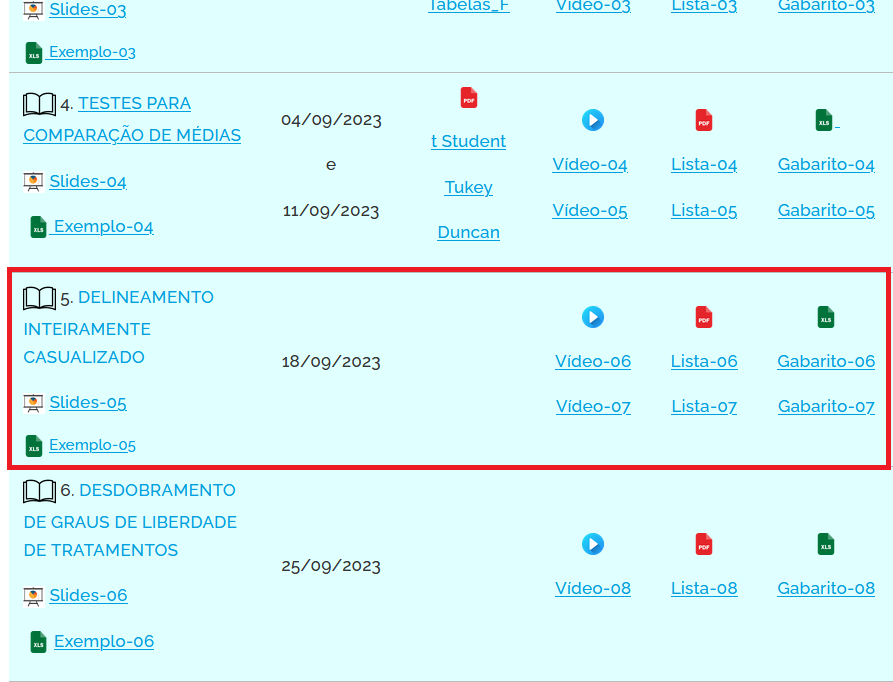
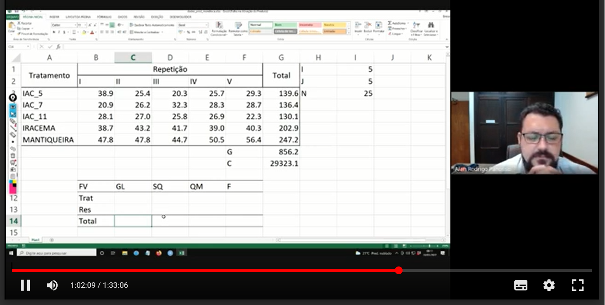
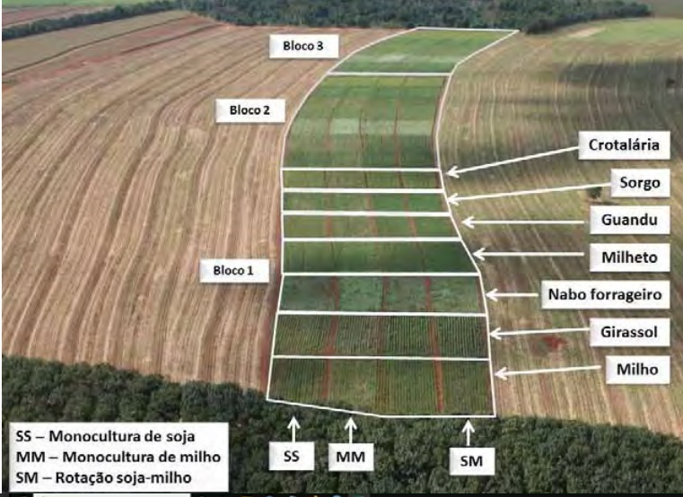
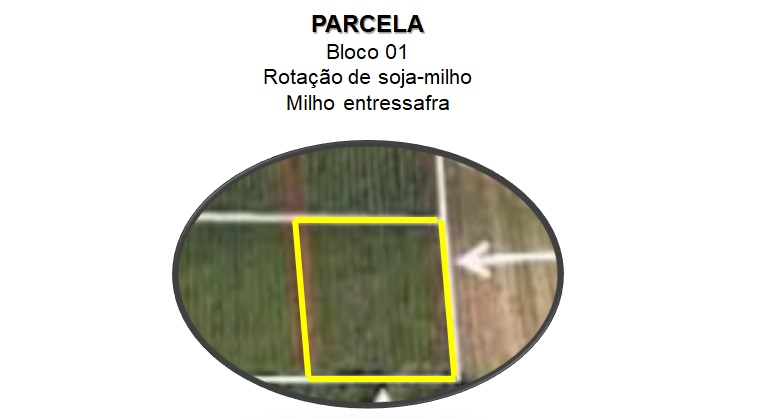
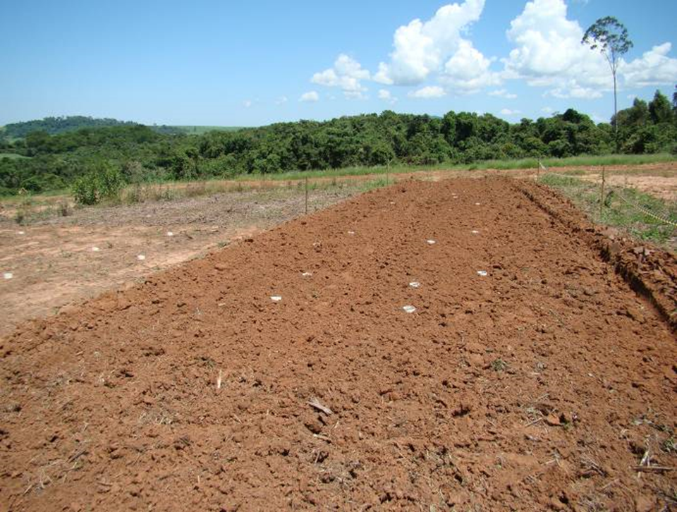
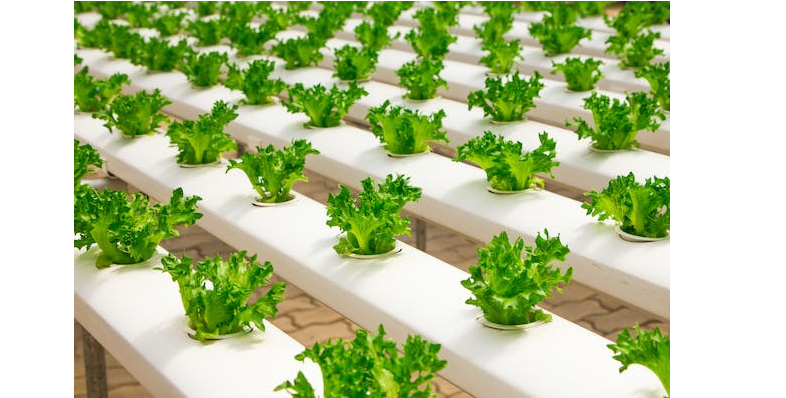
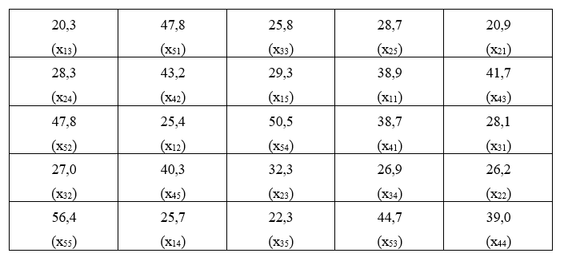

## Material Didático:

Acesse: https://www.fcav.unesp.br/alan, e clique em **Material Didático**.


---

## Material Didático:

Agora selecione a disciplina: **Experimentação Agrícola**.


---

## Material Didático:

O aluno terá acesso aos nosso capítulo, slides, exemplos, listas e gabaritos.




---

## Material Didático:

E acesso ao vídeo da nossa aula.



---
# Experimentos Inteiramente Casualizados

## Cronograma da aula

### 1. Conceitos Básicos

### 2. Caracterização

### 3. Modelo matemático

### 4. Hipóteses básicas para aplicação da análise de variância

### 5. Obtenção do quadro da análise de variância

### 6. Exemplo prático


---

### 1. Conceitos Básicos

**OBJETIVOS**: Estudo dos experimentos: planejamento, execução, análise de dados e interpretação dos resultados.

**POPULAÇÃO**: é um conjunto de indivíduos (objetos), tendo pelo menos uma (característica) comum observável. 

**AMOSTRA**: é qualquer subconjunto não vazio e com menor número de elementos da população.

**VARIÁVEL ALEATÓRIA**: é a função que associa os possíveis resultados experimentais a valores reais.

**PARÂMETRO**: é a medida usada para descrever uma característica da população. Característica principal, não varia.

ex: média populacional $(\mu)$; variância populacional $(\sigma^2)$; etc.

**ESTATÍSTICA**: qualquer função de uma amostra aleatória sendo um instrumento de descrição de alguma característica da população, ex: média amostral $(\bar{y})$ ; variância amostral $(s^2)$, etc...portanto é também uma variável aleatória.


---
### 1. Conceitos Básicos

**EXPERIMENTO**: Trabalho previamente planejado, que segue alguns princípios básicos, cujo objetivo é comparar efeitos de tratamentos.

**TRATAMENTO**: é o método, elemento ou material cujo efeito se deseja medir ou comparar em um experimento. 

São diferentes condições ou manipulações que aplicamos a um grupo de unidades experimentais com o objetivo de avaliar seu efeito em uma variável dependente $(Y)$. Também denominados **"FATORES"**.

Assim, esses fatores podem variar em termos de quantidade, intensidade ou tipo de estímulo aplicado. 


Por exemplo, em um experimento agrícola, os tratamentos podem ser diferentes tipos de fertilizantes aplicados às plantas.

---

### 1. Conceitos Básicos

**NÍVEIS DE UM TRATAMENTO**: Os níveis de um tratamento se referem às diferentes intensidades ou categorias dentro de um tratamento específico. Em muitos experimentos, um tratamento pode ter várias variações ou níveis que são usados para testar como diferentes intensidades ou categorias desse tratamento afetam a variável de interesse. 

Por exemplo, se o tratamento é a aplicação de um fertilizante, os níveis desse tratamento podem ser diferentes dosagens desse fertilizante, como 0 kg/ha, 50 kg/ha, 100 kg/ha, etc.

Dizemos que o Fator "Fertilizante" tem $a$ níveis, com $a = 3$.
---

### 1. Conceitos Básicos

**UNIDADES EXPERIMENTAIS** – ou "parcelas" é a unidade a qual o tratamento é aplicado, onde obteremos os dados que refletirão os efeitos dos tratamentos.

Em outras palavras é uma unidade básica na qual um tratamento ou uma condição experimental é aplicada e na qual as medições ou observações são feitas em um experimento. Em termos simples, é o "espaço" onde o experimento ocorre e onde se coletam dados. 
---


Foto de um experimento (2008).

---


Mesmo experimento em outra época apresentando os níveis de dois fatores experimentais, cultura de inverno e cultura de verão.

---



---

Mais um exemplo de unidade experimental.
---
### 2 CARACTERIZAÇÃO

O **delineamento inteiramente casualizado (DIC)** é o mais simples de todos os delineamentos experimentais, e os experimentos instalados de acordo com este delineamento são chamados de experimentos interiamente casualizados ou experimentos inteiramente ao acaso.

Este delineamento apresenta as seguintes características:

1. Apenas um fator é analisado "one-way" (variedades de plantas, tipos de herbicidas, drogas, níveis de adubação, sistema de manejo, ração, etc). 

2. Leva em consideração os princípios da **repetição** e da **casualização**, deixando de lado o *princípio do controle local* e, portanto, as repetições não são organizadas em blocos.

3. Os tratamentos são designados às parcelas de forma inteiramente casual, com qualquer número de repetições, ou seja não há necessidade de que o número de unidades experimentais destinadas a cada nível do fator seja igual.

---

**As principais vantagens desse delineamento são as seguintes:**

1) Flexibilidade, uma vez que o número de repetições pode variar de um nível do tratamento para outro, sem causar sérios problemas na análise.

2) Proporciona o maior número de graus de liberdade possível para o resíduo.
    
--

**As principais desvantagens desse delineamento são:**
   
1) As parcelas experimentais devem ser homogêneas.
  
2) Leva a uma alta estimativa da variância residual $QM_\text{Res}$, uma vez que todas as variações, exceto aquela devido ao efeito de tratamentos, são tomadas como variação do acaso.

---

Para a instalação desse experimento devemos ter certeza da homogeneidade das condições experimentais. 

Este delineamento é bastante utilizado em ensaios de laboratório e em ensaios com vasos, realizados dentro de casas de vegetação, em que as condições experimentais podem ser perfeitamente controladas.



---
A distribuição casual dos tratamentos a todas as parcelas do experimento é a principal característica deste delineamento. 

Por exemplo, num experimento no delineamento inteiramente casualizado com $a = 5$ tratamentos (A, B, C, D e E) e $r = 4$ repetições $(1 \text{ a } 4)$, a casualização dos tratamentos seria feita sorteando-se para cada uma das $(20)$ parcelas do experimento uma combinação de tratamento e repetição $(5 \times 4)$, ou seja:

$$\begin{matrix}
A1 & A2 & A3 & A4 \\
B1 & B2 & B3 & B4 \\
C1 & C2 & C3 & C4 \\
D1 & D2 & D3 & D4 \\
E1 & E2 & E3 & E4 
\end{matrix}$$

Assim, um sorteio para distribuição dos tratamentos às parcelas poderia ser o seguinte:

OBS: nesse caso o número de repetiçõe é o mesmo para cada nível do tratamento $(r_1 = r_2 = ... = r_a = 4)$.

---


```{r}
a <- 5
r <- 4
trat <-  rep(LETTERS[1:a], r)
rep <- rep(1:r, rep(a,r))
parcelas <- paste0(trat, rep)
set.seed(1235) 
sorteio <- sample(parcelas, size = 20, replace = FALSE)
matrix(sorteio, ncol=5, byrow = TRUE)
```


Resultado do sorteio

$$\begin{matrix}
E3 & B3 & C1 & E4 & E1\\
D3 & D1 & D4 & C3 & C4\\
A4 & B2 & B1 & B4 & A2\\
E2 & D2 & C2 & A1 & A3
\end{matrix}$$

---
### Na aplicação de um DIC os objetivos podem ser:

- Estimar as médias

- Testar a diferença entre grupos

A análise de variância é usada para testar a diferença entre médias de grupos pela comparação da variabilidade explicada, causada pelas diferenças entre os grupos, com a variação não explicada, a qual está entre as unidades medidas dentro dos grupos. 


---
### 3 MODELO MATEMÁTICO

Todo delineamento experimental possui um modelo matemático que o representa, e deve ser levado em conta na análise de variância, **aceitando algumas hipóteses básicas necessárias para a validade da análise.** 

No caso do $DIC$, o modelo matemático é definido como:

$$y_{ij}= \mu + \tau_i + \epsilon_{ij}$$
com $$\begin{cases} i =1,2..,a \\ j = 1, 2, ...,r_i \end{cases}$$  
onde:

$y_{ij}$ é o valor observado na unidade experimental que recebeu o tratamento *i* na repetição *j*;

$\mu$ é a média geral do experimento;

---
### 3 MODELO MATEMÁTICO

$$y_{ij}= \mu + \tau_i + \epsilon_{ij}$$

$\tau_i$ é o efeito devido ao tratamento *i* que foi aplicado à unidade experimental .Representado como: $\tau_i = \mu_i - \mu$.

  > Pelas definições de $\mu$ e $\tau_i$ o modelo possui a restrição:

$$
\sum \limits_{i=1}^{a} r_i\tau_i = 0
$$

  > Portanto estamos supondo que...
  
$\epsilon_{ij}$ é o efeito dos fatores não controlados na parcela que recebeu o tratamento *i* na repetição *j*.

---

### 4 HIPÓTESES BÁSICAS PARA APLICAÇÃO DA ANÁLISE DE VARIÂNCIA

As hipóteses básicas que devemos admitir para tornar válida a aplicação da análise de variância são as seguintes:

1) **Aditividade**: Os efeitos dos fatores do modelo são aditivos.
  
2) **Independência**: Os erros (desvios) $\epsilon_{ij}$, devido aos efeitos de fatores não controlados ou acaso devem ser independentes.
  
3) **Homocedasticidade (homogeneidade de variâncias)**: Os erros (desvios) $\epsilon_{ij}$, devido ao acaso devem possuir variância comum $\sigma^2$
  
4) **Normalidade dos desvios**: Os erros ou desvios $\epsilon_{ij}$ devido ao acaso devem possuir distribuição normal de probabilidades.

---

Uma forma resumida de apresentar estas quatro pressuposições é apresentada a seguir:

$$
\epsilon_{ij} \overset{iid}{\tilde{} }N(0,\sigma^2)  \\
$$
  
Quando as hipóteses básicas não são satisfeitas, como no caso mais frequente a **homocedasticidade**, deve-se utilizar uma transformação dos dados para contormar o problema.

---

**Principais Transformações**

**1. Raiz Quadrada:** $y'=\sqrt{y}$

Geralmente utilizada para **dados de contagem**, que frequentemente seguem a distribuição de *Poisson*, em que a **média e a variância são iguais**. Exemplo, número de ácaros por folha, número de frutos atacados, número de plantas doentes por parcela, etc. No caso de ocorrência de valores nulos ou baixos, recomenda-se $y'=\sqrt{y+0,5}$ ou $y'=\sqrt{y+1}$.

**2. Arco Seno:** $y'=arcoseno\sqrt{\frac{y}{100}}$

Recomendada para **dados de porcentagem**, proveniente de contagem, que geralmente seguem a distribuição **binomial**, como exemplo, $\%$ de plantas atacadas, $\%$ de germinação, etc.

**3. Transformação Logarítmica:** $y'=log{(y)}$

Quando é constatada uma certa **proporcionalidade entre as médias e os desvios padrões** dos tratamentos. Exemplo: No caso de contagem de insetos, se a população é numerosa, as contagens serão altas para a testemunha e para os tratamentos que não controlam a praga, enquanto que, para os tratamentos que controlam a praga, a amplitude de variação será baixa.

Quando houver zeros entre as contagens, utiliza-se $y'=log(y+1)$.

---

### 5 OBTENÇÃO DA ANÁLISE DE VARIÂNCIA

Para a obtenção da análise de variância, vamos considerar um experimento inteiramente casualizado com **I** tratamentos e **J** repetições.

|Trat `\` Rep | $1$| $2$|...| $j$|...| $J$|Total|
|:---|:---:|:---:|:---:|:---:|:---:|:---:|:---:|:---:|
| $1$| $y_{11}$| $y_{12}$|...| $y_{1j}$|...| $y_{1J}$| $T_1 = \sum_{j=1}^J y_{1j}$|
| $2$| $y_{21}$| $y_{22}$|...| $y_{2j}$|| $y_{2J}$| $T_2 = \sum_{j=1}^J y_{2j}$|
|...|...|...|...|...|...|...|...|
| $i$| $y_{i1}$| $y_{i2}$|...| $y_{ij}$|---| $y_{iJ}$| $T_i = \sum_{j=1}^J y_{ij}$|
|...|...|...|...|...|...|...|...|
| $I$| $y_{I1}$| $y_{I2}$|...| $y_{Ij}$|...| $y_{IJ}$| $T_I = \sum_{j=1}^J y_{Ij}$|
|**Total**||||||| $G = \sum_{i=1}^I\sum_{j=1}^J y_{ij}$|

---
De acordo com o modelo matemático deste delineamento, o valor observado na parcela que recebeu o tratamento *i* na repetição *j* é representado por:

$$y_{ij}= \mu + \tau_i + \epsilon_{ij}$$

Porém, os parâmetros do modelo são desconhecido. Assim, devemos incialmente, obter estimativas desses parâmetros.

O método utilizado para obtenção das estimativas desses parâmetros é chamado de **Método dos Mínimos Quadrados**, e consiste em obter as estimativas que minimizam a soma dos quadrados dos erros $\epsilon_{ij}$

Utilizamos o **Métodos dos Mínimos Quadrados**, para minimizar a soma dos quadrados dos erros $\epsilon_{ij}$:

$$\epsilon_{ij}= y_{ij} - \mu - \tau_i$$

$$\epsilon_{ij}^2= (y_{ij} - \mu - \tau_i)^2$$

$$\sum_{i=1}^I\sum_{j=1}^J\epsilon_{ij}^2=\sum_{i=1}^I\sum_{j=1}^J( y_{ij} - \mu - \tau_i)^2$$
---

Fazendo $z=\sum_{i=1}^I\sum_{j=1}^j\epsilon_{ij}^2$, derivando em relação a $\mu$ e em relação $\tau_i$ e igualando as equações a $0$, temos:

$$\begin{cases} \sum_{i=1}^I\sum_{j=1}^Jy_{ij} - IJ\hat{m} -J\sum_{i=1}^I \hat{\tau_i} =0 \\ \sum_{j=1}^Jy_{ij}-J\hat{m}-J\hat{\tau_i}=0 \end{cases}$$

Impondo a restrição $\sum_{i=1}^I \hat{\tau_i}=0$, temos:

$$\begin{cases} \sum_{i=1}^I\sum_{j=1}^Jy_{ij} - IJ\hat{m} =0 \\ \sum_{j=1}^Jy_{ij}-J\hat{m}-J\hat{\tau_i}=0 \end{cases}$$
Então:
$$\hat{m} = \frac{\sum\limits_{i=1}^I\sum\limits_{j=1}^Jy_{ij}}{IJ}=\frac{G}{IJ}$$
e, fazendo $T_i=\sum_{j=1}^Jy_{ij}$, sendo o total para o tratamento específico *i*:

$$
\hat{\tau_i} =\frac{T_i}{J} - \hat{m}
$$

---

**Podemos agora obter as somas de quadrados:**

**1. Soma de Quadrados Total**: $SQ_{Total}$ - é definida como a soma dos quadrados dos desvios em relação à média aritmética:

$$SQ_\text{Total} = \sum_{i=1}^I\sum_{j=1}^J(y_{ij} - \hat{m})^2$$
Manipulando algebricamente, temos:

$$SQ_\text{Total} = \sum_{i=1}^I\sum_{j=1}^Jy_{ij}^2 - \frac{G^2}{IJ}$$

Ao fazermos 

$C = \frac{G^2}{IJ}$ 

temos portanto:

$$SQ_\text{Total} = \sum_{i=1}^I\sum_{j=1}^Jy_{ij}^2 - C$$

---

**2. Soma de Quadrados de Tratamentos**: $SQ_\text{Trat}$ - é definida como a soma dos quadrados dos efeitos dos tratamentos:

$$SQ_\text{Trat} = \frac{\sum_{i=1}^IT_i^2}{J} - C$$

Lembrando que:

$$T_i^2 = \left ( \sum_{j=1}^J{y_{ij}} \right)^2$$

e

$$C = \frac{G^2}{IJ}$$


---
**3. Soma de Quadrados do resíduo**: $SQ_\text{Resíduo}$ - é definida como a soma dos quadrados do efeito do acaso. Lembrando que no delineamento inteiramente casualizado a variância total é dividida em duas partes, uma devido ao efeito dos tratamentos e outra devido ao efeito dos fatores não controlados ou acaso (Resíduo), então, a soma de quadrados do resíduo pode ser obtida por diferença, ou seja:

$$SQ_\text{Resíduo} = SQ_\text{Total} - SQ_\text{Trat}$$

Podemos, a seguir, montar o seguinte quadro de análise de variância:

Fontes de Variação | $GL$ | $SQ$ | $QM$ | $F$ 
:---|:---:|:---:|:---:|:---:
Tratamento | $I-1$| $SQ_\text{Trat}$ | $\frac{SQ_\text{Trat}}{(I-1)}$ | $\frac{QM_\text{Trat}} {QM_\text{Resíduo}}$
Resíduo | $I(J-1)$| $SQ_\text{Res}$ | $\frac{SQ_\text{Res}}{[I(J-1)]}$ | 
**Total** | ** $IJ-1$ **| $SQ_\text{Total}$ |  | 

As hipóteses testadas são:

$$\begin{cases} H_0: \tau_i = 0, i=1,2,...,I. \\ 
H_1: \text{pelo menos um valor } \tau_i \neq 0
\end{cases}$$


---

**CRITÉRIO DO TESTE**: Comparamos o valor $F$ calculado para tratamentos com o valor de $F$ tabelado em função do número de graus de liberdade (GL) de tratamentos e do resíduo, ao nível $\alpha$ de significância.

Se $F_{Trat} > F_{Tab}$, concluímos que o teste é significativo, portanto, rejeitamos $H_0$ e devemos concluir que existe diferença significativa entre os efeitos dos tratamentos testados em relação às variáveis (característica) em estudo.

---

### 6 EXEMPLO DE APLICAÇÃO

Num experimento inteiramente casualizado, de competição de variedades de mandioca, realizado numa área perfeitamente homogênea quanto às condições experimentais, foram utilizadas $5$ repetições das seguintes variedades:

T1: IAC-5

T2: IAC-7

T3: IAC-11

T4: IRACEMA

T5: MANTIQUEIRA


---
A designação dos tratamentos às parcelas no campo, juntamente com as produções, expressa em t/ha, foi a seguinte:



**Dados originais**:[DOWNLOAD](https://github.com/arpanosso/experimentacao-agricola-unesp-fcav/raw/master/data/dados_prod_mandioca.xlsx)

---

Com estes dados, podemos organizar o quadro seguinte:

Tratamentos|Rep.1|Rep.2|Rep.3|Rep.4|Rep. 5|Total
:---|:---:|:---:|:---:|:---:|:---:|---:
1 - IAC_5|38,9|25,4|20,3|25,7|29,3|139,6
2 - IAC_7 |20,9|26,2|32,3|28,3|28,7|136,4
3 - IAC_11|28,1|27,0|25,8|26,9|22,3|130,1
4 - IRACEMA|38,7|43,2|41,7|39,0|40,3|202,9
5 - MANTIQUEIRA|47,8|47,8|44,7|50,5|56,4|247,2
**Total**|---|---|---|---|---|856,2

As hipóteses que desejamos testar são:

$$\begin{cases} 
 H_0: \text{As variedades testadas não diferem entre si quanto à produção.} \\
 H_1: \text{As variedades testadas diferem entre si quanto à produção.}
\end{cases}$$

---

**Cálculo das Somas de Quadrados**

**a) Soma de Quadrados Total**:

$$SQ_\text{Total} = \sum_{i=1}^I\sum_{j=1}^Jy_{ij}^2 - C \\
SQ_\text{Total} = \sum_{i=1}^I\sum_{j=1}^Jy_{ij}^2 - \frac{G^2}{IJ} \\
SQ_\text{Total} = (38,9^2+25,4^2+...+56,4^2) - \frac{856,2^2}{5\times5}\\
SQ_\text{Total} = 2509,46$$
---

**b) Soma de Quadrados devido ao efeito de Tratamentos**:

$$SQ_\text{Trat} = \frac{\sum_\limits{i=1}^IT_i^2}{J} - C \\
SQ_\text{Trat} = \frac{T_1^2+T_2^2+...+T_I^2}{J} - \frac{G^2}{IJ}\\
SQ_\text{Trat} = \frac{139,6^2+136,4^2+...+247,2^2}{5} - \frac{856,2^2}{5\times5}\\ 
SQ_\text{Trat}= 2135,94$$

--
**Soma de Quadrados do Resíduo**:
$$SQ_\text{Res} = SQ_\text{Total} - SQ_\text{Trat} \\
SQ_\text{Res} = 2509,46 - 2135,94 = 373,52$$

---

Então, podemos montar o seguinte quadro de análise de variância:

Fontes de Variação |GL | SQ | QM | F 
:---|:---:|:----:|:----:|:---:
Tratamento | $4$| $2135,94$ | $533,99$ | $28,59$**
Resíduo | $20$| $373,52$ | $18,68$ | -
**Total** | $24$| $2509,46$| - | - |- 

Valores de $F$ da tabela para $(4 \times 20\;GL)$:
$$\begin{cases} 5\%=2,87 \\ 1\%=4,43 \end{cases}$$

[Tabela F a 5%](https://github.com/arpanosso/experimentacao-agricola-unesp-fcav/blob/master/img/aula03/f_5p.png)

[Tabela F a 1%](https://github.com/arpanosso/experimentacao-agricola-unesp-fcav/blob/master/img/aula03/f_1p.png)

---

**Conclusão**: O teste $F$ foi significativo ao nível de $1\%$ de probabilidade, indicando que devemos rejeitar $H_0$ e concluir que as variedades diferem entre si em relação à produção de mandioca, com um grau de confiança de $99\%$ de probabilidade.

Conclusões específicas sobre o comportamento das variedades, devemos utilizar um teste de comparação de médias (comparações múltiplas).


---

**a) Cálculo das médias de cada tratamento e erros padrões das médias**:

$$\hat{m_1} = \frac{T_1}{J} = \frac{139,6}{5} = 27,9\;t/ha\\
\hat{m_2} = \frac{T_2}{J}= \frac{136,4}{5} = 27,3\;t/ha\\
\hat{m_3} = \frac{T_3}{J}= \frac{130,1}{5} = 26,0\;t/ha\\
\hat{m_4} = \frac{T_4}{J}= \frac{202,9}{5} = 40,6\;t/ha\\
\hat{m_5} =\frac{T_5}{J}= \frac{247,2}{5} = 49,4\;t/ha$$

E o erro padrão das médias será:

$$s(\hat{m_1}) = s(\hat{m_2})=s(\hat{m_3})=s(\hat{m_4})=s(\hat{m_5})= \\\ = \sqrt{\frac{QM_\text{Res}}{J}} = \sqrt{\frac{18,68}{5}} = 1,93 \; t/ha$$
---
**b) Aplicação do teste de Tukey para a comparação das médias de tratamentos**

**b.1) Cálculo do valor de $\Delta$**:

$$
q_{(5\;Trat \times 20 GL\;Resíduo)}(5\%) = 4.23
$$
[Tabela das amplitudes totais studentizadas de Tukey a 5%](https://github.com/arpanosso/experimentacao-agricola-unesp-fcav/blob/master/img/aula04/tTukey.png)

Então, temos:

$$\Delta = q \times \sqrt{\frac{QM_{Res}}{J}} \\ 
\Delta = 4,23 \times 1,93 \\
\Delta = 8,2\;t/ha$$

---

**b.2) Organizar as médias em ordem decrescente**:

$$\hat{m_5} = 49,4\;t/ha\\
\hat{m_4} = 40,6\;t/ha\\
\hat{m_1} = 27,9\;t/ha\\
\hat{m_2} = 27,3\;t/ha\\
\hat{m_3} = 26,0\;t/ha$$

**b.3) Cálculo das estimativas de contrastes entre duas médias**:

|| $\hat{m_4}$| $\hat{m_1}$| $\hat{m_2}$| $\hat{m_3}$|
|:---:|:---:|:---:|:---:|:---:|:---:|
| $\hat{m_5}$| $8,8^{*}$| $21,5^{*}$| $22,1^{*}$| $23,4^{*}$|
| $\hat{m_4}$|| $12,7^{*}$| $13,3^{*}$| $14,6^{*}$|
| $\hat{m_1}$||| $0,60^{ns}$| $1,9^{ns}$|
| $\hat{m_2}$|||| $1,3^{ns}$|

---

**b.4) Conclusão**: Médias seguidas pela mesma letra, não diferem entre si, pelo teste de Tukey ao nível de $5\%$ de probabilidade. 

$$\hat{m_5} = 49,4\;a\\
\hat{m_4} = 40,6\;b\\
\hat{m_1} = 27,9\;c\\
\hat{m_2} = 27,3\;c\\
\hat{m_3} = 26,0\;c$$

**Médias seguidas pela mesma letra não diferem entre sim pelo teste de Tukey ao nível de 5% de significância**

Portanto, a melhor variedade é a Mantiqueira, pois difere de todas as outras pelo teste de Tukey e apresenta maior produção de mandioca.

---

**c) Cálculo do coeficiente de variação do experimento:**

$$\hat{m} = \frac{G}{IJ} = \frac{856,2}{5 \times 5} = 34,2 \;t/ha \\
s = \sqrt{QM_{res}} = \sqrt{18,64} = 4,32\;t/ha \\
CV = 100 \times \frac{s}{\hat{m}} = 100 \times \frac{4,32}{34,2} = 12,63\%$$

---
Utilizando o R para obtermos o quadro da análise de variância, os dados estão disponíveis em:  [mandioca.txt](https://raw.githubusercontent.com/arpanosso/experimentacao-agricola-unesp-fcav/master/img/aula05/mandioca.txt)


```{r}
# Carregando o pacote para a análise
library(ExpDes.pt)

# Caminho dos dados
url<-"https://raw.githubusercontent.com/arpanosso/experimentacao-agricola-unesp-fcav/master/img/aula05/mandioca.txt"

# Lendo o arquivo de dados
dados<-read.table(url, h = TRUE)

# verificando os 6 primeiros registros
head(dados)

# Análise de variância e teste de Tukey com a função dic
trat <- as.factor(dados$Trat) # Criando o vetor de tratamentos
resp <- dados$Y # Criando o vetor com a variável resposta

# Utilizando a função
dic(trat, resp, mcomp = "tukey")
```

---
```{r,echo=FALSE}
dic(trat, resp, mcomp = "tukey")
```
